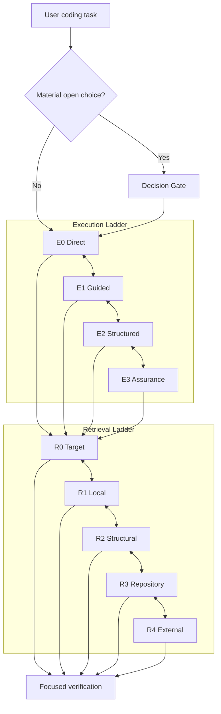

# Practical Coding — Progressive Ladders Experiment

> **Experimental branch:** `experiment/progressive-ladders`. This is an architecture exploration, not a published v1.3 benchmark claim.

Practical Coding asks one question continuously:

> **How much engineering process and how much context are actually necessary right now?**

This branch turns that idea into two independent progressive ladders whose boundaries are explicitly intended to be tuned by benchmark evidence.

```bash
npx skills@latest add Hubujiu/practical-coding
```

## Architecture



The arrows are bidirectional on purpose. Practical Coding should not only escalate; it should **de-escalate and contract** as soon as uncertainty disappears.

## Execution: progressive constraint

| Level | Meaning | Runtime cost |
|---|---|---|
| **E0 Direct** | Target, contract, and sufficient check are already clear | Core only |
| **E1 Guided** | One bounded local uncertainty blocks Direct work | Core only + one local evidence step |
| **E2 Structured** | A specialist blocker remains | Core + exactly one Debugging or Implementation capability |
| **E3 Assurance** | The selected capability needs wider evidence for a material guarantee | Same capability, deeper evidence; no new module |

`Debugging` and `Implementation` are **capabilities**, not levels. Decision is a separate gate.

This avoids the false sequence `Direct → Debugging → Implementation`: a risky new feature may need Implementation without Debugging, while a small bug may need Debugging without complex implementation.

### Escalation rule

Escalate only when fresh evidence demonstrates that the current level cannot answer the next material question or support the required claim.

### De-escalation rule

Once the cause, contract, invariant, or evidence boundary is known, stop the higher-level procedure, narrow the surface, make the smallest coherent change, and run the cheapest sufficient check.

## Retrieval: progressive context

| Level | Scope |
|---|---|
| **R0 Target** | Current context / known path / symbol / error / test |
| **R1 Local** | Bounded or ranked search in the nearest plausible scope |
| **R2 Structural** | Callers, callees, imports, implementations, dependency/flow relationships |
| **R3 Repository** | Repo-wide discovery or bounded exhaustive claim |
| **R4 External** | Authoritative framework/API/license/compatibility evidence not established locally |

Tool choice is secondary to scope. A structural index such as Codebase Memory is optional and used only when already available and cheaper than reconstructing the relationship from source.

The most important retrieval rule is not "search wider" but:

> **expand → localize → contract**

A repo-wide search that identifies two relevant files should immediately become a two-file investigation.

## Decision Gate

Decision answers **what should be done**. The ladders answer **how much process/context is needed after that**.

Load [`references/decision.md`](references/decision.md) only for a material genuinely-open choice that changes the next action. Choices already specified by the request or repository are inputs, not events.

## Context isolation

Already-read references cannot be removed from model context by saying "return to Direct". Therefore:

- E0/E1 use no reasoning reference;
- E2/E3 use at most one reasoning reference in the root;
- substantial second events or broad R2/R3 mapping may be isolated in a worker only when handoff saves net context;
- returning to a lower rung means narrowing future behavior, not pretending context disappeared.

## Benchmark-driven ladder evolution

The number and boundary of levels are hypotheses.

For every axis, benchmark capped variants to discover the **minimum quality-qualified rung** for each task, then compare the adaptive Skill against that empirical minimum.

Measure:

- correctness/safety/build first;
- tokens, latency, tool calls, LOC, references loaded second;
- **over-escalation**: adaptive level > minimum sufficient level;
- **under-escalation**: adaptive level < minimum sufficient level and fails where a higher cap succeeds;
- distribution of which level is actually minimum sufficient.

If a level is almost never the minimum sufficient level, test merging/removing it. If one level contains both persistent over- and under-escalation clusters, test moving the boundary or splitting it.

See [`benchmarks/LADDER_EVOLUTION.md`](benchmarks/LADDER_EVOLUTION.md) and [`benchmarks/ladder_analysis.py`](benchmarks/ladder_analysis.py).

## Persistent evolution knowledge

Runtime agents do **not** read [`evolution/`](evolution/README.md). That directory is for benchmark/maintenance work:

```text
evolution/
├── patterns/      # repeated mechanisms supported by evidence
├── experiments/   # proposed and accepted boundary/wording changes
└── rejected/      # failed changes retained so they are not repeated
```

This separates:

```text
raw benchmark evidence
        ↓
persistent maintenance knowledge
        ↓
Skill change proposal
        ↓
validation gate
        ↓
accept / reject while retaining the lesson
```

## Repository structure

```text
practical-coding/
├── SKILL.md
├── AGENTS.md
├── references/
│   ├── decision.md
│   ├── debugging.md
│   ├── implementation.md
│   ├── navigation.md
│   └── delegation.md
├── benchmarks/
│   ├── LADDER_EVOLUTION.md
│   ├── ladder_analysis.py
│   └── ...existing harness...
└── evolution/
    ├── patterns/
    ├── experiments/
    └── rejected/
```

Historical v1.0–v1.2 results remain under `benchmarks/results/` and must not be reinterpreted as evidence for this experimental architecture. A fresh repeated run is required before merging or publishing comparative claims.

## Inspirations

Practical Coding remains influenced by Ponytail, Superpowers, Agent Skills progressive disclosure, FFF-style bounded retrieval, and Codebase Memory-style structural navigation. This branch additionally adopts the persistent-evolution separation suggested by recent Skill-evolution work: maintenance knowledge survives rejected patches, while runtime context remains lean.

MIT License. See `THIRD_PARTY_NOTICES.md` for applicable upstream attribution.
