# Practical Coding

<p align="center">
  <a href="https://github.com/Hubujiu/practical-coding/blob/main/LICENSE"></a>
  <a href="https://agentskills.io"></a>
  
  
  <a href="https://github.com/Hubujiu/practical-coding/pulls"></a>
</p>

<p align="center">
  🌐 <b>English</b> | <a href="README_zh.md">简体中文</a>
</p>

---

> **One coding skill, load only what the task needs.**  
> Practical Coding is a lean, event-driven coding skill for AI agents. It eliminates LLM over-engineering, skips bureaucratic process ceremony, and delivers surgical, production-ready code with fresh evidence.

---

## 📑 Table of Contents

- [The Problems We Solve](#-the-problems-we-solve)
- [Inspirations & Lineage (The Synthesis of Giants)](#-inspirations--lineage-the-synthesis-of-giants)
- [Architecture & How It Works](#-architecture--how-it-works)
- [The Always-On Core](#-the-always-on-core)
- [The 6 Modular Pillars](#-the-6-modular-pillars)
- [Subagent Delegation & Isolation Gate](#-subagent-delegation--isolation-gate)
- [Optional Codebase Memory (AST & LSP Intelligence)](#-optional-codebase-memory-ast--lsp-intelligence)
- [Quick Start & Installation](#-quick-start--installation)
- [Configuration](#-configuration)
- [Repository Structure](#-repository-structure)
- [Contributing & License](#-contributing--license)

---

## ⚡ The Problems We Solve

AI coding assistants are prone to two major failure modes:
1. **The AI Bloat Trap (Over-Engineering)**: Writing speculative abstractions, nested wrappers, unrequested fallback/retry logic, defensive catch-alls, and bloated boilerplate tests for simple 2-line edits.
2. **The "Process Ceremony" Tax**: Heavy multi-stage agent frameworks force *every* task (even fixing a typo or CSS color) through rigid 5-stage sequential pipelines (*Brainstorm → Plan → TDD → Review → Git Ceremony*), burning massive token budgets and causing developer fatigue.

Conversely, unconstrained single-prompt agents fail when facing complex multi-file refactors or tricky bug diagnoses due to lack of engineering discipline.

### How Practical Coding Compares

| Dimension / Task | Rigid Agent Frameworks | Naive / Unconstrained LLMs | 🚀 Practical Coding |
|---|---|---|---|
| **Simple / Local Edits** *(e.g. fix CSS, rename var)* | Heavy multi-step ceremony; burns tokens on unneeded plans & tests | Fast, but risks touching unrelated code | **Direct Path**: Zero references loaded, zero subagent overhead, executes immediately |
| **Complex Features** | Rigid pipeline overhead across every single step | Hallucinates architecture, creates defensive bloat | **Event-Driven Router**: Loads targeted modules (`decision.md`, `implementation.md`) on demand |
| **Bug Diagnosis** | Often writes boilerplate test suites before finding the bug | Patches downstream symptoms with `try/catch` & fallback hacks | **Evidence-First**: Reproduce → Earliest broken state → Single hypothesis → Root cause fix |
| **Subagent Workers** | Arbitrary subagent proliferation & pipeline chains | Single-context overload | **Economic Isolation Gate**: Dispatches workers only when avoided context clearly exceeds handoff cost |
| **Reusing Solutions** | Reinvents wheels or creates complex custom wrappers | Generates subpar custom code for solved problems | **Mature Implementation First**: Prefers stdlib → native platform → installed deps → mature upstream |
| **Code Intelligence** | Dumps full repo scans into context | Repeated slow grep/find across huge repos | **Non-Intrusive CLI Mode**: Direct AST/LSP graph via `codebase-memory-mcp` with zero permanent context pollution |

---

## 💡 Inspirations & Lineage (The Synthesis of Giants)

Practical Coding merges the best design paradigms from leading open-source agent methodologies:

```text
               ┌─────────────────────────────────────────────────────────┐
               │              DietrichGebert/ponytail                    │
               │   "Laziest Senior Dev" Pragmatism, YAGNI, Stdlib-First  │
               └────────────────────────────┬────────────────────────────┘
                                            │ (Pragmatic Philosophy)
                                            ▼
┌───────────────────────────┐      ┌─────────────────┐      ┌─────────────────────────────┐
│      obra/superpowers     │      │                 │      │      Agent Skills Spec      │
│  Engineering Rigor, TDD,  │─────►│ PRACTICAL CODING│◄─────│    (mattpocock / Anthropic) │
│  Delegation & Verification│      │                 │      │    Progressive Disclosure   │
└───────────────────────────┘      └────────┬────────┘      └─────────────────────────────┘
  (Decoupled from rigid pipeline)           │ (Structured Graph)
                                            ▼
               ┌─────────────────────────────────────────────────────────┐
               │             DeusData/codebase-memory-mcp                │
               │    Tree-sitter AST, Hybrid LSP, CLI-mode Intelligence   │
               └─────────────────────────────────────────────────────────┘
```

### 1. 🦄 [DietrichGebert/ponytail](https://github.com/DietrichGebert/ponytail) — *The Pragmatic Senior Dev Mindset*
- **What we adopted**: The ruthless **YAGNI** (You Aren't Gonna Need It) principle, the **Decision Ladder** (stdlib → platform native → installed dependency → mature external library → custom code as last resort), zero defensive bloat, and the discipline of writing the **smallest coherent diff**.

### 2. ⚡ [obra/superpowers](https://github.com/obra/superpowers) — *Disciplined Engineering Capabilities*
- **What we adopted**: Systematic root-cause debugging, verification gates, and isolated subagent task contracts.
- **How we evolved it**: We **unchained** these powerful tools from mandatory linear pipelines. You no longer suffer through mandatory brainstorming or TDD ceremony for trivial changes; capabilities are triggered **only when an unresolved event occurs**.

### 3. 📦 [mattpocock/skills](https://github.com/mattpocock/skills) & [Agent Skills Spec](https://agentskills.io) — *Progressive Disclosure*
- **What we adopted**: Ultra-lean entry footprint. [`SKILL.md`](SKILL.md) is under 50 lines, allowing it to remain permanently resident in the agent's context without wasting token budget. Deep reference modules are read only when routed.

### 4. 🧠 [DeusData/codebase-memory-mcp](https://github.com/DeusData/codebase-memory-mcp) — *Zero-Bloat Code Intelligence*
- **What we adopted**: Industrial-grade Tree-sitter AST parsing, Hybrid LSP semantic resolution, and persistent code graphs.
- **How we evolved it**: Instead of permanently injecting a heavy MCP server and tool definitions into the agent's system prompt, Practical Coding invokes upstream in **one-shot CLI mode** only when navigation value justifies it.

---

## 🏗️ Architecture & How It Works

Practical Coding is an **Event-Driven Router** backed by an **Always-On Core**:

```mermaid
flowchart TB
    Task["🎯 User Task / Coding Request"] --> Core["⚡ SKILL.md<br/>Always-on Core & Event Router"]

    Core -->|"Local & Well-Understood"| Direct["🚀 Direct Path<br/>Root agent executes immediately<br/>(No modules, no subagents)"]
    
    Core -->|"Unresolved Material Choice"| D["🧭 Decision Module<br/>(references/decision.md)"]
    Core -->|"Multi-file Coordination Unclear"| I["🏗️ Implementation Module<br/>(references/implementation.md)"]
    Core -->|"Observed Bug / Cause Unknown"| G["🔍 Debugging Module<br/>(references/debugging.md)"]
    Core -->|"Meaningful Verification Risk"| V["🛡️ Verification Module<br/>(references/verification.md)"]
    Core -->|"Broad Codebase Navigation"| E["🗺️ Exploration Module<br/>(references/exploration.md)"]
    E -->|"codebase_memory.enabled: true"| M["🧠 Codebase Memory (CLI Mode)<br/>(references/codebase-memory.md)"]

    subgraph IsolationGate["⚖️ Economic Isolation Gate"]
        IG{"Avoided Context & Parallelism<br/>>> Startup + Handoff Cost?"}
        IG -->|"Yes"| Worker["🤖 Isolated Worker Subagent<br/>(Reads references/delegation.md + 1 module)"]
        IG -->|"No"| RootExec["👤 Root Agent Loads Module Locally"]
    end

    D -.-> IG
    I -.-> IG
    G -.-> IG
    V -.-> IG
    E -.-> IG
    M -.-> IG

    Worker -->|"Returns compact evidence capsule"| Done["✅ Fresh Evidence Check & Completion"]
    RootExec --> Done
    Direct --> Done
```



---

## 🛡️ The Always-On Core

These non-negotiable engineering principles apply to **every path**, including direct edits:

1. **Understand & Inspect Narrowly**: Inspect the smallest relevant context before modifying code.
2. **Traceable Value**: Everything added — abstractions, dependencies, validations, retries, configs, tests, or documentation — must trace to a concrete requirement, boundary, or observed risk.
3. **Mature Implementation First**: For non-trivial capabilities, integrate a mature, maintained package rather than building a parallel custom implementation.
4. **Preserve System Invariants**: Protect security, permissions, data integrity, accessibility, compatibility, and explicit project constraints.
5. **Untouched Scope**: Keep unrelated code and existing user modifications untouched.
6. **Fresh Evidence**: Obtain the cheapest fresh evidence sufficient to justify the change before claiming completion.

---

## 🧩 The 6 Modular Pillars

When a task encounters an unresolved engineering event, only the matching module is loaded:

| Module | Loaded When | Core Deliverable |
|---|---|---|
| 🧭 [`references/decision.md`](references/decision.md) | A material choice about architecture, dependencies, APIs, or data models remains open | Evaluates $\le 3$ viable options (stdlib/native first); chooses the smallest fitting solution. |
| 🏗️ [`references/implementation.md`](references/implementation.md) | A change coordinates multiple files/contracts and the change surface is unclear | Bounded change map; authoritative boundary validation; no defensive bloat. |
| 🔍 [`references/debugging.md`](references/debugging.md) | An observed failure, regression, or failed verification lacks a diagnosed cause | Evidence-first: symptom → earliest broken state → single hypothesis → root cause fix. |
| 🛡️ [`references/verification.md`](references/verification.md) | Risk or uncertainty makes the verification strategy itself a meaningful decision | Cheapest falsification ladder; rejects rationalizations like *"too simple to test"*. |
| 🗺️ [`references/exploration.md`](references/exploration.md) | Broad navigation of a large codebase is necessary with standard text/symbol tools | Bounded impact map (exact paths, symbols, edges) without full file dumps. |
| 🧠 [`references/codebase-memory.md`](references/codebase-memory.md) | Broad structural navigation in a project with `codebase_memory.enabled: true` | AST/LSP graph intelligence via upstream CLI across Scout, Verify, and Auditor tiers. |

---

## 🤖 Subagent Delegation & Isolation Gate

Practical Coding prevents runaway subagent proliferation through a strict **Economic Isolation Gate**:

> **The Isolation Rule:**  
> Spawn an isolated worker **only** when the context it avoids, or the parallel work it unblocks, **clearly exceeds** the startup and handoff overhead. Otherwise, keep the task in the root agent.

### Worker Protocol ([`references/delegation.md`](references/delegation.md))
- **Focused Scope**: Worker reads `delegation.md` + exactly **one** assigned module.
- **Read-Only by Default**: Decision, Exploration, Codebase Memory, and Debugging workers cannot modify code.
- **Sole Writer**: An Implementation worker writes only within its assigned directory/files and is the sole writer.
- **Compact Evidence Capsule**: Workers return structured summaries (paths, symbols, diff summaries, test outputs), never raw transcripts or full file contents.

---

## 🧠 Optional Codebase Memory (AST & LSP Intelligence)

Practical Coding integrates directly with [`DeusData/codebase-memory-mcp`](https://github.com/DeusData/codebase-memory-mcp) as its structured code intelligence backend.

### Why One-Shot CLI Mode?
Instead of permanently loading upstream MCP server tools into the agent's system prompt (which wastes 1,000+ tokens on every conversation turn), Practical Coding executes upstream via one-shot CLI commands:

```bash
# Search symbols & call graphs
codebase-memory-mcp cli search_graph '{"name_pattern":".*Handler.*","label":"Function"}'
codebase-memory-mcp cli trace_call_path '{"function_name":"main","direction":"both"}'

# Check architecture & index coverage
codebase-memory-mcp cli get_architecture '{}'
codebase-memory-mcp cli check_index_coverage '{"paths":["src/core.ts"]}'
```

### CLI Resolution Order
1. Existing `codebase-memory-mcp` binary on `PATH`.
2. Official lazy npm launcher (if `npx` is available):
   ```bash
   npx --yes codebase-memory-mcp@latest cli <tool> '<json-arguments>'
   ```
3. **Graceful Fallback**: If upstream cannot be launched, the agent falls back to standard text exploration and reports that Codebase Memory was not used.

### Evidence Tiers
- 🔭 **Scout**: Rapid positive discovery. Small limits, shallow traces, marked provisional.
- 🎯 **Verify (Default)**: Normal development. Exact snippets + `check_index_coverage` validation.
- 🔬 **Auditor**: Bounded exhaustive audits. Scope coverage, pagination completion, and fallback source checking for any reported coverage gaps.

---

## 🚀 Quick Start & Installation

### One-Command Install (Recommended)

Using the standard [`skills`](https://github.com/mattpocock/skills) CLI:

```bash
npx skills@latest add Hubujiu/practical-coding
```

---

### Manual Installation by Agent Platform

#### 🟣 Claude Code
```bash
git clone https://github.com/Hubujiu/practical-coding.git ~/.claude/skills/practical-coding
```

#### 🔵 Cursor / Codex / Copilot CLI / Gemini CLI / Antigravity / Goose

**macOS & Linux:**
```bash
git clone https://github.com/Hubujiu/practical-coding.git ~/.agents/skills/practical-coding
```

**Windows (PowerShell 7):**
```powershell
git clone https://github.com/Hubujiu/practical-coding.git "$env:USERPROFILE\.agents\skills\practical-coding"
```

#### 📁 Project-Level Installation
To install Practical Coding for a specific workspace/repository:
```bash
# For Agent Skills compatible tools
git clone https://github.com/Hubujiu/practical-coding.git .github/skills/practical-coding
```

---

## ⚙️ Configuration

Enable optional Codebase Memory by adding `.practical-coding.yaml` to your project root:

```yaml
version: 1
codebase_memory:
  enabled: true
```

- `enabled: false` (or missing file): Codebase Memory is disabled; standard exploration is used without prompting.
- `enabled: true`: Upstream AST/LSP graph intelligence is enabled for large-scale navigation.

---

## 📂 Repository Structure

```text
practical-coding/
├── SKILL.md                 # Lean entry point: Always-on Core & Event Router
├── AGENTS.md                # Agent instructions & module routing index
├── README.md                # English documentation (this file)
├── README_zh.md             # Simplified Chinese documentation
├── CONTRIBUTING.md          # Contribution guidelines
├── LICENSE                  # MIT License
├── THIRD_PARTY_NOTICES.md   # Attribution for upstream Codebase Memory MCP
├── agents/
│   └── openai.yaml          # Agent configuration profile
├── examples/
│   ├── README.md            # Example configuration instructions
│   └── practical-coding.yaml# Sample project-level configuration
├── references/              # On-demand engineering modules
│   ├── decision.md          # Architecture & dependency decisions
│   ├── implementation.md    # Multi-file change maps & bounded implementation
│   ├── debugging.md         # Evidence-first root-cause diagnosis
│   ├── verification.md      # Falsification ladder & verification gates
│   ├── delegation.md        # Worker subagent protocol & capsule return
│   ├── exploration.md       # Standard source navigation & impact maps
│   └── codebase-memory.md   # Upstream AST/LSP graph intelligence & coverage
└── .github/
    └── workflows/
        └── validate.yml     # Skill validation workflow
```

---

## 🤝 Contributing & License

Contributions are welcome! Please review our [Contributing Guidelines](CONTRIBUTING.md) before submitting pull requests.

- **License**: [MIT License](LICENSE) © 2026 Hubujiu
- **Third-Party Attribution**: See [THIRD_PARTY_NOTICES.md](THIRD_PARTY_NOTICES.md) for details on [`DeusData/codebase-memory-mcp`](https://github.com/DeusData/codebase-memory-mcp).
