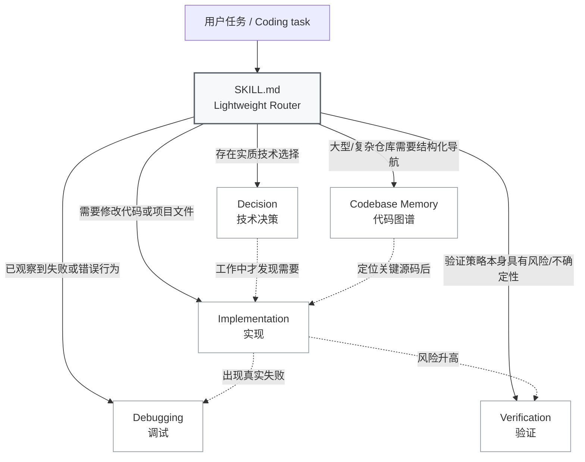
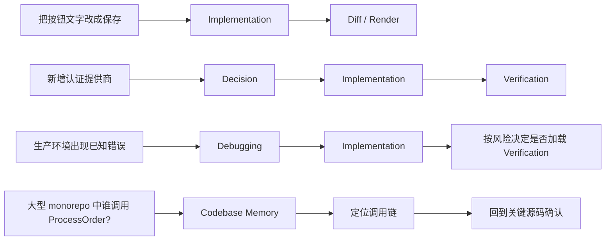
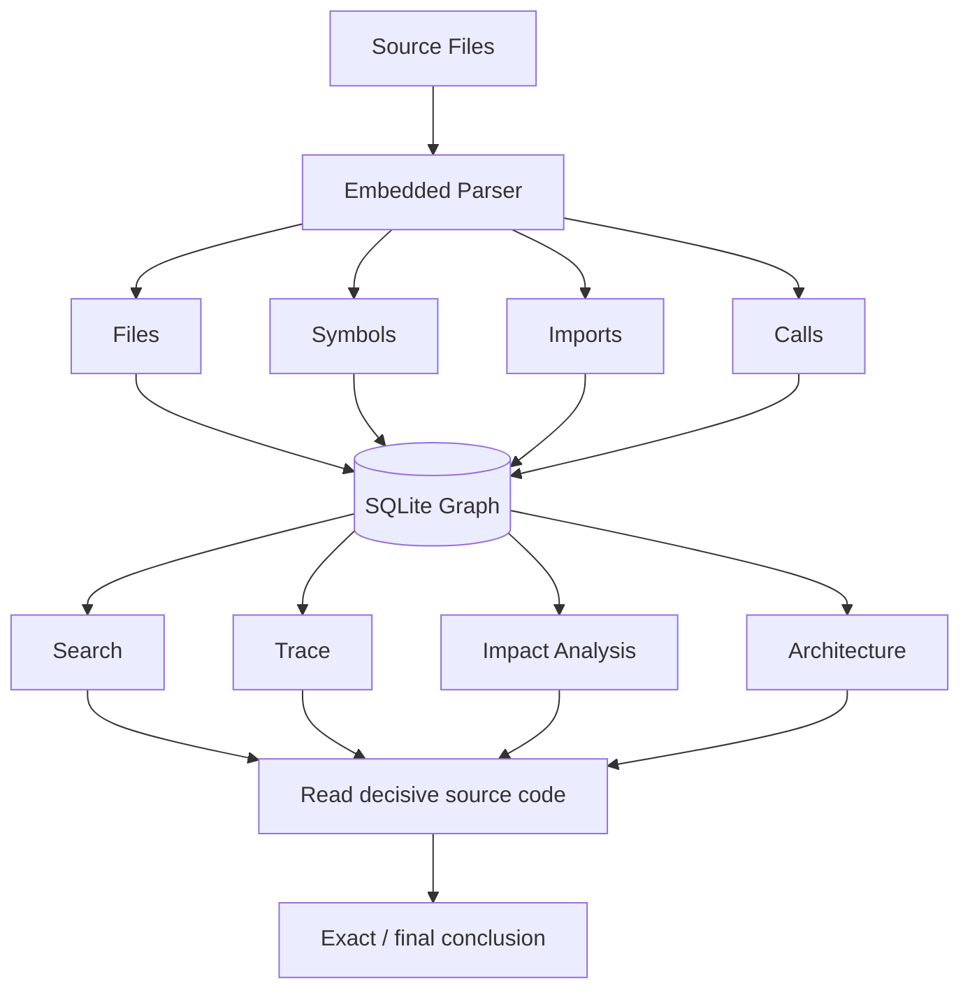
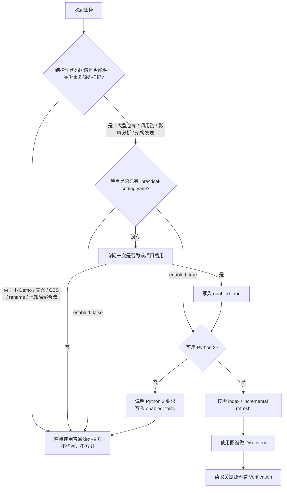
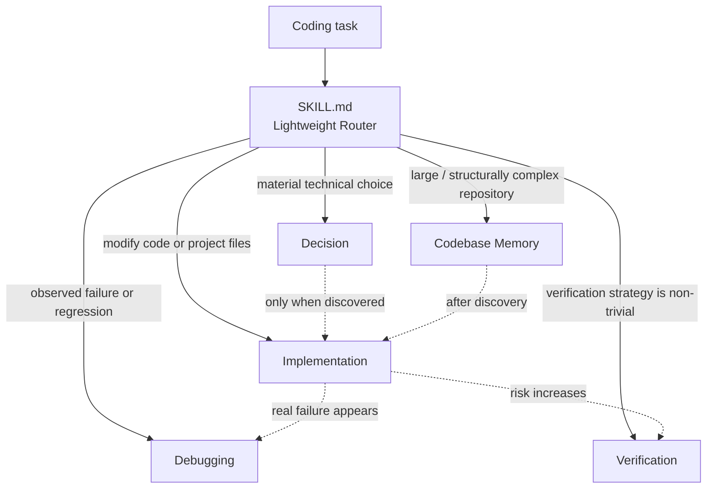
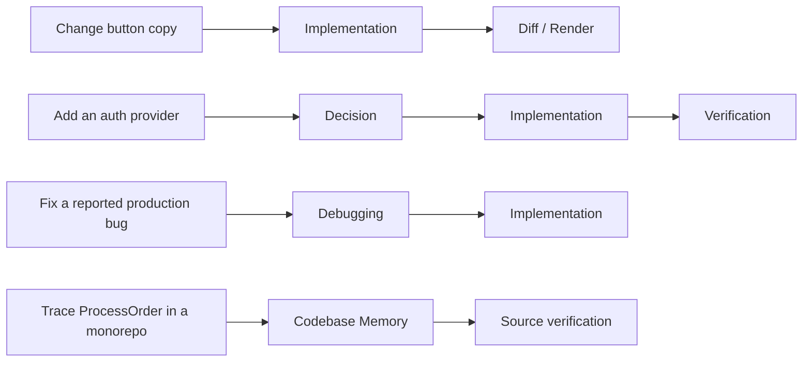
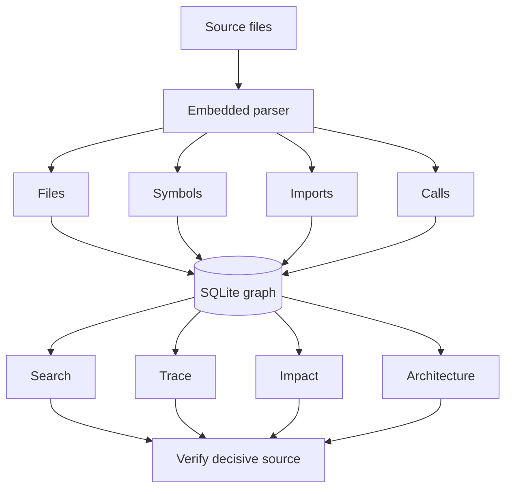

# Practical Coding

> **一个 Skill，按需加载。**  
> **One skill, load only what the task needs.**

Practical Coding 是一个面向 Coding Agent 的轻量通用编码 Skill。它不把 Brainstorming、Planning、TDD、Debugging、Review 和 Git Workflow 串成固定流水线，而是让 `SKILL.md` 作为轻量 Router，只加载当前任务真正需要的工程能力。

目标：**用最小、完整、可维护的修改解决真实问题，同时减少多余代码、测试、文档、防御性编程、重复源码扫描和流程成本。**

[中文](#中文) · [English](#english)

---

## 中文

### 它解决什么问题

很多 Coding Agent 工作流默认把“先规划 → 再实现 → 强制测试 → Review → Git 流程”全部串起来。对于大型改造，这些步骤可能有价值；但对于改一个按钮、修一处样式、定位一个明确 bug，它们会制造额外上下文、文件、测试和流程。

Practical Coding 的做法相反：

- 一个轻量 Router 常驻；
- 工程能力彼此独立；
- 只有触发条件出现时才加载对应规则；
- 任务简单时保持简单，任务复杂时再升级。

### 架构：四个工程模块 + 一个内置代码图谱模块



> **这不是五阶段流水线。** 模块没有固定顺序，也不要求每次全部加载。

| 模块 | 何时加载 |
|---|---|
| `references/decision.md` | 架构、依赖、API、数据模型、兼容性、新能力或多个实质方案需要选择 |
| `references/implementation.md` | 修改代码或项目文件 |
| `references/debugging.md` | 已观察到 bug、回归、错误行为或失败检查 |
| `references/verification.md` | 风险/不确定性使验证策略本身成为工程问题 |
| `references/codebase-memory.md` | 大型/多模块仓库、调用链、影响分析、架构发现、跨模块导航 |

### 同一个 Skill，不同任务走不同路径



这意味着：改文案时不会被迫做架构决策；修 bug 时不会预加载一整套规划流程；大型仓库需要跨模块导航时，又可以直接启用结构化代码图谱。

### 核心原则

- **Reuse before invention**：现有代码 → 标准库 → 框架原生能力 → 已安装依赖 → 调研成熟方案 → 新依赖 → 最小自研。
- **Smallest coherent change**：追求最小完整修改，而不是最少字符。
- **No defensive bloat**：retry、fallback、wrapper、validation、feature flag 都需要真实边界或风险支撑。
- **Evidence-driven debugging**：证据 → 最早错误状态 → 单一假设 → 根因 → 最小修复。
- **Risk-proportional verification**：测试是证据，不是默认产物。
- **Document reasons, not reconstructable facts**：记录“为什么”，不重复代码、图谱或 Git 已能廉价恢复的事实。
- **Git is evidence, not ceremony**：不强制 branch、worktree、checkpoint、`PLAN.md`。
- **Progressive disclosure**：只有触发条件出现时才加载对应 reference。

## 内置 Codebase Memory

安装 **Practical Coding 本身就已经包含代码图谱能力**。

不需要额外安装：

- `codebase-memory-mcp`
- MCP Server
- WebUI
- daemon / watcher
- semantic model
- 额外数据库服务
- pip package

内置 runtime：

```text
runtime/codebase_memory.py
```

只使用 Python 标准库，核心数据存储为本地 SQLite。

### Codebase Memory 如何工作



核心纪律是：**Graph 用于 Discovery，源码用于 Verification。** 代码图谱帮助 Agent 更快找到“应该读哪里”，但精确、负面或穷尽式结论仍要回到源码确认。

### 为什么没有直接塞入整个 `codebase-memory-mcp`

Practical Coding 的代码图谱设计参考 [DeusData/codebase-memory-mcp](https://github.com/DeusData/codebase-memory-mcp)（MIT），尤其是：

- 持久结构化索引；
- 调用链；
- 影响分析；
- 增量刷新；
- 图谱负责 Discovery、源码负责最终 Verification。

但 upstream 的生产实现把 MCP、daemon、watcher、semantic、UI、CLI 和大规模 Tree-sitter/LSP 解析体系一起链接。直接搬入会让一个轻量 Skill 变成大型运行时 fork。

因此 Practical Coding 内置的是独立维护的轻量 graph runtime，而不是要求用户额外安装 upstream，也不是把整个 upstream 工程复制进来。

### 当前内置能力

```bash
# 建立 / 增量刷新索引
python <skill-root>/runtime/codebase_memory.py --repo <project-root> index

# 查看状态
python <skill-root>/runtime/codebase_memory.py --repo <project-root> status

# 架构概览
python <skill-root>/runtime/codebase_memory.py --repo <project-root> architecture

# 搜索符号
python <skill-root>/runtime/codebase_memory.py --repo <project-root> search ProcessOrder

# 调用链
python <skill-root>/runtime/codebase_memory.py --repo <project-root> trace ProcessOrder --direction both --depth 3

# 当前 Git 改动的影响范围
python <skill-root>/runtime/codebase_memory.py --repo <project-root> impact --git-diff
```

实际执行前会解析可用的 Python 3 命令：优先 `python`，其次 `python3`，Windows 还可以使用 `py -3`。

索引默认放在用户缓存目录，不污染项目工作树：

| 系统 | 默认位置 |
|---|---|
| Linux | `${XDG_CACHE_HOME:-~/.cache}/practical-coding/codebase-memory/` |
| macOS | `~/Library/Caches/practical-coding/codebase-memory/` |
| Windows | `%LOCALAPPDATA%\practical-coding\cache\codebase-memory\` |

### 解析范围

Python 使用标准库 AST。

内置轻量解析同时识别：

- JavaScript / TypeScript / JSX / TSX
- Java / Kotlin
- Go
- Rust
- C / C++
- C#
- PHP
- Ruby
- Vue / Svelte
- Scala
- Swift

这些非 Python 语言目前使用轻量语法抽取，不等同于 upstream 的完整 Tree-sitter + LSP 精度。因此图谱用于加速 Discovery，精确/负面/穷尽结论仍需要回源确认。

### Codebase Memory 什么时候启用

Codebase Memory 是**能力内置，但项目级使用可选**。



项目需要长期保存选择时才创建：

```yaml
version: 1
codebase_memory:
  enabled: true
```

模板见 [`examples/practical-coding.yaml`](examples/practical-coding.yaml)。

规则：

- 小 Demo、文案、CSS、rename、已知局部修改：直接跳过，不询问；
- 大型仓库、调用链、影响分析等明显受益时：询问一次是否为该项目启用；
- `enabled: true` 只表示需要时可以用，不代表每次任务都索引/查询；
- runtime 增量刷新，只重解析内容发生变化的文件；
- 已启用但找不到可用 Python 3 时：提示用户安装/启用 Python，把 `.practical-coding.yaml` 的 `codebase_memory.enabled` 改为 `false`，本次继续普通源码搜索；
- `enabled: false` 时不重复检测/提示；用户之后准备好 Python 并希望重新启用时，再改回 `true`。

不会自动安装 Python，也不会因为代码图谱不可用而阻塞普通编码任务。

## 安装

### 一键安装

```bash
npx skills@latest add Hubujiu/practical-coding
```

安装 Skill 后，`runtime/codebase_memory.py` 同时存在，因此无需第二次安装 Codebase Memory。

### 手动安装

**Codex / Cursor / Copilot CLI / Gemini CLI**

```bash
git clone https://github.com/Hubujiu/practical-coding.git ~/.agents/skills/practical-coding
```

Windows PowerShell：

```powershell
git clone https://github.com/Hubujiu/practical-coding.git "$env:USERPROFILE\.agents\skills\practical-coding"
```

**Claude Code**

```bash
git clone https://github.com/Hubujiu/practical-coding.git ~/.claude/skills/practical-coding
```

### 项目结构

> 目录树是文件结构，不是流程图，因此保留文本形式更便于复制和定位。

```text
practical-coding/
├── SKILL.md
├── AGENTS.md
├── README.md
├── CONTRIBUTING.md
├── LICENSE
├── agents/
│   └── openai.yaml
├── examples/
│   ├── README.md
│   └── practical-coding.yaml
├── references/
│   ├── decision.md
│   ├── implementation.md
│   ├── debugging.md
│   ├── verification.md
│   └── codebase-memory.md
├── runtime/
│   ├── README.md
│   ├── codebase_memory.py
│   └── test_codebase_memory.py
└── .github/
    └── workflows/
        └── validate.yml
```

### 思想来源

- [Ponytail](https://github.com/DietrichGebert/ponytail)：YAGNI、reuse-first、stdlib/native-first、极小实现。
- [Matt Pocock / skills](https://github.com/mattpocock/skills)：Agent Skills 与 progressive disclosure。
- [Superpowers](https://github.com/obra/superpowers)：完整工程流程的参考，以及 Practical Coding 有意避免的流程强耦合。
- [Codebase Memory](https://github.com/DeusData/codebase-memory-mcp)：持久结构图谱、调用链、影响分析、增量索引和 graph → source evidence discipline。
- [Agent Skills specification](https://agentskills.io/specification)：Skill 结构与 progressive disclosure。

---

## English

Practical Coding is a compact general-purpose coding skill for coding agents. Instead of forcing every task through one fixed engineering pipeline, `SKILL.md` acts as a lightweight router and loads only the capabilities that materially help the current task.

**Goal:** produce the smallest durable change with enough fresh evidence to justify confidence, while minimizing unnecessary code, tests, documentation, dependencies, defensive handling, process, and context usage.

### Architecture



These are independent capabilities, **not mandatory stages**.

| Module | Load when |
|---|---|
| **Decision** | Architecture, dependency, API, data, compatibility, new capability, or another material solution choice is required |
| **Implementation** | Code or project files must change |
| **Debugging** | A failure, regression, incorrect behavior, or failed check has actually been observed |
| **Verification** | Risk or uncertainty makes the evidence strategy itself a meaningful engineering decision |
| **Codebase Memory** | Large-repository navigation, call chains, impact analysis, architecture discovery, or repeated cross-module exploration would materially reduce source scanning |

### Routing examples



### Embedded codebase graph

Installing Practical Coding also installs the graph capability itself:

```text
runtime/codebase_memory.py
```

There is no separate `codebase-memory-mcp` installation, MCP registration, WebUI, daemon, network request, API key, or pip dependency.

The embedded runtime uses the Python standard library and persistent SQLite storage.



It supports:

- incremental indexing;
- files, symbols, imports, and call relationships;
- architecture summaries;
- symbol search;
- caller/callee tracing;
- changed-file impact analysis;
- read-only SQL graph queries.

The design is inspired by MIT-licensed [DeusData/codebase-memory-mcp](https://github.com/DeusData/codebase-memory-mcp), but Practical Coding does not vendor the upstream runtime. It keeps the graph-navigation model while deliberately omitting MCP, UI, daemon, watcher, semantic embeddings, client installers, and the large Tree-sitter/LSP bundle.

Python parsing uses the standard-library AST. Other supported languages use lightweight syntax extraction, so the graph accelerates discovery but never replaces decisive source verification.

### Project opt-in

Capability is bundled; project-level usage remains optional:

```yaml
version: 1
codebase_memory:
  enabled: true
```

Small/local tasks skip the graph. Large or structurally complex tasks may use it when the navigation savings justify indexing.

When enabled, resolve a Python 3 command (`python`, `python3`, or Windows `py -3`) before using the runtime. If Python is unavailable, explain the requirement, persist `codebase_memory.enabled: false`, and continue with normal source search. Do not auto-install Python or repeatedly retry while the project remains disabled. Re-enable the setting after Python becomes available and the user wants the graph again.

### Installation

```bash
npx skills@latest add Hubujiu/practical-coding
```

That single installation includes both the Skill rules and the embedded graph runtime.

### License

See [LICENSE](LICENSE). The embedded runtime is part of Practical Coding. Codebase Memory is credited as an MIT-licensed design/source of inspiration; its runtime is not bundled.
