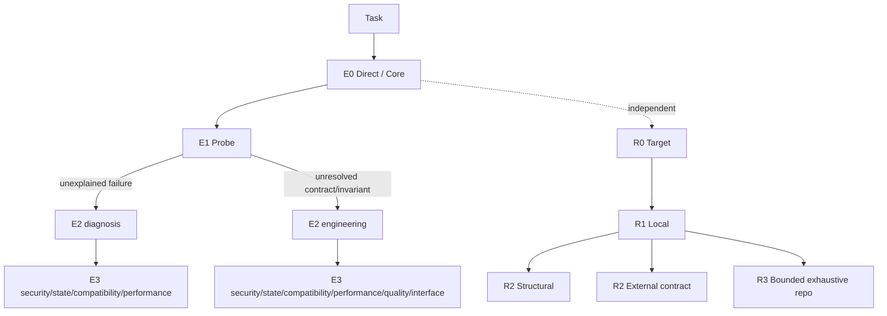

# Practical Coding — Progressive Capability Tree Experiment

> **Experimental branch:** `experiment/progressive-ladders`. The architecture below is a candidate and has not yet earned a release claim.

Practical Coding asks:

> **What is the least engineering depth and context needed for the next reliable action?**

The default runtime stays Ponytail-like and minimal. **Interactive requirement/decision workflows are not part of adaptive routing.**

## Default architecture



The model starts at Core/E0. Branches become available only when evidence shows the current execution or retrieval depth is insufficient.

**Execution and Retrieval are independent.** Finding another file, caller, sibling, contract, implementation, or configuration is Retrieval work and does not by itself raise execution depth. A simple edit may therefore be `E0/R2`; a difficult bug with a known target may be `E3/R0`.

## Manual-only interaction modes

`grill-me`-style requirements interviewing and Decision/option-selection are deliberately **outside** the tree. They cannot be selected because the model thinks a task is vague or a choice is important.

They run only when the user explicitly requests the behavior:

- [`references/manual/clarification.md`](references/manual/clarification.md) — "grill me", "interview me", "ask requirements before coding";
- [`references/manual/decision.md`](references/manual/decision.md) — "use Decision mode", "compare the options with me before coding".

A manual mode cannot automatically activate another manual mode. Ordinary tasks may still ask one genuinely blocking question when execution is otherwise impossible; that is not an interview workflow.

This keeps interactive skills available without charging every coding task for model-selected questioning or choice management.

## Minimal Core

Most tasks should remain at Core with shallow execution depth:

- smallest observable success;
- smallest coherent diff;
- reuse existing project primitives;
- no speculative abstractions, fallbacks, options, validation, tests, or documentation;
- cheapest focused verification;
- preserve unrelated behavior and user changes.

## Progressive execution tree

| Depth | Meaning | Loaded context |
|---|---|---|
| **E0 Direct** | behavior/contract/check are clear from available or retrieved evidence | Core only |
| **E1 Probe** | one cheap executable observation can settle one execution uncertainty | Core only |
| **E2 Root** | a real unresolved execution event needs a structured method | one root: diagnosis **or** engineering |
| **E3 Leaf** | a material specialist guarantee remains | root + one specialist leaf |

E1 is deliberately narrow: reproduce one behavior, exercise one path, falsify one concrete hypothesis, or run one focused check. **Searching or reading source is not E1.**

The specialist leaves are deliberately narrow: security, persistence/concurrency/state, compatibility/migration, measured performance, structural quality, and interface quality.

This takes the useful part of expert skill packs—concrete trigger, procedure, exit, verification—without loading their workflows globally. Addy Osmani's progressive-disclosure anatomy, Superpowers' executable procedures, SkillsBench expert skills, and design-oriented skills such as taste-skill inform the leaf design rather than becoming dependencies.

## Retrieval tree

Retrieval is the only adaptive control for **acquiring source/context**:

- **R0 Target** — known source;
- **R1 Local** — bounded/ranked search, nearby callers/references/siblings/contracts;
- **R2 Structural** — relation/flow lookup;
- **R2 External** — authoritative contract the repository cannot establish;
- **R3 Bounded exhaustive repository** — only for explicit exhaustive claims or failed localization.

The governing rule remains **expand → localize → contract**. Structural tools such as Codebase Memory are optional accelerators, never required dependencies.

`references/navigation.md` is retained as a filename for compatibility, but conceptually it is **the deeper R2 Structural / R3 coverage procedure inside Retrieval**, not a third runtime axis or a separate phase.

## Benchmark-driven tree optimization

Benchmark the adaptive tree against no-skill and the accepted prior Practical Coding version. Measure correctness/safety/build first, then minimum-sufficient depth/path, unnecessary or missed root/leaf loads, branch confusion, tokens, time, tool calls, and LOC.

Axis calibration must keep the distinction measurable: a source-discovery-only task can be `E0/R1` or `E0/R2`; E1 requires an executable probe.

Manual-only modes are a separate control surface: test that explicit activation works and that ordinary tasks have **zero spontaneous manual-mode activation**. Do not treat Clarification or Decision as adaptive routing candidates.

See [`benchmarks/LADDER_EVOLUTION.md`](benchmarks/LADDER_EVOLUTION.md).

## WikiSkill-style evolution loop

Runtime agents do not read `evolution/`. Maintainers separate real-project/benchmark evidence, persistent wiki knowledge, frozen experiments, and runtime rules. Repeated mechanisms can therefore improve boundaries without bloating ordinary runtime context.

See [`evolution/README.md`](evolution/README.md) and [`evolution/EXPERIENCE_SCHEMA.md`](evolution/EXPERIENCE_SCHEMA.md).

## Runtime reference tree

```text
SKILL.md
references/
├── debugging.md          # adaptive diagnosis root
├── engineering.md        # adaptive engineering root
├── navigation.md         # Retrieval: substantial R2 structural / R3 coverage procedure
├── delegation.md
├── specialists/          # adaptive E3 leaves
│   ├── security.md
│   ├── state.md
│   ├── compatibility.md
│   ├── performance.md
│   ├── quality.md
│   └── interface.md
└── manual/               # explicit user activation only
    ├── clarification.md
    └── decision.md
```

Historical benchmark results remain historical; fresh repeated runs are required before merging this experiment or publishing comparative claims.

MIT License. See `THIRD_PARTY_NOTICES.md` for upstream attribution.