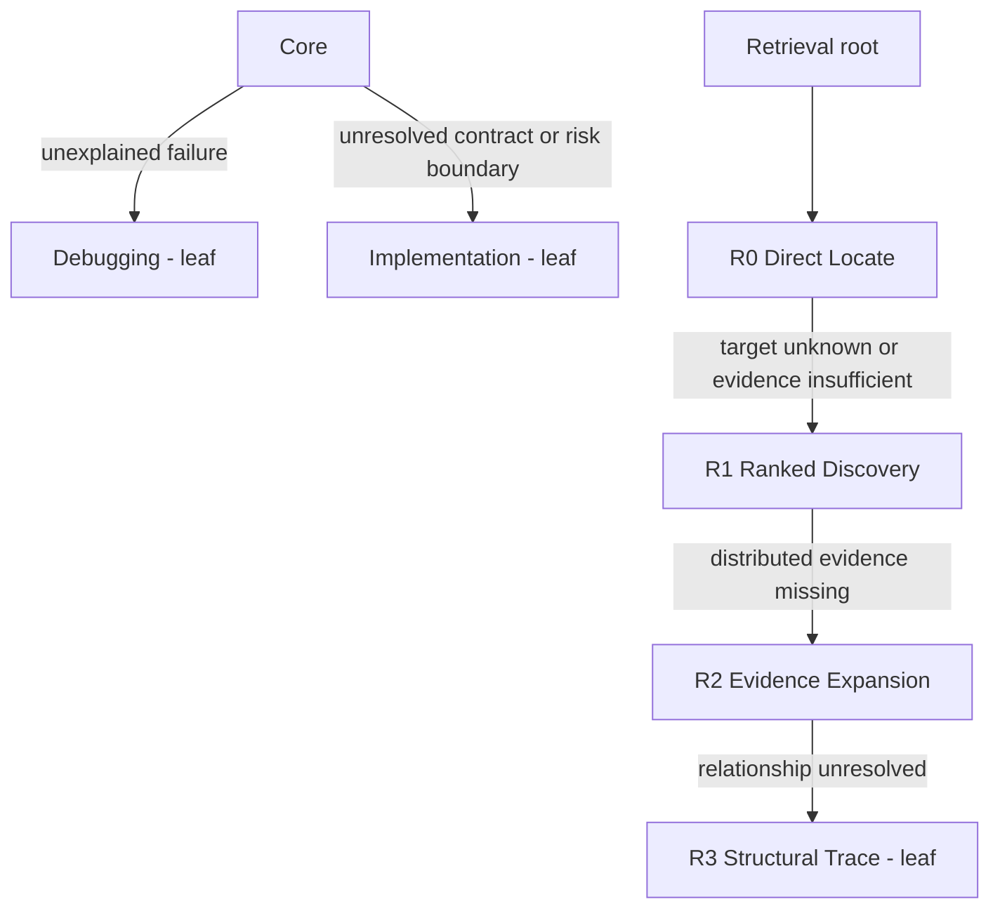

# Practical Coding

A compact Agent Skill for implementing, fixing, reviewing, and explaining code with the smallest correct change and fresh evidence.

**Current branch: 2.1-rc1, an unpromoted candidate.** The prompts, measurement pipeline, and delivery regression gate have changed. There are no new measured model-quality or token-saving claims. [Delivery readiness](benchmarks/DELIVERY_READINESS.md) separates observed checks from [engineering targets](benchmarks/release_targets.json).

## Runtime

`SKILL.md` is the runtime authority. Core defines observable success, reuses existing primitives, preserves user changes, and chooses sufficient verification. It does not require a plan, interview, worker, new abstraction, or new test for every task. Read-only requests authorize no edits.



Execution and Retrieval are independent. Each loaded node owns only its immediate-child router. A known target and settled contract remain at Core even when risk-related words occur. Retrieval depth describes an evidence gap, not tool strength or file count. A known location passes through Discovery without a redundant discovery query. Reuse already-loaded guidance and stop when the current claim is sufficiently supported.

[Decision](references/manual/decision.md) and [Clarification](references/manual/clarification.md) are explicit-only manual modes outside the trees. Alternatives found during implementation do not activate them. [Navigation](references/navigation.md) maps an unresolved repository area; it does not discover evidence or trace graphs. [Delegation](references/delegation.md) is optional, bounded, and single-writer.

## Capabilities

Ranked search, graph retrieval, and command-output compaction are replaceable infrastructure, not tree nodes. Normal runtime supports bounded native-source fallback. The dependency-enabled benchmark deliberately requires all three pinned providers in [the manifest](benchmarks/capability_manifest.json): `zg` 0.2.0, `codebase-memory-mcp` 0.10.8, and `rtk` 0.47.0.

Provider installation, downloads, indexes, dependency resolution, and first-build warmup occur before measured execution. Setup remains separately auditable and excluded from compared tokens, duration, and tool calls. Missing providers abort rather than silently selecting a fallback benchmark. See [capability boundaries](docs/CAPABILITY_LAYER.md).

## Validation and delivery

The active runner is `benchmarks/retrieval_validation.py`. It supports source analysis and executable delivery suites, plus Retrieval or execution capability ceilings. `dependency_tree_validation.py` is an execution-axis compatibility entry point; it no longer installs global monkey patches.

```sh
# Deterministic evaluator and oracle checks; no model-quality claim.
python benchmarks/benchmark_retrieval_integrity.py --output benchmark-results/evaluator.json
python benchmarks/benchmark_readiness.py --output benchmark-results/readiness.json

# Show the planned matrix without invoking a model.
python benchmarks/retrieval_validation.py --suite source --runs 3 --comparators-only --describe
python benchmarks/retrieval_validation.py --suite delivery --runs 3 --comparators-only --describe
```

The engineering gate covers 15 source tasks and 8 public code-delivery fixtures, three arms and three repetitions: 207 cells. These public regression tasks are not held-out generalization evidence. Their acceptance floors and cost limits are targets, not observed scores. Actual evaluation requires authenticated Codex, all pinned providers, and frozen source checkouts. [Reproduction commands and limitations](benchmarks/DELIVERY_READINESS.md) include the full paired run and gate.

Raw transcripts, tool exits, source-content reads, setup receipts, candidate/baseline identities, and archived code support the results. Missing telemetry is unknown, not zero. The gate rejects incomplete or mixed experiments. Run model evaluation only in a disposable trusted environment without production secrets; the existing unattended Codex command is not a security containment boundary.

## Evolution and history

[AGENTS.md](AGENTS.md) and [CONTRIBUTING.md](CONTRIBUTING.md) describe maintenance. Ordinary runtime does not read `evolution/`. Freeze a hypothesis and tests before editing; use n=1 for iteration and n=3 only for a frozen candidate. Tree changes require quality-qualified capability ablation, not symmetry or additional process.

Historical reports remain under `benchmarks/results/` and rejected experiments under `evolution/rejected/`. They are preserved evidence, not certification of the current candidate. MIT license; see [third-party notices](THIRD_PARTY_NOTICES.md).
