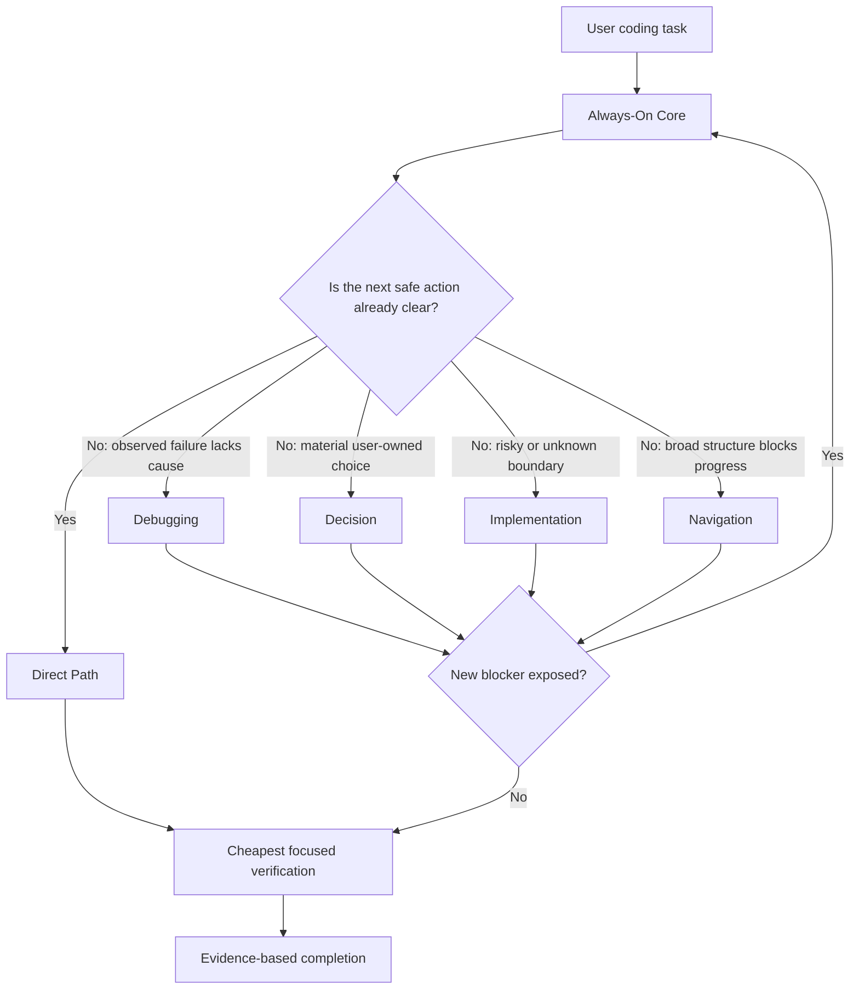

# Practical Coding

<p align="center">
  <a href="LICENSE"></a>
  <a href="https://agentskills.io"></a>
  
  
</p>

<p align="center">
  <b>English</b> · <a href="README_zh.md">简体中文</a>
</p>

> ## The right amount of engineering for every coding task.
>
> **Simple edits stay simple. Unknown bugs get root-cause debugging. Risky changes get rigor. Nothing else gets loaded.**

Practical Coding is a lean, event-driven Agent Skill for coding assistants. It is designed for one recurring problem: a coding agent should not choose between **always being lazy** and **always entering a heavyweight engineering workflow**. It should escalate only when the task actually contains uncertainty or risk.

```bash
npx skills@latest add Hubujiu/practical-coding
```

## Why this exists

Coding agents tend to fail in two opposite ways:

- **Over-engineering:** a tiny edit becomes abstractions, wrappers, speculative tests, extra files, and long explanations.
- **Process overkill:** every task is forced through brainstorming, planning, TDD, reviews, and subagents even when the next safe edit is obvious.
- **Under-engineering:** forcing minimalism everywhere can be too weak for unknown root causes, migrations, authorization, persistence, concurrency, or compatibility boundaries.

Practical Coding makes **rigor conditional**.

| Situation | Practical Coding behavior |
|---|---|
| Rename, CSS tweak, established local pattern | **Direct Path** — edit immediately, no module, no worker |
| Bug with unknown cause | Load **Debugging** only |
| Real unresolved architecture/dependency choice | Load **Decision** only |
| Security, migration, persistence, concurrency, compatibility risk | Load **Implementation** only |
| Broad structural navigation is itself the blocker | Load **Navigation** only |

The invariant is simple: **stay Direct until an unresolved event makes Direct unsafe.**

---

## Why not just install Ponytail + Superpowers together?

Practical Coding is influenced by both projects, but it is **not a concatenation of their prompts**.

Ponytail's current Skill is intentionally broad: it says to use Ponytail on **any coding task**, keeps it active across responses, and optimizes for the laziest solution that actually works. Superpowers is intentionally broad in a different direction: its `using-superpowers` Skill requires relevant skill invocation **before any response or action**, and its documented default workflow moves from brainstorming/specification into planning, TDD, and subagent-driven development.

Installing both gives the agent two useful philosophies, but it does not create a shared control plane that decides which philosophy should dominate a particular moment.

| Question | Ponytail | Superpowers | Ponytail + Superpowers | Practical Coding |
|---|---|---|---|---|
| Default stance | Minimize the solution | Follow applicable engineering process skills | Both broad policies may apply | **Direct unless blocked** |
| Who arbitrates between minimalism and rigor? | Ponytail rules | Superpowers skill priority/workflow | Host/model must reconcile both | **One first-match Event Router** |
| Tiny obvious edit | Minimal implementation | Still begins with skill/process selection | Both instruction sets remain relevant | **No reference, no worker** |
| Unknown bug | Root-cause-minded minimal fix | Systematic debugging workflow | Two overlapping policies | **Debugging module only** |
| High-risk change | Do not simplify away safety | Full engineering rigor | Useful, but separately triggered | **Implementation module only when the risk exists** |
| Context footprint | One always-active coding philosophy | Multiple composable process skills | Two independent systems | **One short core + at most one routed module** |
| Delegation | Not the core abstraction | Subagent-driven development is a major workflow | Superpowers still owns delegation behavior | **Worker only when avoided context exceeds handoff cost** |

### The actual difference is orchestration

Practical Coding adds a layer that neither project provides simply by being installed beside the other:

1. **A Direct Path is a first-class route, not a weaker workflow.** If the next safe action is already known, nothing else is loaded.
2. **Escalation is event-driven.** A bug does not imply architecture work; a migration does not imply a Decision if the policy is already fixed.
3. **Exactly one module is loaded at a time.** Resolve the current blocker, then route again only if a new blocker appears.
4. **Rigor is bounded by the reason it was invoked.** Debugging finds an evidenced cause; Implementation maps the risky invariant; Decision resolves a material choice.
5. **Delegation has an economic gate.** Subagents are used only when isolation saves more context or unlocks enough parallelism to justify startup and handoff cost.
6. **Optional code intelligence is also routed.** AST/LSP graph tooling is not a permanent prompt tax.

So the product is better described as:

> **Ponytail-like pragmatism + Superpowers-like rigor, governed by a new adaptive routing policy.**

Not:

> `ponytail.md + superpowers.md` pasted together.

### Important evidence boundary

The v1.0 benchmark compares Practical Coding with Ponytail and Superpowers **as separate specialist comparators**. It does **not** yet contain a `Ponytail + Superpowers` combined-install arm. Therefore this repository does not claim that combined-install superiority has already been experimentally proven.

That exact stack is now part of the next validation plan. Until it is measured, the argument above is an **architectural difference**, while the benchmark claims below remain limited to the tested head-to-head suites.

---

## How it works



### Always-On Core

The resident `SKILL.md` is intentionally small. It enforces the common rules that should hold regardless of route:

- read the real code touched before editing;
- stop at the first rung that works: do nothing → reuse → stdlib → native platform → installed dependency → one line → minimum custom code;
- add no speculative abstractions, options, wrappers, config, tests, fallbacks, or comments;
- preserve unrelated code and existing user changes;
- prefer deletion and boring code;
- run the cheapest focused check once;
- claim only what fresh evidence supports.

### Four on-demand modules

| Module | Trigger | Purpose |
|---|---|---|
| [`decision.md`](references/decision.md) | A material unresolved choice changes the next action | Compare a small set of viable options and converge |
| [`implementation.md`](references/implementation.md) | Security, irreversible effects, persistence, concurrency, compatibility, or unknown cross-boundary invariant | Map the boundary and falsify the risky assumptions |
| [`debugging.md`](references/debugging.md) | An observed failure still lacks an evidenced cause | Reproduce → earliest broken state → one hypothesis → root-cause fix |
| [`navigation.md`](references/navigation.md) | Broad structural navigation independently blocks progress | Choose ordinary source search or optional graph-backed navigation |

### Economic Isolation Gate

A routed module does not automatically mean a subagent. A worker is dispatched only when the context it keeps out of the root conversation, or parallel work it unlocks, clearly exceeds startup and handoff cost. Workers return compact evidence capsules rather than raw transcripts.

---

## Inspirations — adopted ideas, different control policy

Practical Coding deliberately builds on mature open-source work:

- **[DietrichGebert/ponytail](https://github.com/DietrichGebert/ponytail):** YAGNI, stdlib/native-first thinking, deletion over addition, shortest working diffs.
- **[obra/superpowers](https://github.com/obra/superpowers):** systematic root-cause debugging, strong engineering discipline, verification, task isolation.
- **[mattpocock/skills](https://github.com/mattpocock/skills) / [Agent Skills Spec](https://agentskills.io):** progressive disclosure and composable Skill structure.
- **[DeusData/codebase-memory-mcp](https://github.com/DeusData/codebase-memory-mcp):** Tree-sitter/LSP-backed code intelligence.

The differentiator is not ownership of those ideas. It is the **routing contract that decides when each kind of rigor is worth paying for**.

---

## Benchmark evidence — v1.0

The published v1.0 matrix uses `gpt-5.6-luna`, reasoning `medium`, isolated workspaces, pinned comparator commits, deterministic graders where possible, and three repetitions per cell.

| Suite | Practical | Comparator | What the result supports |
|---|---:|---:|---|
| **Debug** | **90.0%** | Superpowers 83.3% | Practical dominated the quality-gated scorecard with `2.311×` relative efficiency in this harness |
| **Explicit security** | **100% safe** | Superpowers 100% safe | Equal observed safety; Practical used materially less input/output/time/tool calls |
| **Decision** | **100%** | grilling 94.4% | Practical led on quality; cost remained a trade-off |
| **Delivery** | 96.3% | **Ponytail 100%** | Ponytail retained the build and LOC lead; Practical was cheaper but did not pass the conservative quality gate |
| **Router** | 95.2% | expected route | Public regression evidence for route selection |
| **Native behavior** | 96.7% | route/load contract | Verifies real Skill discovery and selective reference loading |

These are **role-specific comparisons**, not a universal leaderboard. Delivery uses Ponytail's published task content/scorer through a Codex adapter; Decision and Debug are controlled project comparisons against the relevant behavior of the comparator Skills.

Read the [published v1.0 data](benchmarks/results/v1.0/README.md), the [reproduction guide](benchmarks/REPRODUCING.md), and the [release evaluation](docs/evaluations/2026-08-26-practical-v1-release.md).

---

## Installation

### Recommended

```bash
npx skills@latest add Hubujiu/practical-coding
```

### Manual

Claude Code:

```bash
git clone https://github.com/Hubujiu/practical-coding.git ~/.claude/skills/practical-coding
```

Cursor / Codex / Copilot CLI / Gemini CLI / Antigravity / Goose on macOS/Linux:

```bash
git clone https://github.com/Hubujiu/practical-coding.git ~/.agents/skills/practical-coding
```

Windows PowerShell:

```powershell
git clone https://github.com/Hubujiu/practical-coding.git "$env:USERPROFILE\.agents\skills\practical-coding"
```

Project-local:

```bash
git clone https://github.com/Hubujiu/practical-coding.git .github/skills/practical-coding
```

---

## Optional Codebase Memory

Practical Coding works without extra configuration. For repositories where graph-backed structural navigation is worth testing, create `.practical-coding.yaml`:

```yaml
version: 1
codebase_memory:
  enabled: true
```

When enabled, Navigation can invoke the upstream `codebase-memory-mcp` CLI on demand. If it cannot be launched, Practical Coding falls back to ordinary source search and reports that Codebase Memory was not used.

This is intentionally opt-in: the current navigation ablation does **not** establish a universal repository-size threshold where graphs always win.

---

## Repository structure

```text
practical-coding/
├── SKILL.md
├── AGENTS.md
├── README.md
├── README_zh.md
├── references/
│   ├── decision.md
│   ├── implementation.md
│   ├── debugging.md
│   ├── navigation.md
│   └── delegation.md
├── benchmarks/
│   ├── run.ps1
│   ├── run_benchmarks.py
│   ├── REPRODUCING.md
│   └── results/v1.0/
├── examples/
├── agents/
└── docs/evaluations/
```

## Contributing

If a real coding task exposes over-engineering, a missed escalation, an unnecessary module load, or an unsafe simplification, open an issue or PR with the smallest reproducible case. See [CONTRIBUTING.md](CONTRIBUTING.md).

MIT License. See [THIRD_PARTY_NOTICES.md](THIRD_PARTY_NOTICES.md) for upstream attribution.
