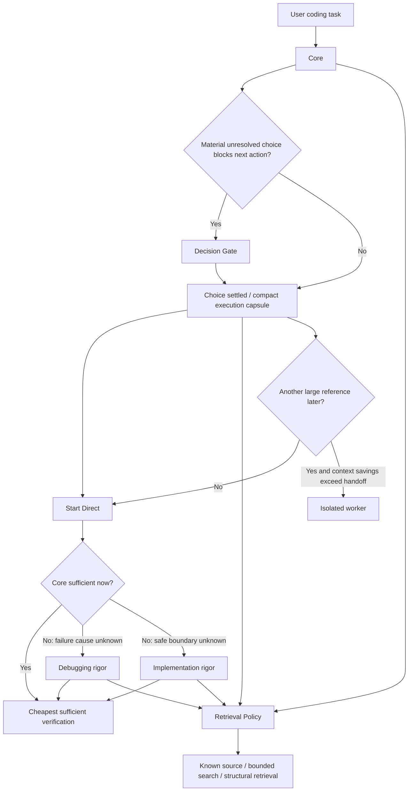

# Practical Coding

<p align="center">
  <a href="LICENSE"></a>
  <a href="https://agentskills.io"></a>
  
  
</p>

<p align="center">
  <b>English</b> · <a href="README_zh.md">简体中文</a>
</p>

> ## The smallest sufficient engineering rigor for every coding task.
>
> **Start cheap. Resolve only choices that block the next action. Add debugging or implementation rigor only when evidence says Direct is insufficient. Retrieve only the context worth paying for.**

Practical Coding is a lean Agent Skill for coding assistants. It is not a four-way task classifier. It is an **adaptive engineering-rigor system** built around four independent controls:

1. **Core** — the minimum rules every coding task needs.
2. **Decision Gate** — resolve a material choice only when it blocks or changes the next safe action.
3. **Execution Escalation** — start Direct; add Debugging or Implementation rigor only for the blocker actually present.
4. **Retrieval + Isolation** — pay only for repository context and extra contexts that materially help.

```bash
npx skills@latest add Hubujiu/practical-coding
```

## v1.3 architecture



The important distinction is:

> **Decision determines what the next action is. Execution rigor determines how much discipline that known action needs. Retrieval determines what code context is worth loading.**

### Core

The resident `SKILL.md` stays route-agnostic:

- define the smallest observable success;
- reuse the nearest established primitive or contract;
- avoid speculative abstractions, options, wrappers, configuration, and scaffolding;
- make the smallest coherent reachable change;
- add tests, validation, fallback, comments, or documentation only for a current requirement, established contract, project rule, or necessary verification;
- run the cheapest focused check once after the final edit;
- claim only what fresh evidence supports.

### Decision Gate

Decision is no longer a peer of Debugging and Implementation.

Ask first:

> **Does a material unresolved choice block or materially change the next safe action?**

If yes, load [`decision.md`](references/decision.md). Resolve repository facts and authoritative constraints before asking the user. Only genuinely user-owned scope, compatibility, cost, preference, or risk choices remain as questions.

If the request, repository, authoritative evidence, or a cheap reversible default already settles the choice, execution starts immediately.

### Execution Escalation

Direct is the default state, not a module.

| Current blocker | Rigor |
|---|---|
| The next safe action is already known | **Direct — Core only** |
| An observed failure exists but its cause is not evidenced | Core + [`debugging.md`](references/debugging.md) |
| Safe execution is blocked by an unknown contract/invariant, unresolved material risk boundary, or insufficient evidence for a risky claim | Core + [`implementation.md`](references/implementation.md) |

Debugging and Implementation are **alternative escalation profiles**, not `Direct → Debugging → Implementation` stages.

A diagnosed bug may be Direct. A one-line persistence or permission edit may need Implementation rigor. A large multi-file edit may still be Direct when the contract, affected surface, and sufficient check are already established.

### Retrieval Policy

Retrieval remains orthogonal to reasoning rigor:

1. current context / known source;
2. bounded or ranked source discovery;
3. structural index only when relationship-heavy exploration materially benefits;
4. current-source verification for material claims.

Host-native search, FFF-style ranked retrieval, ordinary `rg`/filename/symbol search, and [`DeusData/codebase-memory-mcp`](https://github.com/DeusData/codebase-memory-mcp) are capabilities, not project requirements. Missing stronger tooling falls back without changing project configuration solely for retrieval.

`references/navigation.md` is loaded only for substantial broad retrieval.

### Retrieval is scored as a cost interval

v1.2 exposed an important benchmark flaw: an exact label can punish a reasonable search that is only one cheap rung broader. The v1.3 benchmark therefore separates:

- **minimum sufficient retrieval**, and
- **maximum reasonable retrieval cost**.

For example, a known concept whose exact file is not available may reasonably use either a targeted read or bounded search. Structural exploration remains excessive unless the task actually needs relationships.

### Context isolation

A prompt cannot unload a reference that is already in model context. Therefore "return to Direct" is a logical state transition, not a context reset.

The root keeps the Core plus at most one large reasoning reference at a time. If Decision is already resident and execution later needs a different substantial profile, or broad mapping would add large context, use an isolated worker only when the saved context exceeds handoff cost. Workers receive a compact capsule of settled choices, verified facts, scope, repository state, and success conditions.

---

## Benchmark contract in v1.3

The old v1.2 classifier:

```text
REASONING = NONE | DECISION | DEBUGGING | IMPLEMENTATION
RETRIEVAL = NONE | TARGETED | BOUNDED | STRUCTURAL
```

is replaced by:

```text
DECISION  = CLEAR | REQUIRED
EXECUTION = BLOCKED | DIRECT | DEBUGGING | IMPLEMENTATION
RETRIEVAL = minimum sufficient .. maximum reasonable
```

Invariant:

```text
DECISION=REQUIRED  => EXECUTION=BLOCKED
DECISION=CLEAR     => EXECUTION in DIRECT | DEBUGGING | IMPLEMENTATION
```

Four explicit transition regressions are added:

- Decision → Direct
- Decision → Implementation
- Debugging → Direct after diagnosis
- Debugging → Implementation only when diagnosis exposes a still-unresolved material boundary

Native behavior cases also verify that a settled Decision is not reopened and a diagnosed bug does not reload Debugging unnecessarily.

The canonical benchmark runner is now v2.1. `run_benchmarks.py` remains the stable execution core; `case_catalog.py` adds the public case corpus and `adaptive_rigor.py` installs the v1.3 contract. This preserves the ability to interpret the committed v1.2 evidence without pretending the schemas are score-comparable.

---

## Evidence status

No v1.3 model result is claimed before a fresh run.

The last committed validated baseline is v1.2 under [`benchmarks/results/v1.2/`](benchmarks/results/v1.2/):

- reasoning classification: **114/114**;
- Retrieval exact classification: **106/114**;
- Native Behavior: **54/54**;
- Practical-only Delivery/Decision/Debug regression: **75/75**.

Those results validate the v1.2 contract, not the v1.3 adaptive-rigor schema. The v1.3 candidate must rerun the affected Router/Behavior matrix and the current-vs-previous regression before release claims are updated.

The GitHub Releases page currently has the tagged `v1.0.0` release; repository benchmark/Skill versions have advanced independently. The next tagged release should be created only after the v1.3 validation gate is complete.

See [`benchmarks/REPRODUCING.md`](benchmarks/REPRODUCING.md) and [`benchmarks/NEXT_VALIDATION.md`](benchmarks/NEXT_VALIDATION.md).

---

## Why not just install Ponytail + Superpowers?

Practical Coding is influenced by both, but its target is the **control policy** around specialist rigor.

| Situation | Broad co-installed skills | Practical Coding |
|---|---|---|
| Tiny obvious edit | Multiple broad policies may remain applicable | **Core only** |
| Unknown bug | Host/model chooses among overlapping process rules | **Debugging rigor only while cause is unknown** |
| Risky change | Strong engineering rules exist but may be activated broadly | **Implementation rigor only while a material boundary is unresolved** |
| Architecture choice | Can mix implementation reasoning with choice resolution | **Decision blocks execution only when the choice actually changes the next action** |
| Repository discovery | Depends on host behavior | **Explicit cheapest-sufficient retrieval policy** |
| Context growth | Independent references may accumulate | **Core + at most one large reasoning reference at a time** |

This is still a hypothesis about integrated-stack efficiency until the planned combined-install benchmark is run. The repository does not claim universal superiority from specialist pairwise comparisons alone.

---

## Installation

Recommended:

```bash
npx skills@latest add Hubujiu/practical-coding
```

Claude Code:

```bash
git clone https://github.com/Hubujiu/practical-coding.git ~/.claude/skills/practical-coding
```

Cursor / Codex / Copilot CLI / Gemini CLI / Antigravity / Goose on macOS/Linux:

```bash
git clone https://github.com/Hubujiu/practical-coding.git ~/.agents/skills/practical-coding
```

Windows PowerShell:

```powershell
git clone https://github.com/Hubujiu/practical-coding.git "$env:USERPROFILE\.agents\skills\practical-coding"
```

Project-local:

```bash
git clone https://github.com/Hubujiu/practical-coding.git .github/skills/practical-coding
```

## Repository structure

```text
practical-coding/
├── SKILL.md
├── AGENTS.md
├── README.md
├── README_zh.md
├── references/
│   ├── decision.md
│   ├── debugging.md
│   ├── implementation.md
│   ├── navigation.md
│   └── delegation.md
├── benchmarks/
│   ├── run_benchmarks.py
│   ├── case_catalog.py
│   ├── adaptive_rigor.py
│   └── run_catalog.py
├── examples/
├── agents/
└── docs/evaluations/
```

## Inspirations

- [DietrichGebert/ponytail](https://github.com/DietrichGebert/ponytail): YAGNI, native/stdlib-first thinking, deletion over addition.
- [obra/superpowers](https://github.com/obra/superpowers): systematic debugging, engineering rigor, verification, isolation.
- [mattpocock/skills](https://github.com/mattpocock/skills) / [Agent Skills Spec](https://agentskills.io): progressive disclosure and composable Skill structure.
- [dmtrKovalenko/fff](https://github.com/dmtrKovalenko/fff): bounded/ranked code retrieval ideas.
- [DeusData/codebase-memory-mcp](https://github.com/DeusData/codebase-memory-mcp): structural code intelligence and graph-backed relationship queries.

The differentiator is the policy that decides **how much engineering rigor, retrieval, and context are worth paying for now**.

## Contributing

If a real coding task exposes over-engineering, a missed escalation, noisy retrieval, unnecessary context loading, or unsafe simplification, open the smallest reproducible issue or PR. See [CONTRIBUTING.md](CONTRIBUTING.md).

MIT License. See [THIRD_PARTY_NOTICES.md](THIRD_PARTY_NOTICES.md) for applicable upstream attribution.
