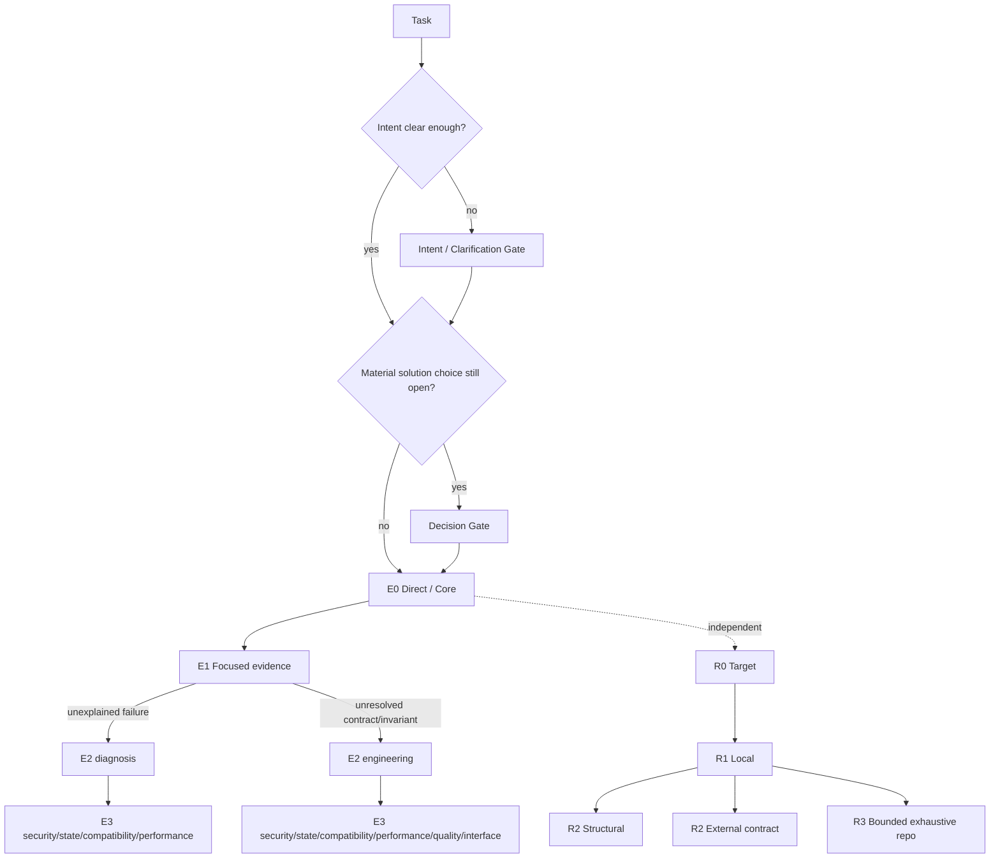

# Practical Coding — Progressive Capability Tree Experiment

> **Experimental branch:** `experiment/progressive-ladders`. The architecture below is a candidate and has not yet earned a release claim.

Practical Coding asks continuously:

> **What is the least questioning, engineering depth, and context needed for the next reliable action?**

The Skill stays Ponytail-like and minimal by default, but now separates four things that should not be conflated: **intent clarification, solution decisions, engineering depth, and problem type**.

## Architecture



No arrow means “always do the next step.” Each gate or branch is entered only when its evidence test fails.

## Intent first: the `grill-me`-style gate

This belongs **before Core and before implementation**.

Use [`references/clarification.md`](references/clarification.md) only when the requested outcome is materially ambiguous and a wrong interpretation would change delivered behavior or cause meaningful rework.

Its discipline is intentionally narrow:

- repository/discoverable facts answer before the user does;
- ask only user-owned intent questions;
- ask one consequential dependent question at a time;
- include a recommended answer and the material trade-off;
- converge as soon as observable success, scope, constraints, and non-goals are clear.

A short request is not automatically vague. Clear tasks should pay **zero clarification overhead**.

This is separate from the **Decision Gate**. Clarification answers **what should be delivered**; Decision answers **which materially different solution to choose once that outcome is understood**.

## Minimal Core

Most tasks should remain E0/E1:

- smallest observable success;
- smallest coherent diff;
- reuse existing project primitives;
- no speculative abstractions, fallbacks, options, validation, tests, or documentation;
- cheapest focused verification;
- preserve unrelated behavior and user changes.

That keeps the default behavior close to Ponytail-style anti-overengineering rather than turning every task into a lifecycle workflow.

## Progressive execution tree

| Depth | Meaning | Loaded context |
|---|---|---|
| **E0 Direct** | target, contract, and check are clear | Core only |
| **E1 Focused** | one bounded evidence step can remove a blocker | Core only |
| **E2 Root** | a real unresolved event needs a structured method | one root: diagnosis **or** engineering |
| **E3 Leaf** | a material specialist guarantee remains | root + one specialist leaf |

The specialist leaves are deliberately narrow: security, persistence/concurrency/state, compatibility/migration, measured performance, structural quality, and interface quality.

This takes the useful part of expert skill packs—concrete trigger, process, exit, verification—without loading their workflows globally. Addy Osmani's progressive-disclosure anatomy, Superpowers' executable procedures, focused SkillsBench expert skills, `grill-me`-style clarification, and design-oriented skills such as taste-skill are inputs to the tree design, not dependencies.

## Retrieval is also a tree

External evidence is not inherently deeper than repository-wide search:

- **R0 Target** — known source;
- **R1 Local** — bounded/ranked search;
- **R2 Structural** — relation/flow lookup;
- **R2 External** — authoritative contract the repository cannot establish;
- **R3 Bounded exhaustive repository** — only for explicit exhaustive claims or failed localization.

The governing rule remains **expand → localize → contract**. Structural tools such as Codebase Memory are optional accelerators, never required dependencies.

## Benchmark-driven tree optimization

Benchmark against:

1. no-skill;
2. accepted prior Practical Coding;
3. candidate adaptive tree;
4. relevant specialist comparators only on families they claim to cover.

Measure not only correctness and cost, but control quality itself:

- unnecessary clarification turns;
- missed material ambiguities;
- minimum-sufficient execution/retrieval depth;
- unnecessary root/leaf loads, missed leaves, branch confusion, and path exactness;
- tokens, time, tool calls, LOC, and quality gates.

If clarification adds interaction without preventing material rework, tighten its trigger. If ambiguous tasks repeatedly fail because execution starts too early, relax it. A leaf that does not show stable net lift over its parent should be tightened, merged, replaced, or deleted.

See [`benchmarks/LADDER_EVOLUTION.md`](benchmarks/LADDER_EVOLUTION.md).

## WikiSkill-style evolution loop

Runtime agents do not read `evolution/`. Maintainers separate raw experience, persistent knowledge, and executable Skill rules:

```text
benchmark runs + real-project experience
                ↓
        evolution/wiki
                ↓
      frozen experiment
                ↓
 no-skill/prior/depth/path validation
          ↙             ↘
       accept           reject
```

Real-project corrections become evidence receipts, not immediate prompt patches. See [`evolution/README.md`](evolution/README.md) and [`evolution/EXPERIENCE_SCHEMA.md`](evolution/EXPERIENCE_SCHEMA.md).

## Runtime reference tree

```text
SKILL.md
references/
├── clarification.md      # intent / requirements gate
├── decision.md           # solution-choice gate
├── debugging.md          # diagnosis root
├── engineering.md        # engineering root
├── navigation.md
├── delegation.md
└── specialists/
    ├── security.md
    ├── state.md
    ├── compatibility.md
    ├── performance.md
    ├── quality.md
    └── interface.md
```

Historical benchmark results remain historical; fresh repeated runs are required before merging this experiment or publishing comparative claims.

MIT License. See `THIRD_PARTY_NOTICES.md` for upstream attribution.