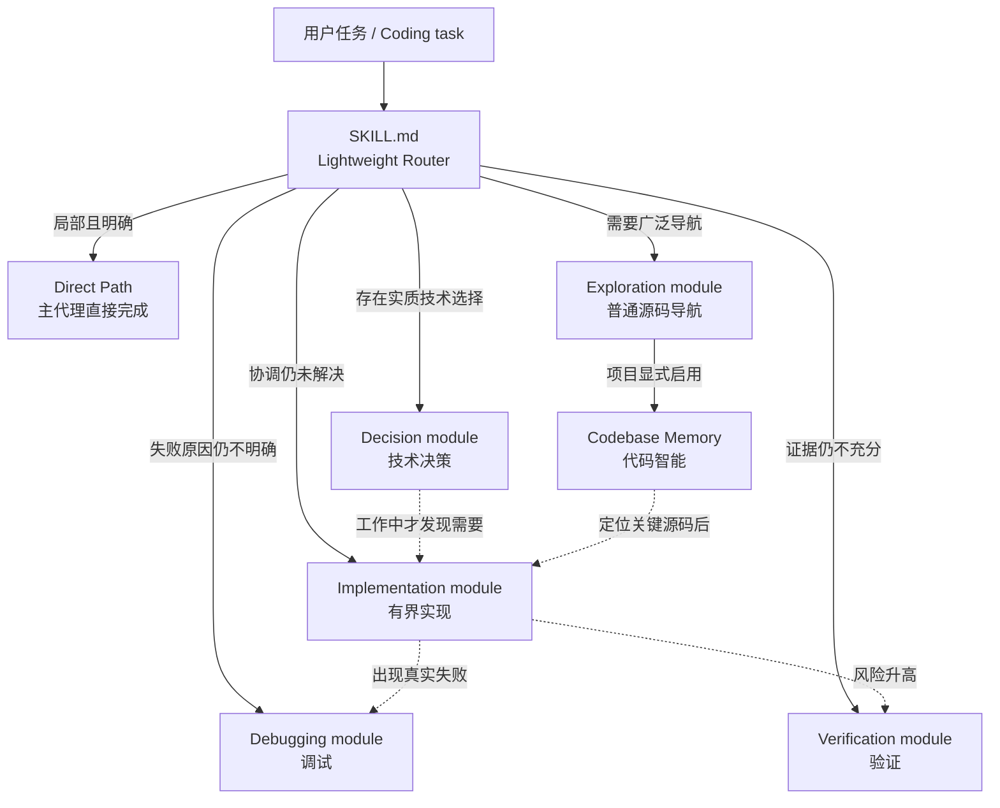
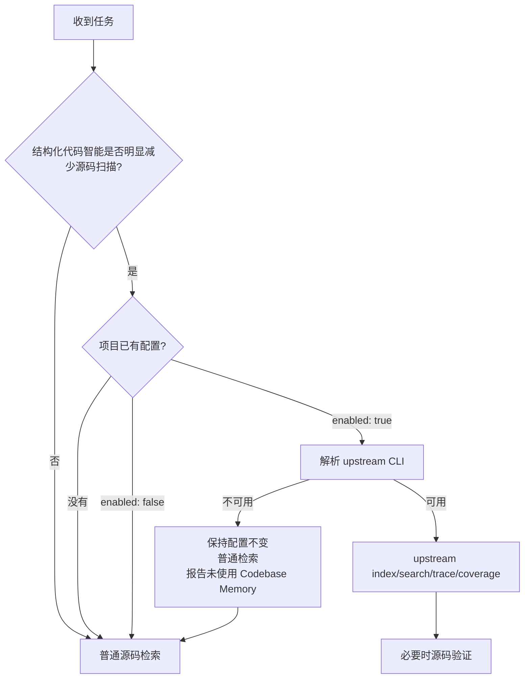

# Practical Coding

> **一个 Skill，按需加载。**  
> **One skill, load only what the task needs.**

Practical Coding 是一个面向 Coding Agent 的轻量通用编码 Skill。它不把 Brainstorming、Planning、TDD、Debugging、Review 和 Git Workflow 串成固定流水线，而是让 `SKILL.md` 作为常驻 Router：简单任务直接执行；未决事件出现时才加载对应工程模块；只有被避免的上下文明显超过启动和交接成本时，才把模块隔离到子代理。

目标：**用最小、完整、可维护的修改解决真实问题，同时减少多余代码、测试、文档、防御性编程、重复源码扫描和流程成本。**

[中文](#中文) · [English](#english)

---

## 中文

### 它解决什么问题

很多 Coding Agent 工作流默认把“先规划 → 再实现 → 强制测试 → Review → Git 流程”全部串起来。大型改造可能需要这些步骤，但对于改一个按钮、修一处样式、定位一个明确 bug，它们会制造额外上下文、文件、测试和流程。

Practical Coding 的做法相反：

- 一个轻量 Router 常驻，通用编码定位不变；
- 工程能力彼此独立；
- 简单任务不加载 reference，也不启动子代理；
- 只有触发事件出现且隔离收益大于交接成本时，才让子代理加载对应规则；
- 任务简单时保持简单，任务复杂时再升级；
- 非平凡能力优先复用成熟实现，不维护已经有成熟方案的缩水平行版本。

### 架构：事件路由 + 隔离模块



> **这不是阶段流水线。** Router 根据运行中尚未解决的事件按需加载模块。只有通过经济门槛时才委派子代理；子代理只读命中的模块并返回简短 capsule。主代理始终负责范围、授权、仓库状态、集成和最终结论。

| 模块 | 何时加载 |
|---|---|
| `references/decision.md` | 聚焦检查后仍存在会改变实现的实质方案选择 |
| `references/implementation.md` | 影响图之后仍有未解决的契约/不变量协调；明确的跨层修改仍走 Direct Path |
| `references/debugging.md` | 已观察到失败，且聚焦检查后原因仍不明确 |
| `references/verification.md` | 项目 gate 和聚焦检查后，关键结论仍缺少充分证据 |
| `references/exploration.md` | 必须广泛扫描时的默认源码导航，返回紧凑影响图 |
| `references/codebase-memory.md` | 同一广泛导航事件，且项目已显式设置 `codebase_memory.enabled: true` |

### 核心原则

- **Mature implementation first**：成熟、维护中的实现优先于自己重写；自定义代码只补成熟实现缺失的边界或已确认缺陷。
- **Reuse before invention**：现有代码 → 标准库/平台原生 → 已安装依赖 → 成熟实现 → 必要的最小补充 → 最后才是完整自研。
- **Smallest coherent change**：追求最小完整修改，而不是最少字符。
- **No defensive bloat**：retry、fallback、wrapper、validation、feature flag 都需要真实边界或风险支撑。
- **Evidence-driven debugging**：证据 → 最早错误状态 → 单一假设 → 根因 → 最小修复。
- **Risk-proportional verification**：测试是证据，不是默认产物。
- **Document reasons, not reconstructable facts**：记录“为什么”，不重复代码、图谱或 Git 已能廉价恢复的事实。
- **Git is evidence, not ceremony**：不强制 branch、worktree、checkpoint、`PLAN.md`。
- **Progressive disclosure**：只有触发条件出现时才加载对应 reference。
- **Context isolation**：只有预计能避免大量上下文或缩短并行关键路径时，才在无历史继承的子代理中运行模块并返回证据 capsule；普通小中型仓库留在主代理。

## Codebase Memory：直接使用成熟 upstream

Practical Coding **不再维护自己的 Python 代码图谱实现**。

当 Codebase Memory 被启用并且当前任务确实受益时，直接使用 MIT 许可的成熟项目 [`DeusData/codebase-memory-mcp`](https://github.com/DeusData/codebase-memory-mcp) 作为唯一图谱后端。

原因很简单：这里的目标是**减少 Agent 重复扫描源码的 token 消耗、提高结构化检索效率和准确率**，不是单纯压缩磁盘占用。Codebase Memory 本身是可选模块，较大的 native runtime 不会进入默认 Skill 上下文，因此没有必要为了“小”而维护一个准确率更低的平行解析器。

上游当前提供的核心能力包括：

- Tree-sitter 多语言 AST 解析；
- major language family 的 Hybrid LSP 语义/类型解析；
- 持久代码知识图谱；
- 增量索引；
- symbol / call path / architecture / impact / code snippet / graph query；
- semantic search 与文本代码搜索；
- `check_index_coverage` 覆盖检查；
- 项目级图谱 mutation coordination；
- macOS / Linux / Windows 原生发行。

Practical Coding 不复制这些能力，不维护第二套 parser、SQLite graph、call resolver、project lock 或 semantic engine。未来 upstream 已经成熟解决的问题，也优先直接使用 upstream。

### 为什么使用 CLI Mode

上游的每个 MCP tool 都可以通过一次性 CLI 调用：

```bash
codebase-memory-mcp cli index_repository '{"repo_path":"/path/to/repo"}'
codebase-memory-mcp cli search_graph '{"name_pattern":".*Handler.*","label":"Function"}'
codebase-memory-mcp cli trace_call_path '{"function_name":"main","direction":"both"}'
codebase-memory-mcp cli get_architecture '{}'
```

Practical Coding 默认使用 **CLI Mode**，而不是自动运行 upstream 的 `install`。

这样：

```text
Practical Coding Skill
        ↓ 只有触发 Codebase Memory 时加载 reference
.practical-coding.yaml
        ↓ enabled: true
upstream CLI
        ↓
Tree-sitter + Hybrid LSP + mature graph engine
        ↓
structured evidence
        ↓
source verification when required
```

不会因为启用了代码图谱，就自动把另一套 MCP tool 定义、Skill、hooks 或 agent config 长期塞进 Agent 上下文。

如果用户明确希望全局安装 upstream MCP/daemon/agent integration，那是独立的安装请求，再使用 upstream 官方 `install` 流程。

### 如何解析 upstream CLI

优先使用系统中已经存在的：

```bash
codebase-memory-mcp
```

如果没有，但环境有 `npx`，可以按需使用官方 npm wrapper：

```bash
npx --yes codebase-memory-mcp@latest cli <tool> '<json-arguments>'
```

npm wrapper 会获取、校验并缓存当前平台对应的官方 native runtime。第一次使用可能需要网络；后续仍由 upstream 负责 runtime 维护。

如果当前环境既不能直接执行 upstream binary，也不能使用官方 lazy launcher：

- 不修改项目的 `enabled: true`；
- 本次任务 fallback 到普通源码检索；
- 明确报告 **本次未使用 Codebase Memory**。

不会回退到一个低精度的 Practical Coding 自研图谱。

### Codebase Memory 配置持久化

Codebase Memory 是**项目级可选能力**：

```yaml
version: 1
codebase_memory:
  enabled: true
```

配置文件：

```text
.practical-coding.yaml
```



规则：

- 未配置或 `enabled: false`：默认关闭，使用普通 Exploration，不主动询问；
- 只有用户或项目显式选择后才持久化 `enabled: true`；
- `enabled: true` 表示项目允许在有价值时调用 upstream，不代表每个任务都要跑图谱；
- 环境缺少 binary、Node/npm 或网络不会改变项目偏好；
- upstream 不可用时普通源码检索仍是合法 fallback。

### 图谱证据等级

Practical Coding 采用 upstream 已经形成的 Scout / Verify / Auditor 思路，而不是把任意图谱结果都当作完整事实。

**Scout**：用于快速正向发现。少量窄查询、浅 trace、结论标记为 provisional，不做“全部/没有/完整影响范围/死代码”一类结论。

**Verify（默认）**：用于正常编码任务。结构化定位后读取关键 snippet，并对实际使用到的 evidence paths 调用 `check_index_coverage`；coverage 有 gap 时回到源码补查。

**Auditor**：只用于有明确边界的穷尽审查。先限定 scope，完成相关分页，检查 scope coverage，对所有 gap 回源验证，并明确剩余限制。

对于这些结论：

- “没有其他调用者”；
- “只有这些文件受影响”；
- “这是完整执行路径”；
- “这是死代码”；

不能只看一页 graph query。应先检查 index coverage，再对 gap 做源码 fallback。

### upstream 出现 bug 怎么办

原则不是“upstream 一定正确”，而是“**成熟实现优先，补丁最后才写**”。

顺序：

1. 查最新稳定版；
2. 查 upstream issue / 已合并修复；
3. 有已维护修复就升级或采用；
4. 确实没有时，才在 Practical Coding 加最窄的兼容 shim；
5. 记录 upstream 版本/issue；
6. upstream 修复后删除本地 shim。

不要因为发现一个 upstream bug，就重新维护整套代码图谱。

## 安装

### 一键安装 Skill

```bash
npx skills@latest add Hubujiu/practical-coding
```

Codebase Memory backend 仍然是**按需解析/按需获取**的 upstream 组件，不会因为安装 Practical Coding 就自动修改 MCP、hooks 或其他 Agent 配置。

### 手动安装 Skill

**Codex / Cursor / Copilot CLI / Gemini CLI**

```bash
git clone https://github.com/Hubujiu/practical-coding.git ~/.agents/skills/practical-coding
```

Windows PowerShell：

```powershell
git clone https://github.com/Hubujiu/practical-coding.git "$env:USERPROFILE\.agents\skills\practical-coding"
```

**Claude Code**

```bash
git clone https://github.com/Hubujiu/practical-coding.git ~/.claude/skills/practical-coding
```

### 项目结构

```text
practical-coding/
├── SKILL.md
├── AGENTS.md
├── README.md
├── CONTRIBUTING.md
├── LICENSE
├── THIRD_PARTY_NOTICES.md
├── agents/
│   └── openai.yaml
├── examples/
│   ├── README.md
│   └── practical-coding.yaml
├── references/
│   ├── decision.md
│   ├── implementation.md
│   ├── debugging.md
│   ├── verification.md
│   ├── delegation.md
│   ├── exploration.md
│   └── codebase-memory.md
└── .github/
    └── workflows/
        └── validate.yml
```

### 思想与实现来源

- [Ponytail](https://github.com/DietrichGebert/ponytail)：YAGNI、reuse-first、stdlib/native-first、极小实现。
- [Matt Pocock / skills](https://github.com/mattpocock/skills)：Agent Skills 与 progressive disclosure。
- [Superpowers](https://github.com/obra/superpowers)：完整工程流程的参考，以及 Practical Coding 有意避免的流程强耦合。
- [Codebase Memory](https://github.com/DeusData/codebase-memory-mcp)：Practical Coding 的可选结构化代码智能后端。
- [Agent Skills specification](https://agentskills.io/specification)：Skill 结构与 progressive disclosure。

第三方说明见 [`THIRD_PARTY_NOTICES.md`](THIRD_PARTY_NOTICES.md)。

---

## English

Practical Coding is a compact general-purpose coding skill for coding agents. `SKILL.md` stays as a lightweight router: direct local work loads no extra module, while unresolved decision, exploration, diagnosis, implementation, or verification events load only their focused reference. A module moves to an isolated subagent only when avoided context or parallel critical-path value clearly exceeds startup and handoff cost.

**Goal:** produce the smallest durable change with enough fresh evidence to justify confidence while minimizing unnecessary code, tests, documentation, defensive handling, process, and repeated source exploration.

### Principles

- **Mature implementation first** — prefer a maintained production implementation over rebuilding the same subsystem; custom code closes only concrete gaps or confirmed defects.
- **Smallest coherent change** — optimize for the smallest complete change, not the fewest characters.
- **Evidence-driven debugging** and **risk-proportional verification**.
- **Progressive disclosure** — conditional modules stay out of context until triggered.

### Optional Codebase Memory

Practical Coding no longer ships or maintains a parallel graph parser. When structured code intelligence is enabled and useful, it directly uses MIT-licensed [`DeusData/codebase-memory-mcp`](https://github.com/DeusData/codebase-memory-mcp) as the only Codebase Memory backend.

The larger upstream native runtime is acceptable because this capability is optional and is invoked only when it reduces source scanning, token usage, or structural uncertainty. It does not occupy the default Skill context.

Practical Coding normally uses upstream **CLI mode** rather than automatically installing its MCP/Skill integration:

```bash
codebase-memory-mcp cli index_repository '{"repo_path":"/path/to/repo"}'
codebase-memory-mcp cli search_graph '{"name_pattern":".*Handler.*","label":"Function"}'
codebase-memory-mcp cli trace_call_path '{"function_name":"main","direction":"both"}'
codebase-memory-mcp cli get_architecture '{}'
```

If the executable is not already installed and `npx` is available, an official lazy launcher may be used:

```bash
npx --yes codebase-memory-mcp@latest cli <tool> '<json-arguments>'
```

Do not automatically run `codebase-memory-mcp install`; that command intentionally mutates agent/editor integration config and may install another persistent Skill/MCP surface.

### Persistent project preference

```yaml
version: 1
codebase_memory:
  enabled: true
```

Missing configuration means disabled: use ordinary Exploration without prompting. Persist `enabled: true` only after an explicit user or project choice. Missing runtime/network/package-manager capability does not change an existing preference. If upstream cannot be launched for the current task, use normal source search and explicitly report that Codebase Memory was not used; never fall back to a lower-accuracy local graph implementation.

For exact negative or exhaustive structural claims, use upstream `check_index_coverage` and source fallback for reported coverage gaps. The default evidence tier is Verify; Scout is provisional discovery and Auditor is bounded exhaustive analysis.

### Installation

```bash
npx skills@latest add Hubujiu/practical-coding
```

See [`references/codebase-memory.md`](references/codebase-memory.md) for the full routing, CLI, coverage, and upstream-fallback rules.

### License

See [LICENSE](LICENSE) for Practical Coding and [THIRD_PARTY_NOTICES.md](THIRD_PARTY_NOTICES.md) for upstream Codebase Memory attribution.
