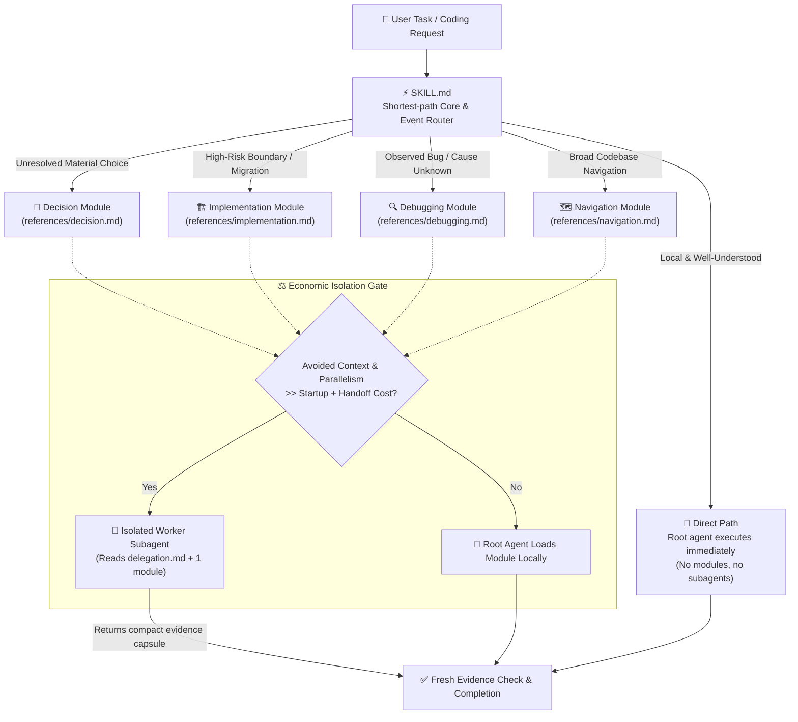

# Practical Coding 🛠️

<p align="center">
  <a href="https://github.com/Hubujiu/practical-coding/blob/main/LICENSE"></a>
  <a href="https://agentskills.io"></a>
  
  
  <a href="https://github.com/Hubujiu/practical-coding/pulls"></a>
</p>

<p align="center">
  🌐 <b>English</b> | <a href="README_zh.md">简体中文</a>
</p>

---

> **One skill. Load only what is needed. Zero unnecessary friction.**  
> Practical Coding is a lean, event-driven universal coding skill for AI coding assistants (Claude Code, Cursor, Copilot CLI, Codex, Antigravity, Goose, and more).  
> The core goal is simple: **Make AI code like a pragmatic senior engineer — eliminate over-engineering, skip bureaucratic process ceremony, write minimal correct code, and verify with fresh evidence.**

---

### 📊 Benchmark Highlights & Comparative Results (v2.1 Evaluation Suite)

In reproducible evaluations on `gpt-5.6-luna`, capabilities are tested against top specialist skills in each category rather than a manufactured universal leaderboard:

| Dimension / Suite | Practical Coding | Comparator | What the result says |
|---|---:|---:|---|
| **Debug Root-Cause** (30 cells) | **90.0%** | Superpowers 83.3% | **2.31× relative efficiency**; less than half the median time and tool calls. |
| **Explicit Security** (12 cells) | **100% safe** | Superpowers 100% safe | Equal observed safety with ~56% fewer input tokens and ~54% less execution time. |
| **Architecture / Decision** (18 cells) | **100%** | grilling 94.4% | Cleaner pragmatic solutions with lower output token cost and faster turnaround. |
| **Direct Route Rate** (30 cells) | **96.7%** | — | Vast majority of everyday tasks execute directly without loading unneeded references or spawning subagents. |
| **Delivery Suite** (27 cells) | 96.3% | **Ponytail 100%** | **Note**: Ponytail's lead on its own delivery/template benchmark stems from hardcoded prompt rules tailored specifically to those benchmark cases (e.g. prompt rules explicitly naming `<input type="date">`, `@lru_cache`, `PCA9685`, etc.). **Practical Coding avoids benchmark-specific prompt overfitting (Zero Overfitting)** to preserve true generalist capabilities, still achieving 96.3% pass rate while using fewer tokens and less time. |

> 📖 See [Published Data](benchmarks/results/v2.1/README.md) · [Reproduction Guide](benchmarks/REPRODUCING.md) · [Full Release Evaluation](docs/evaluations/2026-08-26-practical-v21-release.md)

---

## 📑 Table of Contents

- [The Problems We Solve](#-the-problems-we-solve)
- [Core Philosophy: Think Like a Pragmatic Senior Dev](#-core-philosophy-think-like-a-pragmatic-senior-dev)
- [Inspirations & Lineage (The Synthesis of Giants)](#-inspirations--lineage-the-synthesis-of-giants)
- [Architecture & How It Works](#-architecture--how-it-works)
  - [The Always-On Core](#1-the-always-on-core)
  - [The Direct Path](#2-the-direct-path)
  - [The 4 On-Demand Modules](#3-the-4-on-demand-modules)
  - [Economic Subagent Isolation Gate](#4-economic-subagent-isolation-gate)
  - [Optional Codebase Memory (AST & LSP Intelligence)](#5-optional-codebase-memory-ast--lsp-intelligence)
- [Quick Start & Installation](#-quick-start--installation)
- [Project Configuration](#-project-configuration)
- [Repository Structure](#-repository-structure)
- [Luna Benchmarks Methodology](#-luna-benchmarks-methodology)
- [Contributing & License](#-contributing--license)

---

## ⚡ The Problems We Solve

Anyone using AI coding assistants regularly has encountered these frustrating extremes:

1. 🤦‍♂️ **The AI Bloat Trap (Over-Engineering)**  
   Ask for a single CSS fix or an added parameter, and the AI produces three layers of abstract factories, five wrappers, defensive retry/fallback logic, and 200 lines of boilerplate mock tests.
2. 🎪 **The Process Ceremony Tax**  
   Heavy multi-stage frameworks force *every single edit* through a rigid sequential assembly line (*Brainstorm → Architecture RFC → TDD Test Suite → Code Review → Git Ceremony*), burning hundreds of thousands of tokens and minutes of latency for trivial tweaks.
3. 🩹 **Band-Aid "Try/Catch" Debugging**  
   Faced with an error, unconstrained models often wrap code in broad `try...catch` blocks or inject downstream fallbacks instead of finding and fixing the root cause.
4. 🤖 **Subagent Sprawl**  
   Spawning multiple subagents that chat back and forth, blowing up context limits, and stepping on each other's changes.

### Comparison

| Scenario / Task | Rigid Pipeline Frameworks | Naive / Unconstrained LLMs | 🚀 Practical Coding |
|---|---|---|---|
| **Simple / Local Edits** *(e.g. fix CSS, rename var)* | Heavy multi-step ceremony; burns tokens on unneeded plans & tests | Fast, but risks touching unrelated files | **Direct Path**: Zero extra references, zero subagent overhead, surgical immediate edits |
| **Complex / Risky Features** | Rigid pipeline overhead across every single step | Hallucinates architecture or misses critical boundaries | **Event-Driven Router**: Loads specialized guidance only when an unresolved choice or material risk occurs |
| **Bug Diagnosis** | Often writes boilerplate test suites before finding the bug | Patches downstream symptoms with `try/catch` hacks | **Evidence-First**: Reproduce → Earliest broken state → Single hypothesis → Root cause fix |
| **Subagent Workers** | Arbitrary subagent proliferation & pipeline chains | Single-context overload | **Economic Isolation Gate**: Dispatches workers only when avoided context clearly exceeds handoff cost |
| **Reusing Solutions** | Reinvents wheels or creates complex custom wrappers | Generates subpar custom code for solved problems | **The Ladder**: Existing code > Stdlib > Native platform > Installed deps > Minimum custom code |
| **Code Intelligence** | Dumps full repo scans into context | Repeated slow grep/find across huge repos | **Non-Intrusive CLI**: One-shot AST / LSP queries via `codebase-memory-mcp` with zero permanent prompt pollution |

---

## 🧠 Core Philosophy: Think Like a Pragmatic Senior Dev

Practical Coding encodes the proven habits of experienced engineers into actionable rules:

### 🪜 The Ladder
Whenever solving a problem, stop at the highest rung that holds:
1. **Does not need to exist** (YAGNI — is this truly necessary?)
2. **Already exists in this codebase** (reuse it directly)
3. **Provided by the language Standard Library** (prefer standard solutions)
4. **Native platform / runtime capability** (browser or OS native APIs, CSS features, DB constraints)
5. **Already installed third-party dependencies**
6. **A clean single line of code**
7. **Write the absolute minimum custom code**

### 🎯 Pragmatic Iron Rules
- **Read First, Then Be Lazy**: Understand the real code touched. Never add speculative extras just because a familiar feature name sounds fancy.
- **Deletion Over Addition**: Deletion is better than addition. Boring code beats clever hacks. Fewer files and shorter diffs are always preferred.
- **Untouched Scope**: Never touch unrelated files or unprompted formatting. Preserve existing user modifications.
- **Evidence-Based Delivery**: Run the cheapest targeted verification (build/test) once. Base completion claims strictly on fresh execution evidence.

---

## 💡 Inspirations & Lineage (The Synthesis of Giants)

Practical Coding synthesizes the best paradigms from top open-source agent methodologies:

```text
               ┌─────────────────────────────────────────────────────────┐
               │              DietrichGebert/ponytail                    │
               │   "Laziest Senior Dev" Pragmatism, YAGNI, Stdlib-First  │
               └────────────────────────────┬────────────────────────────┘
                                            │ (Pragmatic Philosophy)
                                            ▼
┌───────────────────────────┐      ┌─────────────────┐      ┌─────────────────────────────┐
│      obra/superpowers     │      │                 │      │      Agent Skills Spec      │
│  Engineering Rigor, TDD,  │─────►│ PRACTICAL CODING│◄─────│    (mattpocock / Anthropic) │
│  Delegation & Verification│      │                 │      │    Progressive Disclosure   │
└───────────────────────────┘      └────────┬────────┘      └─────────────────────────────┘
  (Decoupled from rigid pipeline)           │ (Structured Graph)
                                            ▼
               ┌─────────────────────────────────────────────────────────┐
               │             DeusData/codebase-memory-mcp                │
               │    Tree-sitter AST, Hybrid LSP, CLI-mode Intelligence   │
               └─────────────────────────────────────────────────────────┘
```

### 1. 🦄 [DietrichGebert/ponytail](https://github.com/DietrichGebert/ponytail) — *The Pragmatic Senior Dev Mindset*
- **What we adopted**: The ruthless **YAGNI** principle, the **Ladder**, deletion over addition, shortest working diffs, and terse delivery prose.
- **How Practical differs**: Ponytail relies on host-specific hooks/plugins to store runtime intensity state. Practical Coding remains an ultra-portable Agent Skill: task events alone decide whether to stay Direct or load an engineering module.

### 2. ⚡ [obra/superpowers](https://github.com/obra/superpowers) — *Disciplined Engineering Capabilities*
- **What we adopted**: Systematic root-cause debugging, risk verification gates, and isolated subagent task contracts.
- **How we evolved it**: We **unchained** these capabilities from mandatory linear pipelines. Trivial tasks no longer suffer through mandatory brainstorming/TDD ceremony; capabilities are loaded **only when an unresolved event occurs**.

### 3. 📦 [mattpocock/skills](https://github.com/mattpocock/skills) & [Agent Skills Spec](https://agentskills.io) — *Progressive Disclosure*
- **What we adopted**: Ultra-lean entry footprint. [`SKILL.md`](SKILL.md) remains a ~50-line resident router; deep reference modules are read only when routed.

### 4. 🧠 [DeusData/codebase-memory-mcp](https://github.com/DeusData/codebase-memory-mcp) — *Zero-Bloat Code Intelligence*
- **What we adopted**: Industrial-grade Tree-sitter AST parsing, Hybrid LSP semantic resolution, and persistent code graphs.
- **How we evolved it**: Instead of permanently injecting heavy MCP server tools into the agent's system prompt (wasting 1,000+ tokens per turn), Practical Coding invokes upstream via **one-shot CLI mode** only when navigation value justifies it.

---

## 🏗️ Architecture & How It Works

Practical Coding is an **Event-Driven Router** backed by an **Always-On Core**:



### 1. The Always-On Core
Defined in [`SKILL.md`](SKILL.md) in ~50 lines. It serves as the minimum fixed cost for coding tasks:
1. **Define Success First**: Understand the requested outcome and real code touched before editing.
2. **Follow the Ladder**: Stop at the first rung that works.
3. **Thinnest Adapters**: Reuse existing APIs; do not invent speculative domain models.
4. **Traceable Value**: Validation, fallback, retry, config, tests, or comments must trace to a real requirement or observed risk.
5. **Smallest Complete Change**: Deletion over addition, boring over clever, fewest files, shortest working diff.
6. **Fresh Evidence Delivery**: Run the cheapest targeted check once before claiming completion.

### 2. The Direct Path
For clear, local edits (fixing CSS, adding a simple parameter, following established repo patterns), the agent **writes the code immediately without loading extra reference docs and without subagents**.

### 3. The 4 On-Demand Modules
When an unresolved engineering obstacle arises, the agent loads exactly **one** matching reference module:

| Module | Triggered When | Output & Behavior |
|---|---|---|
| 🧭 **Decision** [`decision.md`](references/decision.md) | Multiple architecture choices or new dependencies are under consideration | Evaluates $\le 3$ viable options (stdlib/native first); chooses the smallest fitting solution. |
| 🏗️ **Implementation** [`implementation.md`](references/implementation.md) | High-risk boundaries (auth/permissions, payment, data migration, concurrency/transactions, breaking changes) | Bounded change maps, strict invariant checks, and the cheapest falsification ladder. |
| 🔍 **Debugging** [`debugging.md`](references/debugging.md) | Errors, test failures, or regressions with unknown root causes | No guessing: Reproduce → Earliest broken state → Single hypothesis → Root cause fix. |
| 🗺️ **Navigation** [`navigation.md`](references/navigation.md) | Navigating structurally complex or massive repositories | Selects search or AST code graphs to build an impact map. |

### 4. Economic Subagent Isolation Gate

> **The Isolation Rule:**  
> Spawn an isolated worker **only** when the context it avoids (such as noisy search dumps or test logs), or the parallel work it unblocks, **clearly exceeds** startup and handoff overhead. Otherwise, execute locally in the root agent.

#### Worker Protocol ([`references/delegation.md`](references/delegation.md))
- **Focused Scope**: Worker reads `delegation.md` + exactly **one** assigned module.
- **Read-Only by Default**: Decision, Navigation, Debugging, and mapping-only Implementation workers cannot modify code.
- **Sole Writer When Authorized**: An Implementation worker writes only when explicitly assigned implementation, strictly within its assigned directory/files, and must be the sole writer there.
- **Compact Evidence Capsule**: Workers return structured summaries (paths, symbols, diff summaries, test outputs), never raw transcripts or full file contents.

### 5. Optional Codebase Memory (AST & LSP Intelligence)

Practical Coding integrates directly with [`DeusData/codebase-memory-mcp`](https://github.com/DeusData/codebase-memory-mcp) as its structured code intelligence backend.

#### Why One-Shot CLI Mode?
Instead of permanently loading upstream MCP server tools into the agent's system prompt (which wastes 1,000+ tokens on every conversation turn), Practical Coding executes upstream via one-shot CLI commands:

```bash
# Search symbols & call graphs
codebase-memory-mcp cli search_graph '{"name_pattern":".*Handler.*","label":"Function"}'
codebase-memory-mcp cli trace_call_path '{"function_name":"main","direction":"both"}'

# Check architecture & index coverage
codebase-memory-mcp cli get_architecture '{}'
codebase-memory-mcp cli check_index_coverage '{"paths":["src/core.ts"]}'
```

#### CLI Resolution Order
1. Existing `codebase-memory-mcp` binary on `PATH`.
2. Official lazy npm launcher (if `npx` is available):
   ```bash
   npx --yes codebase-memory-mcp@latest cli <tool> '<json-arguments>'
   ```
3. **Graceful Fallback**: If upstream cannot be launched, the agent falls back to standard text exploration and reports that Codebase Memory was not used.

#### Evidence Tiers
- 🔭 **Scout**: Rapid positive discovery. Small limits, shallow traces, marked provisional.
- 🎯 **Verify (Default)**: Normal development. Exact snippets + `check_index_coverage` validation.
- 🔬 **Auditor**: Bounded exhaustive audits. Scope coverage, pagination completion, and fallback source checking for any reported coverage gaps.

---

## 🚀 Quick Start & Installation

### Recommended: One-Command Install via skills CLI

```bash
npx skills@latest add Hubujiu/practical-coding
```

---

### Manual Installation by Platform

#### 🟣 Claude Code
```bash
git clone https://github.com/Hubujiu/practical-coding.git ~/.claude/skills/practical-coding
```

#### 🔵 Cursor / Codex / Copilot CLI / Gemini CLI / Antigravity / Goose

**macOS & Linux:**
```bash
git clone https://github.com/Hubujiu/practical-coding.git ~/.agents/skills/practical-coding
```

**Windows (PowerShell 7):**
```powershell
git clone https://github.com/Hubujiu/practical-coding.git "$env:USERPROFILE\.agents\skills\practical-coding"
```

#### 📁 Project-Level Installation
To install Practical Coding for a specific workspace/repository:
```bash
git clone https://github.com/Hubujiu/practical-coding.git .github/skills/practical-coding
```

---

## ⚙️ Project Configuration

By default, Practical Coding is **zero-config and works out of the box**.

To enable **Codebase Memory (AST / LSP code graphs)** for large repositories, add `.practical-coding.yaml` to your project root:

```yaml
version: 1
codebase_memory:
  enabled: true
```

- `enabled: false` (or file omitted): Uses standard fast source search without dependencies.
- `enabled: true`: Enables on-demand AST/LSP code intelligence during complex navigation.

---

## 📂 Repository Structure

```text
practical-coding/
├── SKILL.md                 # Lean entry point: resident Core & Event Router
├── AGENTS.md                # Agent instruction & module routing guide
├── README.md                # English documentation (this file)
├── README_zh.md             # Simplified Chinese documentation
├── CONTRIBUTING.md          # Contribution guidelines
├── LICENSE                  # MIT License
├── THIRD_PARTY_NOTICES.md   # Attribution for upstream Codebase Memory MCP
├── agents/
│   └── openai.yaml          # Agent configuration profile
├── benchmarks/              # Benchmark suites & reproduction scripts
│   ├── run.ps1              # PowerShell entry point
│   ├── run_benchmarks.py    # Luna isolation, grading, and aggregation
│   ├── test_benchmarks.py   # Harness regression tests
│   └── REPRODUCING.md       # Exact reproduction protocol and evidence boundaries
├── examples/                # Example configurations
└── references/              # 4 on-demand specialized engineering modules
    ├── decision.md          # Architecture & dependency decisions
    ├── implementation.md    # Risk boundaries & bounded changes
    ├── debugging.md         # Evidence-first root-cause diagnosis
    ├── delegation.md        # Worker subagent protocol & capsule return
    └── navigation.md        # Source or graph-backed code navigation
```

---

## 🧪 Luna Benchmarks Methodology

The v2.1 release matrix uses a fixed `gpt-5.6-luna` / `medium` setup, isolated workspaces, pinned comparator commits, deterministic graders, and three repetitions per cell. It measures different capabilities against the relevant specialist rather than manufacturing one universal leaderboard:

- **Delivery**: Reuses Ponytail's published agentic tasks and scorer through a Codex adapter.
- **Decision**: Uses real resumed turns against Matt Pocock's `grilling` Skill.
- **Debug & Explicit Security**: Compares delivered invariants and safety boundaries against Superpowers.
- **Router & Native Behavior**: Verifies Direct Path, route selection, Skill discovery, and on-demand reference loading.
- **Navigation**: Ablates ordinary source search against the optional graph backend on two real repositories.

**Correctness and safety gate cost**: A cheap failure cannot win. Qualified comparisons then report Pareto status and a weighted geometric efficiency index over uncached input, output, model time, and tool calls. Read the committed [`v2.1 data`](benchmarks/results/v2.1/README.md), follow the exact [`reproduction guide`](benchmarks/REPRODUCING.md), or inspect the [`release evaluation`](docs/evaluations/2026-08-26-practical-v21-release.md).

---

## 🤝 Contributing & License

Found edge cases where your AI still over-engineers or gets stuck? Contributions and issues are warmly welcomed! Please read [CONTRIBUTING.md](CONTRIBUTING.md) before submitting.

- **License**: [MIT License](LICENSE) © 2026 Hubujiu
- **Third-Party Attribution**: Special thanks to [`codebase-memory-mcp`](https://github.com/DeusData/codebase-memory-mcp), [`ponytail`](https://github.com/DietrichGebert/ponytail), and [`superpowers`](https://github.com/obra/superpowers) for their groundbreaking work in the open-source agent ecosystem.
