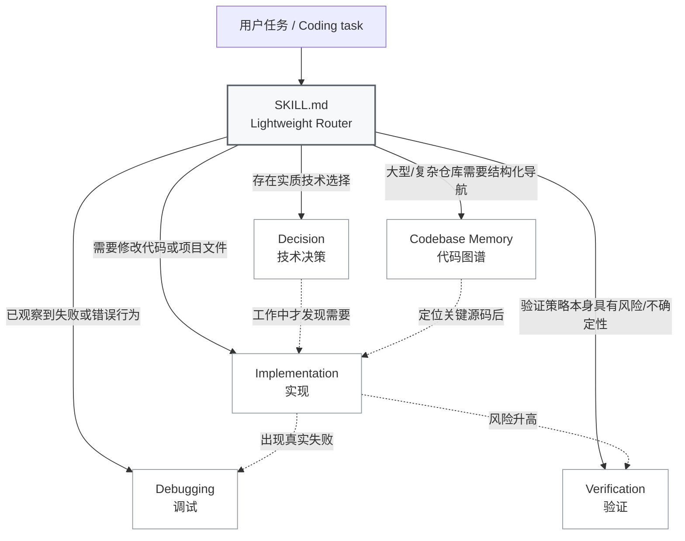
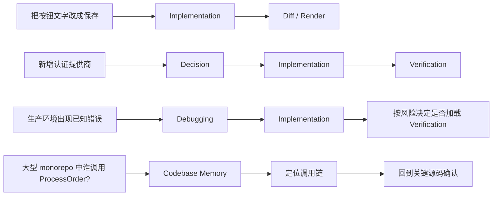
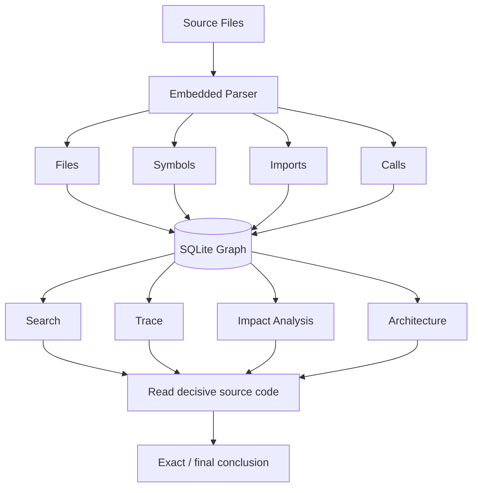
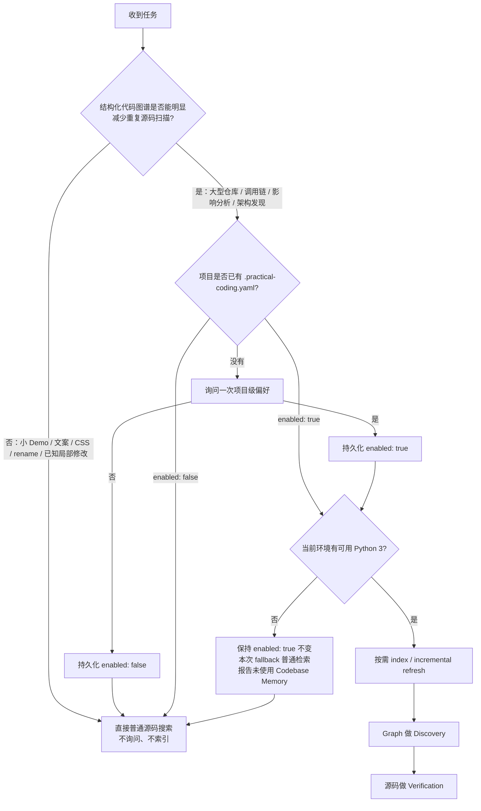
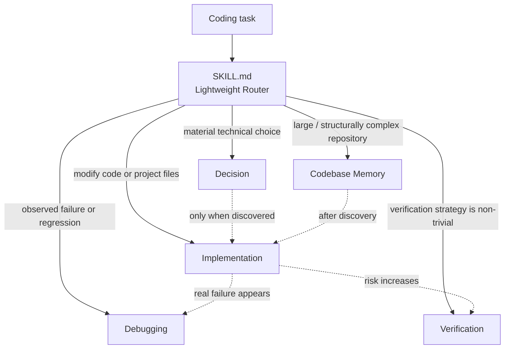

# Practical Coding

> **一个 Skill，按需加载。**  
> **One skill, load only what the task needs.**

Practical Coding 是一个面向 Coding Agent 的轻量通用编码 Skill。它不把 Brainstorming、Planning、TDD、Debugging、Review 和 Git Workflow 串成固定流水线，而是让 `SKILL.md` 作为轻量 Router，只加载当前任务真正需要的工程能力。

目标：**用最小、完整、可维护的修改解决真实问题，同时减少多余代码、测试、文档、防御性编程、重复源码扫描和流程成本。**

[中文](#中文) · [English](#english)

---

## 中文

### 它解决什么问题

很多 Coding Agent 工作流默认把“先规划 → 再实现 → 强制测试 → Review → Git 流程”全部串起来。对于大型改造，这些步骤可能有价值；但对于改一个按钮、修一处样式、定位一个明确 bug，它们会制造额外上下文、文件、测试和流程。

Practical Coding 的做法相反：

- 一个轻量 Router 常驻；
- 工程能力彼此独立；
- 只有触发条件出现时才加载对应规则；
- 任务简单时保持简单，任务复杂时再升级。

### 架构：四个工程模块 + 一个内置代码图谱模块



> **这不是五阶段流水线。** 模块没有固定顺序，也不要求每次全部加载。

| 模块 | 何时加载 |
|---|---|
| `references/decision.md` | 架构、依赖、API、数据模型、兼容性、新能力或多个实质方案需要选择 |
| `references/implementation.md` | 修改代码或项目文件 |
| `references/debugging.md` | 已观察到 bug、回归、错误行为或失败检查 |
| `references/verification.md` | 风险/不确定性使验证策略本身成为工程问题 |
| `references/codebase-memory.md` | 大型/多模块仓库、调用链、影响分析、架构发现、跨模块导航 |

### 同一个 Skill，不同任务走不同路径



### 核心原则

- **Reuse before invention**：现有代码 → 标准库 → 框架原生能力 → 已安装依赖 → 调研成熟方案 → 新依赖 → 最小自研。
- **Smallest coherent change**：追求最小完整修改，而不是最少字符。
- **No defensive bloat**：retry、fallback、wrapper、validation、feature flag 都需要真实边界或风险支撑。
- **Evidence-driven debugging**：证据 → 最早错误状态 → 单一假设 → 根因 → 最小修复。
- **Risk-proportional verification**：测试是证据，不是默认产物。
- **Document reasons, not reconstructable facts**：记录“为什么”，不重复代码、图谱或 Git 已能廉价恢复的事实。
- **Git is evidence, not ceremony**：不强制 branch、worktree、checkpoint、`PLAN.md`。
- **Progressive disclosure**：只有触发条件出现时才加载对应 reference。

## 内置 Codebase Memory

安装 **Practical Coding 本身就已经包含代码图谱能力**。

不需要额外安装：

- `codebase-memory-mcp`
- MCP Server
- WebUI
- daemon / watcher
- semantic model
- 额外数据库服务
- pip package

### Runtime 到底是什么？

这里的 `runtime` 只是 **Skill 附带的辅助程序**，不是另一套 Agent Runtime。

```text
Agent
  ↓ 加载
SKILL.md + references/*.md
  ↓ 只有任务需要图谱时才调用
runtime/codebase_memory.py
  ↓
runtime/_codebase_memory_impl.py
  ↓
SQLite graph
```

真正决定“要不要使用 Codebase Memory”的是 Agent 已加载的 Skill 指令和项目配置；Python 文件只是执行索引、查询、trace、impact 等具体操作。

因此 `.practical-coding.yaml` 是 **Skill 的项目级路由偏好**。Agent 在调用辅助程序之前读取它；辅助程序本身不需要再实现第二套配置判断。用户如果手工直接执行 `runtime/codebase_memory.py`，等于主动绕过 Skill 路由，这是合理的边界。

### Codebase Memory 如何工作



核心纪律是：**Graph 用于 Discovery，源码用于 Verification。**

### 与成熟 `codebase-memory-mcp` 的关系

Practical Coding 参考 MIT 许可的 [DeusData/codebase-memory-mcp](https://github.com/DeusData/codebase-memory-mcp)。当前 upstream 已经是明显更成熟的生产级实现：它使用大规模 Tree-sitter grammar、Hybrid LSP 语义解析、协调 daemon、watcher、项目级 mutation lock 等完整体系。

因此这里不再走“自己不断补正则，追求和 upstream 一样的多语言精度”的路线。能独立、轻量复用的成熟机制直接吸收；依赖整套大型运行时的能力则明确保持边界。

当前从 upstream 思路中吸收并内置的部分：

- 持久 SQLite 图谱；
- graph → source 的证据纪律；
- 增量刷新；
- **统一 always-skip 目录过滤**：无论候选文件来自 `git ls-files` 还是普通目录扫描，都再次过滤依赖、构建产物、缓存等目录；
- **每项目图谱写锁**：多个 Agent 同时索引同一个项目时，只有一个 writer 修改图谱，避免 SQLite writer race。

仍然不搬入：

- MCP transport；
- WebUI；
- daemon / watcher；
- semantic embeddings；
- 自动客户端安装；
- upstream 的完整 Tree-sitter / Hybrid LSP parser bundle。

第三方来源和 MIT notice 见 [`THIRD_PARTY_NOTICES.md`](THIRD_PARTY_NOTICES.md)。

### 当前内置能力

```bash
# 建立 / 增量刷新索引
python <skill-root>/runtime/codebase_memory.py --repo <project-root> index

# 查看状态
python <skill-root>/runtime/codebase_memory.py --repo <project-root> status

# 架构概览
python <skill-root>/runtime/codebase_memory.py --repo <project-root> architecture

# 搜索符号
python <skill-root>/runtime/codebase_memory.py --repo <project-root> search ProcessOrder

# 调用链
python <skill-root>/runtime/codebase_memory.py --repo <project-root> trace ProcessOrder --direction both --depth 3

# 当前 Git 改动的影响范围
python <skill-root>/runtime/codebase_memory.py --repo <project-root> impact --git-diff
```

实际执行前会解析可用的 Python 3 命令：优先 `python`，其次 `python3`，Windows 还可以使用 `py -3`。

索引默认放在用户缓存目录，不污染项目工作树：

| 系统 | 默认位置 |
|---|---|
| Linux | `${XDG_CACHE_HOME:-~/.cache}/practical-coding/codebase-memory/` |
| macOS | `~/Library/Caches/practical-coding/codebase-memory/` |
| Windows | `%LOCALAPPDATA%\practical-coding\cache\codebase-memory\` |

每个图谱数据库旁边还会保留一个很小的 advisory lock 文件，用于串行化 `index` writer；只读查询不需要这个锁。

### 解析范围

Python 使用标准库 AST，是内置 helper 中最可靠的解析路径。

helper 还会识别：

- JavaScript / TypeScript / JSX / TSX
- Java / Kotlin
- Go
- Rust
- C / C++
- C#
- PHP
- Ruby
- Vue / Svelte
- Scala
- Swift

这些非 Python 语言目前使用轻量语法抽取，只应视为 **best-effort discovery**。它们不等同于 upstream 的 Tree-sitter + Hybrid LSP 精度，也不再以“继续堆 regex”作为追赶 upstream 的目标。

### Codebase Memory 什么时候启用

Codebase Memory 是**能力内置，但项目级使用可选，而且配置持久化**。



模板：

```yaml
version: 1
codebase_memory:
  enabled: true
```

见 [`examples/practical-coding.yaml`](examples/practical-coding.yaml)。

规则：

- 小 Demo、文案、CSS、rename、已知局部修改：直接跳过，不询问；
- 大型仓库、调用链、影响分析等明显受益时，如果没有配置，只询问一次；
- **用户回答“是”和“否”都持久化**，这样跨 session 才真的不会重复询问；
- `enabled: true` 只表示项目允许按需使用图谱，不代表每个任务都索引；
- `enabled: false` 表示这个项目不使用 Codebase Memory；
- **Python 不可用不会把 `enabled: true` 改成 false**；这是环境能力缺失，不是项目偏好改变；
- 当前环境没有 Python 3 时，本次任务 fallback 为普通源码检索，并在结果中明确说明 **Codebase Memory 未使用**；
- 不自动安装 Python，也不因为图谱不可用而阻塞普通编码任务。

## 安装

### 一键安装

```bash
npx skills@latest add Hubujiu/practical-coding
```

安装 Skill 后，图谱 helper 同时存在，因此无需第二次安装 Codebase Memory。

### 手动安装

**Codex / Cursor / Copilot CLI / Gemini CLI**

```bash
git clone https://github.com/Hubujiu/practical-coding.git ~/.agents/skills/practical-coding
```

Windows PowerShell：

```powershell
git clone https://github.com/Hubujiu/practical-coding.git "$env:USERPROFILE\.agents\skills\practical-coding"
```

**Claude Code**

```bash
git clone https://github.com/Hubujiu/practical-coding.git ~/.claude/skills/practical-coding
```

### 项目结构

```text
practical-coding/
├── SKILL.md
├── AGENTS.md
├── README.md
├── CONTRIBUTING.md
├── LICENSE
├── THIRD_PARTY_NOTICES.md
├── agents/
│   └── openai.yaml
├── examples/
│   ├── README.md
│   └── practical-coding.yaml
├── references/
│   ├── decision.md
│   ├── implementation.md
│   ├── debugging.md
│   ├── verification.md
│   └── codebase-memory.md
├── runtime/
│   ├── README.md
│   ├── codebase_memory.py
│   ├── _codebase_memory_impl.py
│   ├── test_codebase_memory.py
│   ├── test_codebase_memory_incremental.py
│   └── test_codebase_memory_guard.py
└── .github/
    └── workflows/
        └── validate.yml
```

### 思想来源

- [Ponytail](https://github.com/DietrichGebert/ponytail)：YAGNI、reuse-first、stdlib/native-first、极小实现。
- [Matt Pocock / skills](https://github.com/mattpocock/skills)：Agent Skills 与 progressive disclosure。
- [Superpowers](https://github.com/obra/superpowers)：完整工程流程的参考，以及 Practical Coding 有意避免的流程强耦合。
- [Codebase Memory](https://github.com/DeusData/codebase-memory-mcp)：持久结构图谱、调用链、影响分析、增量索引、过滤策略、项目级 mutation locking 和 graph → source evidence discipline。
- [Agent Skills specification](https://agentskills.io/specification)：Skill 结构与 progressive disclosure。

---

## English

Practical Coding is a compact general-purpose coding skill for coding agents. Instead of forcing every task through one fixed engineering pipeline, `SKILL.md` acts as a lightweight router and loads only the capabilities that materially help the current task.

**Goal:** produce the smallest durable change with enough fresh evidence to justify confidence, while minimizing unnecessary code, tests, documentation, dependencies, defensive handling, process, and context usage.

### Architecture



These are independent capabilities, **not mandatory stages**.

### Embedded codebase graph

Installing Practical Coding also installs the graph capability itself. Here, “runtime” means only the bundled helper program, not another agent runtime:

```text
Agent loads SKILL.md + references
        ↓ only when graph navigation is useful
runtime/codebase_memory.py
        ↓
runtime/_codebase_memory_impl.py
        ↓
SQLite graph
```

The Skill reads `.practical-coding.yaml` before deciding whether to invoke the helper. The helper does not duplicate that routing policy; direct manual invocation intentionally bypasses the Skill gate.

There is no required separate `codebase-memory-mcp` installation, MCP registration, WebUI, daemon, network request, API key, or pip dependency.

### Upstream relationship

The design is based on MIT-licensed [DeusData/codebase-memory-mcp](https://github.com/DeusData/codebase-memory-mcp). Upstream is materially stronger as a production code-intelligence engine because it ships a large Tree-sitter grammar set, Hybrid LSP semantic resolution, daemon/watcher coordination, and per-project mutation locking.

Practical Coding does not try to reproduce that parser quality by endlessly expanding regex heuristics. Instead it adopts lightweight mechanisms that fit the bundled helper:

- persistent SQLite graph navigation;
- incremental refresh;
- graph-to-source evidence discipline;
- always-skip directory filtering applied after either Git or filesystem discovery;
- per-project serialization of graph-mutating index writers.

It still omits the upstream MCP server, UI, daemon/watcher, semantic embeddings, client installers, and Tree-sitter/LSP parser bundle. Attribution is recorded in [`THIRD_PARTY_NOTICES.md`](THIRD_PARTY_NOTICES.md).

Python parsing uses the standard-library AST. Other recognized languages use lightweight syntax extraction and are best-effort discovery only.

### Persistent project opt-in

Capability is bundled; project-level usage remains optional and persistent:

```yaml
version: 1
codebase_memory:
  enabled: true
```

When configuration is missing, cheap/local tasks skip the graph silently. If a graph would materially help, ask once and persist either `enabled: true` or `enabled: false` so later sessions do not repeat the project-level question.

When enabled, resolve a Python 3 command (`python`, `python3`, or Windows `py -3`) before using the helper. If Python is unavailable, **keep the persisted preference unchanged**, fall back to normal source search for the current task, and explicitly report that Codebase Memory was not used because no usable Python 3 environment was available. Do not auto-install Python or repeatedly retry in the same task/session.

### Concurrent indexing and filtering

The helper keeps graph databases in the user cache. A small advisory lock beside each database serializes `index` writers for that project; read-only graph operations remain unlocked. Candidate files are also re-filtered against always-skip directories after Git discovery so tracked dependency/build/cache trees do not leak into the graph.

### Installation

```bash
npx skills@latest add Hubujiu/practical-coding
```

That single installation includes both the Skill rules and the embedded graph helper.

### License

See [LICENSE](LICENSE) for Practical Coding and [THIRD_PARTY_NOTICES.md](THIRD_PARTY_NOTICES.md) for upstream Codebase Memory attribution.
