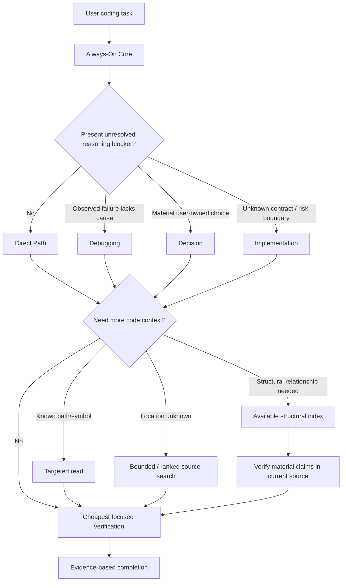

# Practical Coding

<p align="center">
  <a href="LICENSE"></a>
  <a href="https://agentskills.io"></a>
  
  
</p>

<p align="center">
  <b>English</b> · <a href="README_zh.md">简体中文</a>
</p>

> ## The right amount of engineering and context for every coding task.
>
> **Simple work stays direct. Unknown bugs get root-cause debugging. Risky changes get rigor. Code retrieval stops at the cheapest sufficient path.**

Practical Coding is a lean Agent Skill for coding assistants. It controls two costs independently:

1. **Reasoning cost:** only unresolved blockers may load Debugging, Decision, or Implementation.
2. **Context cost:** code discovery progresses from known source to bounded/ranked search to structural indexes only when each stronger rung is actually needed.

```bash
npx skills@latest add Hubujiu/practical-coding
```

## What changes with v1.2

Navigation is no longer a fourth Event Router branch. It is a retrieval policy shared by Direct work and every routed event.

| Situation | Practical Coding behavior |
|---|---|
| Rename, CSS tweak, known local edit | **Direct Path** — Core only |
| Observed bug with unknown cause | Core + **Debugging** |
| Material unresolved architecture/API/dependency choice | Core + **Decision** |
| Unknown contract or unresolved migration, permission, persistence, concurrency, compatibility, or other material risk boundary blocks safe work | Core + **Implementation** |
| Need to locate code | Use the cheapest sufficient retrieval capability; no reasoning route is selected merely because search is needed |
| Broad relationship-heavy mapping | Prefer an already-available structural index when it saves exploration; otherwise fall back to bounded source search |

The main invariant is now:

> **Core + at most one reasoning module; retrieval is orthogonal and capability-based.** Risk-related nouns do not trigger Implementation after the governing boundary, affected surface, and sufficient check are already established.

Legacy `.practical-coding.yaml` files from v1.1 are no longer read by the Skill and can be removed. Retrieval capability is discovered from the current host/environment instead of stored as a project preference.

---

## Architecture



### Always-On Core

The resident `SKILL.md` stays short and route-agnostic:

- define the smallest observable success;
- stop at the first implementation rung that works;
- reuse established project primitives and contracts;
- add no speculative abstractions, options, wrappers, configuration, or scaffolding;
- make the smallest coherent reachable change;
- prefer deletion and boring code;
- add tests, fallback, validation, comments, or documentation only when a current requirement, contract, project rule, or necessary verification requires them;
- run the cheapest focused check once;
- claim only what fresh evidence supports.

### Three reasoning modules

| Module | Trigger | Purpose |
|---|---|---|
| [`debugging.md`](references/debugging.md) | An observed failure still lacks an evidenced cause | Reproduce → earliest broken state → supported cause → root-cause fix |
| [`decision.md`](references/decision.md) | A material user-owned choice remains open and changes the next action | Resolve the smallest real decision frontier |
| [`implementation.md`](references/implementation.md) | Safe execution is blocked by an unknown contract/invariant, material risk boundary, or insufficient evidence for a risky claim | Map the boundary, preserve guarantees, and choose sufficient evidence |

The Event Router chooses only among these three. File count, task nouns, search needs, or the mere existence of another library do not select a reasoning module.

---

## Retrieval: context selection instead of another workflow

Retrieval answers a different question from the Event Router:

> **What is the cheapest way to obtain the code context needed for the current task?**

The ladder is deliberately progressive:

1. **Current context / known target** → read only the known source.
2. **Unknown location** → use an already-available bounded or ranked source-search primitive.
3. **No ranked primitive** → fall back to ordinary filename, text, and symbol search such as host search, `rg`, `grep`, or `find`.
4. **Relationship-heavy question** → use an already-available structural index only when it materially reduces repeated exploration.
5. **Material conclusion** → verify against current source; source is authoritative.

Stop at the first sufficient rung.

### FFF-style retrieval and Codebase Memory are complementary

| Capability | Best at | Role in Practical Coding |
|---|---|---|
| Host-native / FFF-style ranked retrieval | Finding likely files and text candidates with bounded output and ranking signals | Cheap candidate discovery when already available |
| Ordinary `rg` / filename / symbol search | Exact text, names, small repositories, universal fallback | Zero-special-backend fallback |
| [`DeusData/codebase-memory-mcp`](https://github.com/DeusData/codebase-memory-mcp) or another structural index | Callers, callees, imports, implementations, dependency edges, cross-file flow | Optional structural retrieval when already available |

Practical Coding does **not** require `@ff-labs/pi-fff`, FFF, Codebase Memory, `.practical-coding.yaml`, or any persistent graph service. It also does not automatically install retrieval tooling merely because a stronger backend would be convenient. Missing capabilities degrade to the next available rung.

`references/navigation.md` contains the detailed broad-retrieval procedure. Routine targeted lookup does not load it.

---

## Context isolation

A textual instruction such as “return to Direct” cannot remove a reference that is already in the model context. Practical Coding therefore treats context isolation as a real resource decision:

- Direct work and small routed events use no worker.
- The root should normally carry the Core plus at most one reasoning reference.
- Routine source search uses host tools directly without loading Navigation.
- If broad mapping becomes expensive while Debugging, Decision, or Implementation is already resident, a read-only Navigation worker is preferred only when the context saved exceeds handoff cost.
- Workers return compact evidence capsules, not raw search transcripts or graph dumps.

This is how progressive disclosure remains a context optimization rather than only a file-organization convention.

---

## Why not just install Ponytail + Superpowers together?

Practical Coding is influenced by both projects, but its differentiator is the control policy.

| Question | Ponytail + Superpowers | Practical Coding |
|---|---|---|
| Tiny obvious edit | Two broad philosophies remain available to the host/model | **Core only** |
| Unknown bug | Multiple applicable process rules may coexist | **Debugging only** |
| High-risk change | Rigor exists, but selection belongs to separate systems | **Implementation only when the risk boundary is unresolved** |
| Code discovery | Depends on host/tool behavior | **Explicit cheapest-sufficient retrieval ladder** |
| Context footprint | Independent systems may accumulate | **Core + at most one reasoning reference; broad retrieval isolated only when worth it** |

Practical Coding is therefore not `ponytail.md + superpowers.md`. It is an adaptive policy for deciding **how much engineering reasoning and how much repository context are worth paying for now**.

---

## Benchmark evidence

The final v1.2 evidence is published under [`benchmarks/results/v1.2/`](benchmarks/results/v1.2/): reasoning classification passed 114/114, independent Retrieval classification passed 106/114, Native Behavior passed 54/54, and the Practical-only Delivery/Decision/Debug regression passed 75/75. The v1.1 five-route results remain historical evidence and are not score-comparable with the v1.2 two-dimensional Router schema.

The published v1.1 results remain:

| Suite | Practical v1.1 |
|---|---:|
| Delivery | **100% (27/27)** |
| Decision | **100% (18/18)** |
| Debug | **96.7% (29/30)** |
| Router | **100% (114/114)** |
| Native behavior | **100% (54/54)** |
| Applicable total | **99.6% (242/243)** |

See the [v1.1 data](benchmarks/results/v1.1/README.md), [Chinese report](benchmarks/results/v1.1/REPORT_ZH.md), and [reproduction guide](benchmarks/REPRODUCING.md). A fresh v1.2 run is required before publishing new comparative claims.

---

## Installation

Recommended:

```bash
npx skills@latest add Hubujiu/practical-coding
```

Claude Code:

```bash
git clone https://github.com/Hubujiu/practical-coding.git ~/.claude/skills/practical-coding
```

Cursor / Codex / Copilot CLI / Gemini CLI / Antigravity / Goose on macOS/Linux:

```bash
git clone https://github.com/Hubujiu/practical-coding.git ~/.agents/skills/practical-coding
```

Windows PowerShell:

```powershell
git clone https://github.com/Hubujiu/practical-coding.git "$env:USERPROFILE\.agents\skills\practical-coding"
```

Project-local:

```bash
git clone https://github.com/Hubujiu/practical-coding.git .github/skills/practical-coding
```

---

## Repository structure

```text
practical-coding/
├── SKILL.md
├── AGENTS.md
├── README.md
├── README_zh.md
├── references/
│   ├── debugging.md
│   ├── decision.md
│   ├── implementation.md
│   ├── navigation.md
│   └── delegation.md
├── benchmarks/
├── examples/
├── agents/
└── docs/evaluations/
```

## Inspirations

- [DietrichGebert/ponytail](https://github.com/DietrichGebert/ponytail): YAGNI, native/stdlib-first thinking, deletion over addition.
- [obra/superpowers](https://github.com/obra/superpowers): systematic debugging, engineering rigor, verification, isolation.
- [mattpocock/skills](https://github.com/mattpocock/skills) / [Agent Skills Spec](https://agentskills.io): progressive disclosure and composable Skill structure.
- [dmtrKovalenko/fff](https://github.com/dmtrKovalenko/fff): bounded/ranked code retrieval ideas such as frecency-aware candidate discovery.
- [DeusData/codebase-memory-mcp](https://github.com/DeusData/codebase-memory-mcp): structural code intelligence and graph-backed relationship queries.

The differentiator is not ownership of those ideas. It is the policy that decides **when each capability is worth its implementation, retrieval, and context cost**.

## Contributing

If a real coding task exposes over-engineering, a missed escalation, noisy retrieval, unnecessary context loading, or unsafe simplification, open the smallest reproducible issue or PR. See [CONTRIBUTING.md](CONTRIBUTING.md).

MIT License. See [THIRD_PARTY_NOTICES.md](THIRD_PARTY_NOTICES.md) for applicable upstream attribution.
