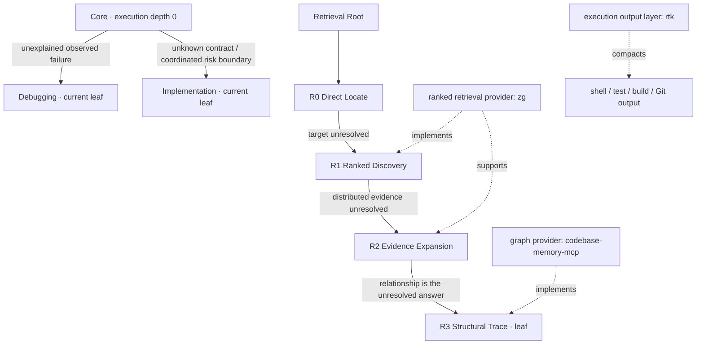

# Practical Coding

Practical Coding is an Agent Skill for producing the smallest reliable coding change without turning every task into a heavyweight workflow.

The active experiment now separates three concerns:

1. an evolvable **execution tree** for engineering depth;
2. an independent progressive **Retrieval tree** for unresolved information problems;
3. a replaceable **capability layer** for ranked search, graph retrieval, and command-output compaction.



Decision and Clarification remain explicit-only manual modes outside both automatic trees.

## Runtime contract

Core applies to every coding task:

- define the smallest observable success;
- reuse established project primitives and contracts;
- add no speculative abstractions, dependencies, configuration, validation, tests, or documentation;
- preserve unrelated behavior and user changes;
- verify with the cheapest check that can falsify the material claim.

Core knows only its immediate automatic execution children:

- [`references/debugging.md`](references/debugging.md) — an observed failure still lacks an evidenced cause;
- [`references/implementation.md`](references/implementation.md) — safe execution is blocked by an unresolved contract, coordinated invariant, material risk boundary, or evidence requirement.

Each loaded node owns only its own next-level router. A node with no benchmark-earned children declares itself a leaf. Automatic routing may deepen to resolve a blocker but must not reopen deliberation.

## Manual modes

- [`references/manual/decision.md`](references/manual/decision.md) loads only when the current user explicitly asks to compare options, select a technology/architecture/dependency/API/data model, or perform decision analysis.
- [`references/manual/clarification.md`](references/manual/clarification.md) loads only when the current user explicitly asks to be interviewed, grilled, questioned, or to clarify requirements before implementation.

No automatic node routes to a manual mode. When a manual request finishes, its settled result returns to Core as input.

## Retrieval tree

Retrieval depth represents **what information remains unresolved**, not which tool is available.

[`references/retrieval/SKILL.md`](references/retrieval/SKILL.md) is the Retrieval root and knows only R0:

| Stage | Question answered | Next escalation |
|---|---|---|
| [`R0 Direct Locate`](references/retrieval/direct.md) | Can a known file, symbol, identifier, or narrow literal establish the target? | Target still unknown → R1 |
| [`R1 Ranked Discovery`](references/retrieval/discovery.md) | Where are the strongest candidates when intent is known but location is not? | Answer needs distributed evidence → R2 |
| [`R2 Evidence Expansion`](references/retrieval/evidence.md) | What is the smallest cross-file evidence set needed for the unresolved claims? | The answer is fundamentally relational → R3 |
| [`R3 Structural Trace`](references/retrieval/structural.md) | What call, dependency, ownership, control/data-flow, or impact relationship establishes the answer? | Leaf; stop when the relationship is proved |

The root does not choose R0–R3 globally. Every node knows only its immediate child and returns as soon as the current claim has enough current-source evidence.

At runtime, providers are optional accelerators and every stage has a bounded source-search fallback. In the dependency-enabled benchmark, concrete providers are mandatory so the experiment measures the intended capability surface rather than a mixture of installed and missing tools.

## Navigation boundary

[`references/navigation.md`](references/navigation.md) answers only: **which bounded repository area should be searched?** It creates a small topology map from module declarations, package metadata, and maintained architecture evidence.

Retrieval answers: **which concrete source evidence resolves the claim?** Navigation does not perform semantic discovery, expand related evidence, or trace graph relationships. Known targets skip Navigation and start at R0.

## Capability and output layers

[`docs/CAPABILITY_LAYER.md`](docs/CAPABILITY_LAYER.md) defines the provider boundary.

The active dependency profile pins and requires:

- `zg` from zvec-grep `0.2.0` for ranked hybrid retrieval at R1/R2;
- `codebase-memory-mcp` `0.10.8` for graph-aware R3 retrieval;
- `rtk` `0.47.0` for compact shell, test, build, and Git output.

These names never become tree nodes. A future provider can replace one without changing Retrieval policy.

Output compaction is cross-cutting infrastructure. It must preserve command semantics, exit status, failures, and material verification evidence. The agent does not route to RTK. A host with a command hook may make this transparent; the Codex benchmark exposes the wrapper through one equal capability note because RTK's Codex integration is instruction-based rather than a hard pre-execution hook, and records whether `rtk` was actually used.

## Dependency-enabled benchmark

The machine-readable profile is [`benchmarks/capability_manifest.json`](benchmarks/capability_manifest.json). Both [`benchmarks/dependency_tree_validation.py`](benchmarks/dependency_tree_validation.py) and [`benchmarks/retrieval_validation.py`](benchmarks/retrieval_validation.py) fail before comparison when any required binary or probe is unavailable. The former preserves the execution-tree ceiling experiment; the latter runs independent `NONE/R0/R1/R2/R3` Retrieval ceilings.

Verify the frozen profile first. The preflight runner enforces the provider-version regular expressions recorded in the manifest and records the observed output:

```powershell
zg --version
codebase-memory-mcp --version
rtk --version
git --version
node --version
npm --version
java -version
mvn --version
```

Install the providers from their maintained upstream distributions before running the model benchmark. The repository does not silently install or substitute them during a measured cell.

### Measurement boundary

Every cell has two phases:

1. **setup, excluded** — versioned provider probes, local model/assets, `zg` indexing plus a first query, Codebase Memory indexing plus daemon warm-up, dependency resolution, first test/build warm-up, and workspace cleanliness checks;
2. **measured execution** — Codex starts only after setup succeeds; transcript tokens, model-visible tool calls, duration, answer quality, and routing trace are collected here.

Setup details are written to each cell's `capability-setup.json` with `included_in_comparison: false`. The setup report contains output byte counts and elapsed time for auditability but no token estimate. Because Codex is not running during setup, those operations cannot enter measured input/output tokens, tool calls, or wall time. Every paired arm receives the same initialized environment.

A measured attempt to run `zg index`, Codebase Memory indexing, `rtk init`, or package installation is a contract violation rather than an accepted cold-start cost.

## Benchmark-driven evolution

The current topology lives in [`benchmarks/tree_topology.json`](benchmarks/tree_topology.json). Cases in [`benchmarks/tree_cases.py`](benchmarks/tree_cases.py) contain no expected automatic execution route or fixed depth.

The benchmark may add, split, merge, promote, collapse, move, or remove nodes when evidence supports the mutation:

- **add/deepen** when a repeatable pre-load signal exists and a child adds stable quality-qualified lift over its parent;
- **merge/move boundary** when nodes are repeatedly ambiguous without net value;
- **promote/collapse** when a child is required for most of its parent's useful scope;
- **remove** when a node has no independent minimum-sufficient or marginal-lift cases;
- **split** when a leaf has a repeated failure cluster with an observable pre-load boundary.

Execution depth and Retrieval depth describe disclosure only. They are not universal task-complexity scores.

## Validation

Deterministic contract checks require no external providers:

```powershell
python benchmarks/dependency_tree_validation.py --self-test
python benchmarks/retrieval_validation.py --self-test
python benchmarks/retrieval_analysis.py /dev/null --self-test
python -m unittest `
  benchmarks.test_tree_benchmarks `
  benchmarks.test_capability_environment `
  benchmarks.test_dependency_tree_validation `
  benchmarks.test_retrieval_analysis
```

A model-backed Retrieval iteration requires every dependency and uses `n=1`:

```powershell
python benchmarks/retrieval_validation.py --current-only --runs 1 --workers 3 `
  --output benchmark-results/retrieval-tree-n1
python benchmarks/retrieval_analysis.py benchmark-results/retrieval-tree-n1/results.jsonl `
  --output benchmark-results/retrieval-tree-n1/analysis.json
```

Run `dependency_tree_validation.py` separately when the execution-tree wording or boundaries also changed. It preserves the Core/Debugging/Implementation ceiling experiment under the same provider and warm-up contract.

After freezing the candidate, run the paired `n=3` Retrieval comparison against no-skill and the v1.5 baseline:

```powershell
python benchmarks/retrieval_validation.py --runs 3 --workers 3 `
  --output benchmark-results/retrieval-tree-final
python benchmarks/retrieval_analysis.py benchmark-results/retrieval-tree-final/results.jsonl `
  --output benchmark-results/retrieval-tree-final/analysis.json
```

For a release candidate that changes both trees, also run:

```powershell
python benchmarks/dependency_tree_validation.py --runs 3 --workers 3 `
  --output benchmark-results/execution-tree-final
python benchmarks/tree_analysis.py benchmark-results/execution-tree-final/results.jsonl `
  --output benchmark-results/execution-tree-final/analysis.json
```

The accepted v1.5 flat Event Router and rejected fixed-depth, specialist-leaf, and execution-state experiments remain historical evidence under `benchmarks/results/` and `evolution/rejected/`. Historical reports are not rewritten to fit the new topology.

MIT License. See [`THIRD_PARTY_NOTICES.md`](THIRD_PARTY_NOTICES.md) for provider attribution.
