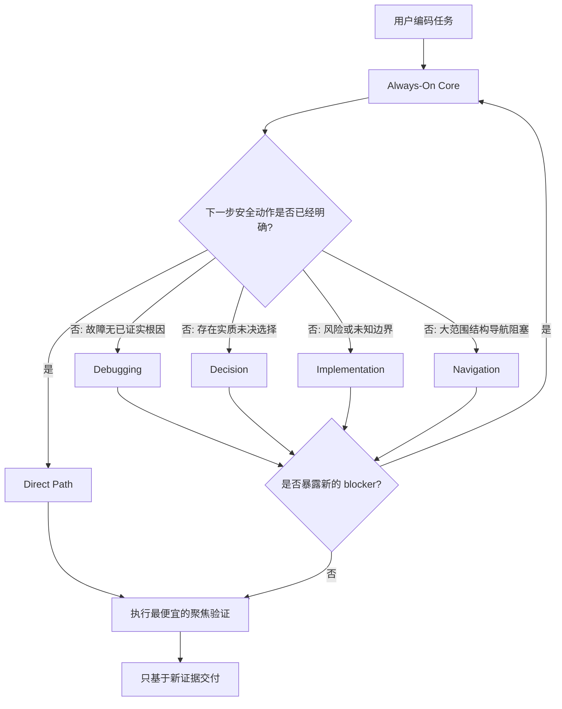

# Practical Coding

<p align="center">
  <a href="LICENSE"></a>
  <a href="https://agentskills.io"></a>
  
  
</p>

<p align="center">
  <a href="README.md">English</a> · <b>简体中文</b>
</p>

> ## 每个编码任务，只使用它真正需要的工程强度。
>
> **简单修改就直接做；未知 Bug 才进入根因调试；高风险修改才升级工程流程；其它东西一律不加载。**

Practical Coding 是一个面向 AI 编码 Agent 的轻量、事件驱动 Skill。它解决的不是“应该永远偷懒”还是“应该永远走完整工程流程”二选一，而是：**只有当前任务真的出现不确定性或风险时，才增加工程强度。**

```bash
npx skills@latest add Hubujiu/practical-coding
```

## 为什么需要它

编码 Agent 常见两种相反的问题：

- **过度工程化：** 一个小修改变成抽象层、wrapper、预防性测试、额外文件和长篇说明。
- **流程过重：** 明明下一步安全且明确，仍然强制走 brainstorming、planning、TDD、review、subagent。
- **过度极简：** 对未知根因、迁移、权限、持久化、并发、兼容性边界仍然一味追求最少代码，反而不够安全。

Practical Coding 的核心是：**工程严谨度按需启用。**

| 当前情况 | Practical Coding 的行为 |
|---|---|
| 改名、CSS、小范围且已有项目模式 | **Direct Path**：直接修改，不加载模块，不启 worker |
| Bug，但根因未知 | 只加载 **Debugging** |
| 真正存在未决架构/依赖选择 | 只加载 **Decision** |
| 安全、迁移、持久化、并发、兼容性风险 | 只加载 **Implementation** |
| 大范围代码结构导航本身成为阻塞 | 只加载 **Navigation** |

核心不变量：**默认 Direct，只有 unresolved event 让 Direct 变得不安全时才升级。**

---

## 为什么不直接同时安装 Ponytail + Superpowers？

Practical Coding 的确吸收了两者的思想，但它**不是把两个提示词拼起来**。

当前 Ponytail 的 Skill 明确要求用于 **任何 coding task**，并跨回复持续生效，目标是寻找真正可用的最懒方案。Superpowers 则从另一个方向覆盖很广：它的 `using-superpowers` 要求在**任何响应或动作前**先调用相关 Skill，官方 README 描述的基础工作流会从需求/brainstorming 进入实现计划、TDD 和 subagent-driven development。

把两者同时装上，相当于给 Agent 两套都有价值、但彼此独立的控制哲学；**它们并不会因为同时存在，就自动产生一个统一的仲裁器。**

| 问题 | Ponytail | Superpowers | Ponytail + Superpowers | Practical Coding |
|---|---|---|---|---|
| 默认倾向 | 尽量最小实现 | 进入适用的工程流程 Skill | 两套宽泛策略可能同时适用 | **默认 Direct** |
| 谁决定“极简还是严谨”？ | Ponytail 自身规则 | Superpowers 的 Skill 优先级/流程 | 交给宿主和模型自行协调 | **单一 first-match Event Router** |
| 很小且明确的修改 | 最小实现 | 仍需先进行 Skill/流程选择 | 两套 instruction 都相关 | **零 reference、零 worker** |
| 未知 Bug | 根因导向的最小修复 | systematic debugging | 两套策略重叠 | **只加载 Debugging** |
| 高风险改动 | 不允许偷掉安全边界 | 完整工程严谨性 | 有价值，但由不同规则分别触发 | **只有真实风险出现才加载 Implementation** |
| 上下文成本 | 一套持续生效的编码哲学 | 多个可组合流程 Skill | 两套独立系统 | **一个短 Core + 最多一个模块** |
| 子代理 | 不是核心抽象 | subagent-driven development 是主要工作流之一 | 主要仍由 Superpowers 决定 | **只有收益大于 handoff 成本才派 worker** |

### 真正新增的是“编排层”

Practical Coding 做了一个“同时安装两者”不会自然得到的控制层：

1. **Direct Path 是正式路径，不是简化版 workflow。** 下一步已经明确，就什么模块都不加载。
2. **按事件升级，而不是按任务名升级。** 有 Bug 不等于要做架构设计；迁移策略已经确定，也不等于还要进入 Decision。
3. **一次只加载一个模块。** 先解决当前 blocker；只有它暴露出新的 blocker 才再次路由。
4. **严谨度只覆盖触发它的边界。** Debugging 负责找已证实根因；Implementation 负责风险 invariant；Decision 负责真正未决选择。
5. **Subagent 有经济门槛。** 只有隔离上下文或并行收益明显大于启动和交接成本才使用。
6. **代码图谱同样按需。** AST/LSP 图谱不是每轮都付出的永久 prompt 税。

因此更准确的定义是：

> **Ponytail 式务实极简 + Superpowers 式工程严谨，由一套新的自适应路由策略统一控制。**

而不是：

> 把 `ponytail.md` 和 `superpowers.md` 拼到一起。

### 证据边界

v1.0 benchmark 当前分别把 Ponytail 和 Superpowers 作为专项 comparator，**还没有测试 `Ponytail + Superpowers` 双装 arm**。因此项目现在不会声称“双装已经被实验证明不如 Practical Coding”。

下一轮验证已经把这个组合加入正式计划。在数据出来之前，上面的优势属于**架构差异**；下面的 benchmark 结论只覆盖真正测过的 head-to-head 场景。

---

## 工作方式



### Always-On Core

常驻 `SKILL.md` 保持很短，只放所有编码任务都应该遵守的规则：

- 修改前先读真正被影响的代码；
- 按阶梯停止：不做 → 复用已有代码 → 标准库 → 原生平台能力 → 已安装依赖 → 一行代码 → 最少自定义代码；
- 不添加推测性的抽象、配置、wrapper、测试、fallback 或注释；
- 不碰无关文件和用户已有修改；
- 删除优于新增，普通代码优于聪明代码；
- 最终只运行一次最便宜、最聚焦的检查；
- 只声明新鲜证据真正支持的内容。

### 四个按需模块

| 模块 | 触发条件 | 目的 |
|---|---|---|
| [`decision.md`](references/decision.md) | 一个实质未决选择会改变下一步 | 比较少量可行方案并收敛 |
| [`implementation.md`](references/implementation.md) | 安全、不可逆操作、持久化、并发、兼容性或未知跨边界 invariant | 映射风险边界并证伪关键假设 |
| [`debugging.md`](references/debugging.md) | 已观察故障仍缺少证据化根因 | 复现 → 最早破坏状态 → 单一假设 → 根因修复 |
| [`navigation.md`](references/navigation.md) | 大范围结构导航本身阻塞任务 | 在普通源码搜索和可选图谱导航之间选择 |

### Economic Isolation Gate

进入模块并不意味着自动创建子代理。只有 worker 能隔离掉的上下文噪声，或带来的并行收益，明显超过启动与 handoff 成本时才派发。Worker 返回紧凑 evidence capsule，而不是把完整日志重新塞回根上下文。

---

## 灵感来源：借鉴思想，但采用不同的控制策略

- **[DietrichGebert/ponytail](https://github.com/DietrichGebert/ponytail)：** YAGNI、stdlib/native-first、删除优先、最短可用 diff。
- **[obra/superpowers](https://github.com/obra/superpowers)：** 系统化根因调试、工程纪律、验证、任务隔离。
- **[mattpocock/skills](https://github.com/mattpocock/skills) / [Agent Skills Spec](https://agentskills.io)：** Progressive Disclosure 与可组合 Skill 结构。
- **[DeusData/codebase-memory-mcp](https://github.com/DeusData/codebase-memory-mcp)：** Tree-sitter/LSP 代码智能。

真正的差异不是“谁发明了这些思想”，而是：**什么情况下值得为哪一种工程能力付出上下文和流程成本。**

---

## v1.0 Benchmark

公开 v1.0 矩阵使用 `gpt-5.6-luna`、`medium` reasoning、隔离工作区、固定 comparator commit、尽可能机械化的 grader，并对每个 cell 重复 3 次。

| Suite | Practical | Comparator | 当前证据支持什么 |
|---|---:|---:|---|
| **Debug** | **90.0%** | Superpowers 83.3% | 在该 harness 下 Practical 通过 quality gate，并达到 `2.311×` 相对效率 |
| **Explicit security** | **100% safe** | Superpowers 100% safe | 观察到的安全性相同，Practical 的输入/输出/时间/tool calls 明显更低 |
| **Decision** | **100%** | grilling 94.4% | Practical 在质量上领先，成本仍是 trade-off |
| **Delivery** | 96.3% | **Ponytail 100%** | Ponytail 保持 build 与 LOC 优势；Practical 更便宜，但未通过保守质量门槛 |
| **Router** | 95.2% | expected route | 路由分类公开回归证据 |
| **Native behavior** | 96.7% | route/load contract | 验证真实 Skill 发现和按需 reference 加载 |

这些结果是**按角色划分的专项比较**，不是把不同任务合成一个“宇宙总榜”。

查看 [v1.0 数据](benchmarks/results/v1.0/README.md)、[复现指南](benchmarks/REPRODUCING.md) 和 [发布评估](docs/evaluations/2026-08-26-practical-v1-release.md)。

---

## 安装

推荐：

```bash
npx skills@latest add Hubujiu/practical-coding
```

Claude Code：

```bash
git clone https://github.com/Hubujiu/practical-coding.git ~/.claude/skills/practical-coding
```

Cursor / Codex / Copilot CLI / Gemini CLI / Antigravity / Goose（macOS/Linux）：

```bash
git clone https://github.com/Hubujiu/practical-coding.git ~/.agents/skills/practical-coding
```

Windows PowerShell：

```powershell
git clone https://github.com/Hubujiu/practical-coding.git "$env:USERPROFILE\.agents\skills\practical-coding"
```

项目级安装：

```bash
git clone https://github.com/Hubujiu/practical-coding.git .github/skills/practical-coding
```

---

## 可选 Codebase Memory

默认零配置即可使用。只有希望测试图谱导航的大型/复杂仓库才需要 `.practical-coding.yaml`：

```yaml
version: 1
codebase_memory:
  enabled: true
```

启用后，Navigation 可以按需调用上游 `codebase-memory-mcp` CLI。如果无法启动，会回退普通源码检索并明确报告没有使用 Codebase Memory。

当前导航 ablation **没有证明一个通用的“多少文件以上图谱一定更好”的阈值**，因此保持 opt-in。

---

## 仓库结构

```text
practical-coding/
├── SKILL.md
├── AGENTS.md
├── README.md
├── README_zh.md
├── references/
│   ├── decision.md
│   ├── implementation.md
│   ├── debugging.md
│   ├── navigation.md
│   └── delegation.md
├── benchmarks/
│   ├── run.ps1
│   ├── run_benchmarks.py
│   ├── REPRODUCING.md
│   └── results/v1.0/
├── examples/
├── agents/
└── docs/evaluations/
```

## 贡献

如果真实任务暴露出过度工程、漏升级、无意义模块加载或不安全的极简化，欢迎提交最小可复现 issue/PR。详见 [CONTRIBUTING.md](CONTRIBUTING.md)。

MIT License。第三方致谢见 [THIRD_PARTY_NOTICES.md](THIRD_PARTY_NOTICES.md)。
