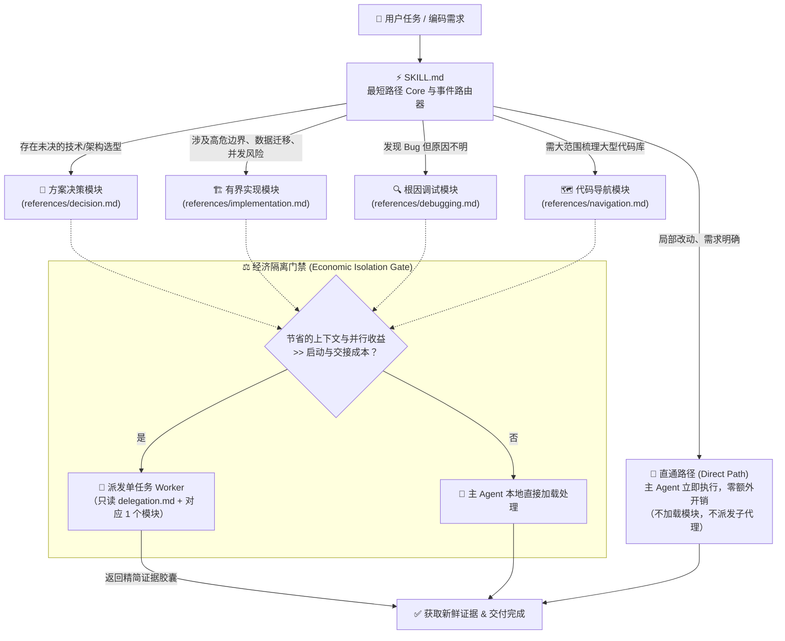

# Practical Coding 🛠️

<p align="center">
  <a href="https://github.com/Hubujiu/practical-coding/blob/main/LICENSE"></a>
  <a href="https://agentskills.io"></a>
  
  
  <a href="https://github.com/Hubujiu/practical-coding/pulls"></a>
</p>

<p align="center">
  🌐 <a href="README.md">English</a> | <b>简体中文</b>
</p>

---

> **一个 Skill，按需加载，绝不瞎折腾。**  
> Practical Coding 是一个面向 AI 编程助手（Claude Code / Cursor / Copilot / Codex / Antigravity / Goose 等）的极简、事件驱动型通用编程 Skill。  
> 它的目标很简单：**让 AI 像一个务实的资深程序员一样写代码 —— 拒绝过度设计、拒绝流程内耗、能不写的代码坚决不写、只做最小且正确的修改，并用真实运行结果说话。**

---

### 📊 实测表现对比（v2.1 评测集）

在基于 `gpt-5.6-luna` 的严格基准测试中，我们不搞虚标的“万能大榜”，而是将各项能力与对应领域最成熟的专项方案进行同台竞技：

| 评测维度与场景 | Practical Coding | 对照组方案 | 实测结论与深度说明 |
|---|---:|---:|---|
| **Debug 根因排查** (30 cells) | **90.0%** | Superpowers 83.3% | **综合效率提升 2.31×**；耗时与工具调用中位数不到 Superpowers 的一半。 |
| **显式安全边界** (12 cells) | **100% 安全** | Superpowers 100% 安全 | 同样做到 100% 零越界，但输入 Token 减少 ~56%，耗时减少 ~54%。 |
| **架构与方案决策** (18 cells) | **100%** | grilling 94.4% | 方案更克制实用，输出 Token 消耗更低、响应更快。 |
| **日常直通路由率** (30 cells) | **96.7%** | — | 绝大多数日常需求直接由主 Agent 一步改完，不加载多余文档，不盲目派发子 Agent。 |
| **Delivery 专项交付** (27 cells) | 96.3% | **Ponytail 100%** | **注**：Ponytail 在该项测试中领先，主因是其 Prompt 针对自身的测试用例存在明显的硬编码提示（如在提示词中显式写入 `<input type="date">`、`@lru_cache`、`PCA9685` 等针对样例编程的规则）。**Practical Coding 拒绝针对测试集做 Prompt 拟合（Zero Overfitting）**，保持真正的通用泛化能力，在此前提下依然取得了 96.3% 的通过率，且在 Token 与耗时成本上更低。 |

> 📖 查看 [完整测试数据](benchmarks/results/v2.1/README.md) · [复现指南](benchmarks/REPRODUCING.md) · [版本评估报告](docs/evaluations/2026-08-26-practical-v21-release.md)

---

## 📑 目录

- [我们解决什么痛点？](#-我们解决什么痛点)
- [核心设计理念：像资深老程序员一样思考](#-核心设计理念像资深老程序员一样思考)
- [站在巨人的肩膀上（灵感与技术传承）](#-站在巨人的肩膀上灵感与技术传承)
- [核心架构与工作机制](#-核心架构与工作机制)
  - [常驻核心（Always-On Core）](#1-常驻核心always-on-core)
  - [直通路径（Direct Path）](#2-直通路径direct-path)
  - [4 个按需触发的工程模块](#3-4-个按需触发的工程模块)
  - [子 Agent 委派与经济隔离门禁](#4-子-agent-委派与经济隔离门禁)
  - [可选代码图谱智能（Codebase Memory）](#5-可选代码图谱智能codebase-memory)
- [快速开始与安装](#-快速开始与安装)
- [项目级配置](#-项目级配置)
- [目录结构](#-目录结构)
- [Luna 基准测试设计原则](#-luna-基准测试设计原则)
- [参与贡献与开源协议](#-参与贡献与开源协议)

---

## ⚡ 我们解决什么痛点？

用过 AI 编程助手的开发者，通常都会被下面这几种极端的表现折磨过：

1. 🤦‍♂️ **“过度设计”综合征（AI Bloat Trap）**  
   你只是让它改个按钮颜色或加一个字段，它顺手写了三层抽象工厂、封装了五层 Wrapper、自作主张加了一堆带重试/降级逻辑的防腐层，最后还给你附赠了 200 行 Mock 测试。
2. 🎪 **“流程形式主义”内耗（Process Ceremony Tax）**  
   某些重型 Agent 框架把所有任务都硬塞进固定流水线：不管多小的改动，都必须强行走一遍「头脑风暴 → 写 RFC 架构设计 → 写 TDD 测试 → Review → Git 仪式」。改个错别字都要烧掉几十万 Token 和几分钟时间。
3. 🩹 **“创可贴式”无脑 Debug**  
   报错了不去找根本原因，反手套个 `try ... catch` 把异常吞掉，或者在下游写各种奇怪的默认值兜底，代码越改越乱。
4. 🤖 **“子 Agent 军团”乱飞**  
   动不动就派生出 5 个子 Agent 在那里互相问候聊天，上下文爆炸，还经常把彼此的代码改坏。

### 核心方案对比

| 场景 / 需求 | 传统重型流水线 Agent 框架 | 朴素 / 无约束的裸 Prompt | 🚀 Practical Coding |
|---|---|---|---|
| **改个样式 / 修个小改动** | 强行走完一套设计+测试流程，浪费 Token | 速度快，但经常误碰无关文件 | **直通路径 (Direct Path)**：不加载额外文档，不派子 Agent，直奔主题修改 |
| **复杂/高风险功能** | 步骤僵化繁琐，执行缓慢 | 容易架构幻觉，遗漏关键安全边界 | **事件路由**：仅在遇到未决方案或安全/事务风险时按需加载专精指南 |
| **排查定位 Bug** | 容易先写一堆无关测试再盲猜 | 各种 try/catch 乱盖或者下游打补丁 | **根因定位**：复现 → 找到最早出错点 → 验证假说 → 直击根因修复 |
| **子 Agent 委派** | 随意泛滥，多层嵌套 | 单一上下文容易超载爆炸 | **经济隔离门禁**：仅当节省的 Context 显著大于交接成本时才派发独立 Worker |
| **复用既有方案** | 喜欢造轮子或封装重型库 | 随手手写劣质临时实现 | **梯子法则**：已有代码 > 标准库 > 平台原生 > 已装依赖 > 最少手写 |
| **大工程代码检索** | 把整个项目几万行代码硬塞进上下文 | 反复用 grep/find 盲目翻找 | **非侵入式图谱**：按需单次调用 Tree-sitter AST / LSP，不污染常驻 Prompt |

---

## 🧠 核心设计理念：像资深老程序员一样思考

Practical Coding 把资深工程师在实际工作中最推崇的习惯提炼成了几条核心铁律：

### 🪜 梯子法则（The Ladder）
遇到任何需求，按以下顺序从上往下找解法，停在第一个能解决问题的阶梯上：
1. **根本不需要存在**（YAGNI，这真的是需求吗？能不能不加？）
2. **当前仓库已有类似实现**（直接复用现有 helper/模式）
3. **语言标准库自带**（优先使用标准库）
4. **平台原生能力**（如浏览器原生 API、CSS 特性、数据库约束）
5. **项目中已安装的第三方依赖**
6. **一行简洁代码**
7. **最后才写最小化的自定义实现**

### 🎯 务实铁律
- **先看懂，再动手，然后尽量“偷懒”**：先看懂真正要改的代码和调用链；不自作聪明去脑补一堆未要求的附加功能。
- **删代码比加代码好**：能删就删，代码越朴实越好，涉及的文件越少越好，改动的 Diff 越短越好。
- **不碰无关代码**：保护用户的现有修改，不搞大范围代码格式化，不在一次修改里掺杂无关私货。
- **用事实与证据说话**：改完后跑一次最轻量的必要验证（单元测试或构建），绝不盲目吹嘘“我已经完美修复”。

---

## 💡 站在巨人的肩膀上（灵感与技术传承）

Practical Coding 融合并升华了社区中多款顶尖开源项目的精髓：

```text
               ┌─────────────────────────────────────────────────────────┐
               │              DietrichGebert/ponytail                    │
               │        “最懒资深工程师”哲学、YAGNI、标准库优先          │
               └────────────────────────────┬────────────────────────────┘
                                            │（极简务实设计理念）
                                            ▼
┌───────────────────────────┐      ┌─────────────────┐      ┌─────────────────────────────┐
│      obra/superpowers     │      │                 │      │      Agent Skills 规范      │
│  工程严谨性、调试、委派与验证│─────►│ PRACTICAL CODING│◄─────│    (mattpocock / Anthropic) │
│  （剥离僵化流水线，按需触发）│      │                 │      │        渐进式披露机制       │
└───────────────────────────┘      └────────┬────────┘      └─────────────────────────────┘
                                            │（代码图谱智能）
                                            ▼
               ┌─────────────────────────────────────────────────────────┐
               │             DeusData/codebase-memory-mcp                │
               │      Tree-sitter AST、Hybrid LSP、CLI 单次调用图谱智能    │
               └─────────────────────────────────────────────────────────┘
```

### 1. 🦄 [DietrichGebert/ponytail](https://github.com/DietrichGebert/ponytail) —— *“最懒资深工程师”的极简务实主义*
- **我们汲取的精髓**：极致的 YAGNI 原则、梯子法则、删优于加、最短可用 Diff，以及绝不输出多余废话的极简交付风格。
- **Practical 的进化区别**：Ponytail 依赖宿主特定插件/Hook 来保存运行时状态与强度档位。Practical Coding 保持纯 Agent Skill 的跨平台便携性：不让模型去猜强度档位，由任务中真实出现的事件自发决定是走 Direct Path 还是按需加载工程模块。

### 2. ⚡ [obra/superpowers](https://github.com/obra/superpowers) —— *严谨的工程能力与隔离纪律*
- **我们汲取的精髓**：系统化根因排查流程、高危风险的伪证验证阶梯、子代理任务契约与证据胶囊汇报机制。
- **我们做出的演化**：把这些能力**从强制性的线性流水线中彻底解放出来**。普通简单改动无需强制走头脑风暴或 TDD 仪式，只有在遇到实质未决阻碍时才按需触发。

### 3. 📦 [mattpocock/skills](https://github.com/mattpocock/skills) & [Agent Skills 规范](https://agentskills.io) —— *渐进式披露*
- **我们汲取的精髓**：极小的常驻入口。[`SKILL.md`](SKILL.md) 仅保留 ~50 行的最短路径核心与事件路由规则，深度模块全部外置，按需读取。

### 4. 🧠 [DeusData/codebase-memory-mcp](https://github.com/DeusData/codebase-memory-mcp) —— *零上下文污染的代码图谱*
- **我们汲取的精髓**：工业级 Tree-sitter AST 解析、Hybrid LSP 跨文件语义解析与持久化代码图谱。
- **我们做出的演化**：改变了将重型 MCP Server 与大量工具定义永久常驻 System Prompt 的做法，创新性地采用**单次 CLI 模式**按需调用，主对话 Prompt 零污染。

---

## 🏗️ 核心架构与工作机制

Practical Coding 由 **一个常驻核心（Always-On Core）** 和 **一个事件路由器（Event Router）** 驱动：



### 1. 常驻核心（Always-On Core）
位于 [`SKILL.md`](SKILL.md)，仅 50 行左右。它是日常普通编码任务值得支付的最低固定成本：
1. **明确目标**：在编辑前明确最小的可观察成功标准；熟悉的功能名只意味着被点名的行为。
2. **践行梯子法则**：停在第一个能解决问题的阶梯上。
3. **接口最小适配**：复用现有 API，只做最薄的适配器；不臆造领域模型。
4. **因果可溯**：校验、兜底、重试、配置、测试和注释必须来自真实需求或已观察到的风险。
5. **最小完备改动**：删优于加，朴实优于炫技，文件越少越好，Diff 越短越好。
6. **新鲜证据交付**：声称完成前运行一次最低成本的针对性验证；未被要求的交付说明保持精简。

### 2. 直通路径（Direct Path）
当需求明确、改动局部时（例如修个 CSS、加个参数、改个接口字段、按既有模式改写），Agent **直接上手写代码，不加载任何外置文档，不派发子 Agent**，直接交活。

### 3. 4 个按需触发的工程模块
只有在真正遇到阻碍时，才单次加载对应的一篇专精模块（用完即止，不混着加载）：

| 模块 | 触发时机 | 核心职责与产出物 |
|---|---|---|
| 🧭 **方案决策** [`decision.md`](references/decision.md) | 面临多种架构、技术选型或依赖库选择时 | 评估不超过 3 个候选方案（优先考虑原生/现有方案），选出满足需求的最小方案。 |
| 🏗️ **有界实现** [`implementation.md`](references/implementation.md) | 涉及高危风险（鉴权/安全性、支付、数据迁移、并发事务、破坏性变更）时 | 明确风险边界，梳理不变量，制定最低成本伪证验证阶梯。 |
| 🔍 **根因调试** [`debugging.md`](references/debugging.md) | 遇到报错、测试失败或行为异常，且原因不明时 | 坚决不猜：复现 → 找到最早的出错状态 → 验证单一假设 → 根治 Bug。 |
| 🗺️ **代码导航** [`navigation.md`](references/navigation.md) | 需要搞清楚超大代码库的复杂调用关系时 | 选择源码搜索或 AST 图谱，快速理清影响范围。 |

### 4. 子 Agent 委派与经济隔离门禁

> **经济隔离法则（Economic Isolation Gate）：**  
> 只有当派发子 Agent 节省的上下文（如海量测试日志、扫描噪音）或带来的并行收益**明显超过**启动与交接成本时才委派；否则由主 Agent 本地加载处理。

#### Worker 协作契约（[`references/delegation.md`](references/delegation.md)）
- **聚焦单一范围**：Worker 仅读取 `delegation.md` + 被分配的 **1 个** 专精模块。
- **默认只读**：Decision、Navigation、Debugging 以及仅负责 Mapping/证据规划的 Implementation Worker **严禁修改代码**。
- **明确授权才可写入**：仅当被明确分配实现任务时，Implementation Worker 才能在指定目录下修改代码，且必须是该区域的**唯一写入者**。
- **精炼证据胶囊（Compact Evidence Capsule）**：Worker 完成后仅返回结构化摘要（所涉路径、符号、关键变更、验证命令结果与剩余未决项），绝不向主会话 Dump 全量 Transcript 或整段源码。

### 5. 可选代码图谱智能（Codebase Memory）

Practical Coding 直接集成 [`DeusData/codebase-memory-mcp`](https://github.com/DeusData/codebase-memory-mcp) 作为可选的结构化代码智能后端。

#### 为什么采用单次 CLI 模式？
传统方式把 MCP Server 工具常驻在 System Prompt 中，每轮对话都会白白浪费 1000+ Tokens。Practical Coding 改为在需要时执行单次 CLI 指令：

```bash
# 检索代码符号与调用拓扑
codebase-memory-mcp cli search_graph '{"name_pattern":".*Handler.*","label":"Function"}'
codebase-memory-mcp cli trace_call_path '{"function_name":"main","direction":"both"}'

# 查询整体架构与索引覆盖率
codebase-memory-mcp cli get_architecture '{}'
codebase-memory-mcp cli check_index_coverage '{"paths":["src/core.ts"]}'
```

#### CLI 解析阶梯
1. 优先使用系统 `PATH` 中已安装的 `codebase-memory-mcp` 二进制。
2. 若存在 `npx`，按需使用官方懒加载运行：
   ```bash
   npx --yes codebase-memory-mcp@latest cli <tool> '<json-arguments>'
   ```
3. **优雅降级**：若上游无法启动，自动降级至普通源码检索，并明确报告本次未使用代码图谱。

#### 3 级证据阶梯（Evidence Depth）
- 🔭 **Scout（探索级）**：窄范围快速正向发现，结论标记为临时，不做穷尽性主张。
- 🎯 **Verify（验证级，默认）**：提取关键代码片段，并执行一次 `check_index_coverage` 覆盖校验。
- 🔬 **Auditor（审计级）**：仅用于有界穷尽审计；要求最新索引代次、完成必要分页，并对报告的覆盖 Gap 进行源码回源补查。

---

## 🚀 快速开始与安装

### 推荐：使用 skills CLI 一键安装

```bash
npx skills@latest add Hubujiu/practical-coding
```

---

### 手动安装（按你的工具选择）

#### 🟣 Claude Code
```bash
git clone https://github.com/Hubujiu/practical-coding.git ~/.claude/skills/practical-coding
```

#### 🔵 Cursor / Codex / Copilot CLI / Gemini CLI / Antigravity / Goose

**macOS / Linux:**
```bash
git clone https://github.com/Hubujiu/practical-coding.git ~/.agents/skills/practical-coding
```

**Windows (PowerShell 7):**
```powershell
git clone https://github.com/Hubujiu/practical-coding.git "$env:USERPROFILE\.agents\skills\practical-coding"
```

#### 📁 仅为单个项目安装
如果你只想在某个特定的代码仓库中启用：
```bash
git clone https://github.com/Hubujiu/practical-coding.git .github/skills/practical-coding
```

---

## ⚙️ 项目级配置

默认情况下，Practical Coding **开箱即用，无需任何配置文件**。

如果你想为大型代码库开启 **Codebase Memory（AST / LSP 代码图谱）**，可以在项目根目录新建 `.practical-coding.yaml`：

```yaml
version: 1
codebase_memory:
  enabled: true
```

- `enabled: false`（或不创建此文件）：使用普通源码检索，极简无依赖。
- `enabled: true`：遇到大范围代码梳理时，允许按需调用图谱智能。

---

## 📂 目录结构

```text
practical-coding/
├── SKILL.md                 # 核心入口：常驻 Core 与事件路由器
├── AGENTS.md                # 统一 Agent 引导说明与路由表
├── README.md                # 英文文档
├── README_zh.md             # 中文文档（本文件）
├── CONTRIBUTING.md          # 贡献指南
├── LICENSE                  # MIT 开源协议
├── THIRD_PARTY_NOTICES.md   # 第三方开源声明
├── agents/
│   └── openai.yaml          # Agent 配置文件
├── benchmarks/              # 基准测试运行工具与复现脚本
│   ├── run.ps1              # PowerShell 入口
│   ├── run_benchmarks.py    # Luna 隔离测试与自动评分聚合
│   ├── test_benchmarks.py   # Harness 自身回归测试
│   └── REPRODUCING.md       # 严格可复现指引与证据边界说明
├── examples/                # 配置示例
└── references/              # 4 个按需加载的专精模块
    ├── decision.md          # 架构与技术选型决策
    ├── implementation.md    # 风险边界与有界实现
    ├── debugging.md         # 证据驱动的根因调试
    ├── delegation.md        # Worker 契约与胶囊回报
    └── navigation.md        # 源码与图谱导航
```

---

## 🧪 Luna 基准测试设计原则

v2.1 的发布测试矩阵固定使用 `gpt-5.6-luna` / `medium`、隔离工作区、固定对照 Commit、确定性评分器与每格 3 次独立重复运行。它不制造虚假的“综合大榜”，而是让每项能力与最相关的专家项目做对标：

- **Delivery**：通过 Codex adapter 复用 Ponytail 公开发布的 Agentic 任务与确定性 Scorer。
- **Decision**：通过真实第二轮访谈与 Matt Pocock 的 `grilling` 对标。
- **Debug 与显式安全**：按交付的不变量与安全边界对标 Superpowers。
- **Router 与原生行为**：验证 Direct Path、路由选择、Skill 发现和按需引用加载机制。
- **Navigation**：在两个真实大型仓库上对普通源码搜索与图谱后端做消融测试。

**质量与安全门禁优先于成本**：廉价的失败绝不能算作胜利。通过质量门后，再基于未缓存输入、输出、模型时间与工具调用的加权几何指数评估综合效率。详见已提交的 [`v2.1 数据`](benchmarks/results/v2.1/README.md)、[`复现指南`](benchmarks/REPRODUCING.md) 与 [`发布评估报告`](docs/evaluations/2026-08-26-practical-v21-release.md)。

---

## 🤝 参与贡献与开源协议

如果你有更好的点子，或者发现了某些 AI 依然容易“发癫”的边界 Case，非常欢迎提交 PR 或 Issue！提交前请查阅 [贡献指南](CONTRIBUTING.md)。

- **开源协议**：[MIT License](LICENSE) © 2026 Hubujiu
- **致谢**：特别感谢 [`codebase-memory-mcp`](https://github.com/DeusData/codebase-memory-mcp)、[`ponytail`](https://github.com/DietrichGebert/ponytail) 与 [`superpowers`](https://github.com/obra/superpowers) 项目为社区带来的卓越启发。
