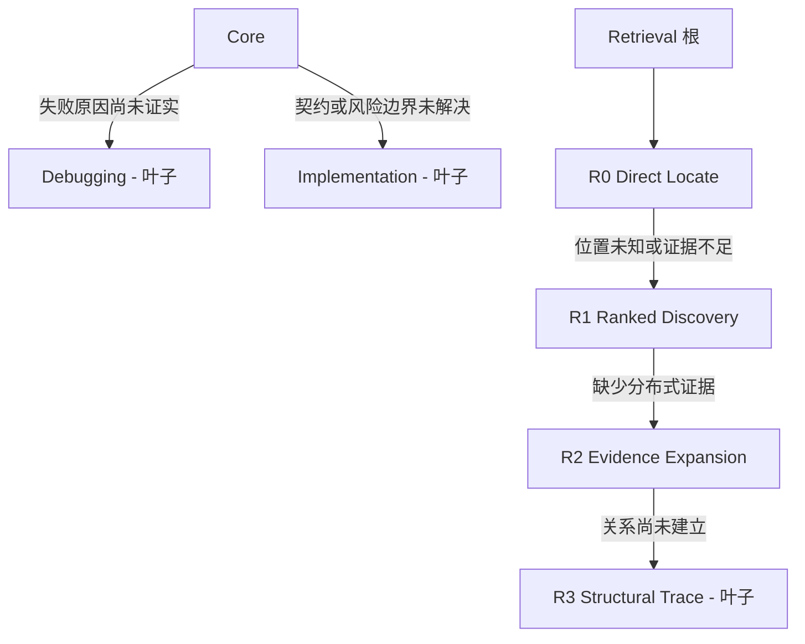

# Practical Coding

一个精简的 Agent Skill：实现、修复、审查或解释代码，交付最小正确修改，并提供新鲜验证证据。

**当前分支为 2.1-rc1 候选版，尚未通过模型交付认证。** 本轮优化了提示词、计量链路和代码交付回归门槛，没有宣称新的模型正确率或 token 节省实测结果。[交付验证说明](benchmarks/DELIVERY_READINESS.md)明确区分已执行检查与[工程目标](benchmarks/release_targets.json)。

## 运行方式

`SKILL.md` 是运行时规则的唯一权威入口。Core 定义可观察成功，复用已有能力，保留用户修改，并选择充分的验证。不强制每个任务都规划、采访、委派、增加抽象或新增测试。只读请求不授权修改代码。



执行树与检索树独立。每个节点只决定自己的直接子节点。已知目标、契约和检查的任务，即使包含安全或并发词汇，也可留在 Core。检索层级代表证据缺口，不代表工具品牌或文件数量。已知位置经过 Discovery 时不要求重复搜索；复用已加载规则，证据充分即停止。

[Decision](references/manual/decision.md) 与 [Clarification](references/manual/clarification.md) 只由当前明确请求触发，不属于自动树。编码途中遇到方案选择，不会自动开启采访。[Navigation](references/navigation.md) 只定位仓库区域，不负责证据扩展或调用图。[委派](references/delegation.md) 可选，必须限制范围并保持单写者。

## 能力层与计量

排序检索、图检索、命令输出压缩是可替换基础设施，不是路由节点。普通运行时允许有界源码检索回退；依赖 benchmark 则强制要求[清单](benchmarks/capability_manifest.json)中的三个固定版本工具：`zg` 0.2.0、`codebase-memory-mcp` 0.10.8、`rtk` 0.47.0。

安装、模型下载、首次建索引、依赖解析和首次构建预热必须先于测量。准备阶段可审计，但不计入比较 token、时长和工具调用。缺依赖时终止，不能用无依赖测试冒充。详见[能力边界](docs/CAPABILITY_LAYER.md)。

## 验证与交付

统一入口为 `benchmarks/retrieval_validation.py`，支持源码分析、可执行代码交付，以及检索树或执行树消融。`dependency_tree_validation.py` 只选择执行轴，不再修改历史 runner 的全局函数。

```sh
# 评测器与执行判定的确定性验证，不是模型成绩。
python benchmarks/benchmark_retrieval_integrity.py --output benchmark-results/evaluator.json
python benchmarks/benchmark_readiness.py --output benchmark-results/readiness.json

# 只展示计划规模，不调用模型。
python benchmarks/retrieval_validation.py --suite source --runs 3 --comparators-only --describe
python benchmarks/retrieval_validation.py --suite delivery --runs 3 --comparators-only --describe
```

工程门槛包含 15 个源码任务和 8 个公开代码交付任务，三个实验组、三轮，共 207 次运行。它们不是未见过的泛化测试。质量下限、成本上限均为目标，不能当成已取得的分数。真实评测需要已认证的 Codex、全部工具和冻结的源码仓库。[复现说明](benchmarks/DELIVERY_READINESS.md)给出了完整命令与限制。

结果绑定原始转录、工具退出码、规则实际内容读取、初始化回执、候选与基线身份，以及归档代码。缺失遥测记为未知而非零；不完整或混用实验不能通过。必须在没有生产凭证的一次性可信环境运行模型评测；现有无人值守 Codex 命令不是安全隔离边界。

## 演化与历史

维护规则位于 [AGENTS.md](AGENTS.md) 和 [CONTRIBUTING.md](CONTRIBUTING.md)。普通任务不读取 `evolution/`。先冻结假设与验证，再修改规则；迭代使用 n=1，冻结候选后再使用 n=3。增加或合并节点必须由质量合格的消融结果支持，不能为层级对称而加层。

历史结果保留在 `benchmarks/results/`，被否决的实验保留在 `evolution/rejected/`，不将其改写成当前候选的成绩。MIT 许可；见[第三方声明](THIRD_PARTY_NOTICES.md)。
