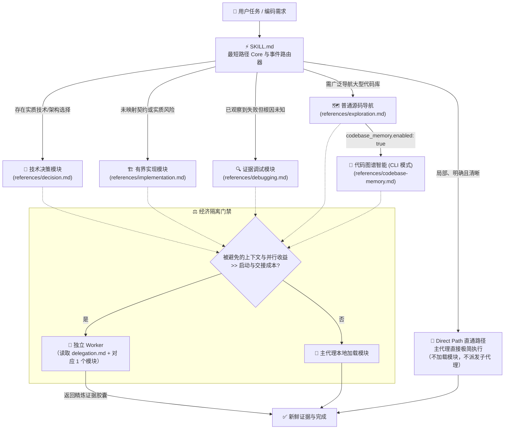

# Practical Coding

<p align="center">
  <a href="https://github.com/Hubujiu/practical-coding/blob/main/LICENSE"></a>
  <a href="https://agentskills.io"></a>
  
  
  <a href="https://github.com/Hubujiu/practical-coding/pulls"></a>
</p>

<p align="center">
  🌐 <a href="README.md">English</a> | <b>简体中文</b>
</p>

---

> **一个 Skill，按需加载。**  
> Practical Coding 是一个面向 AI Coding Agent 的轻量、事件驱动型通用编码 Skill。它抑制 LLM 过度设计，跳过不必要的流程仪式，并用与任务风险匹配的新鲜证据完成精准交付。

---

## 📑 目录

- [解决什么问题](#-解决什么问题)
- [灵感来源与技术血脉（集大成者）](#-灵感来源与技术血脉集大成者)
- [核心架构与工作流](#-核心架构与工作流)
- [常驻核心（Always-On Core）](#-常驻核心always-on-core)
- [五大按需工程模块](#-五大按需工程模块)
- [子代理委派与经济隔离门禁](#-子代理委派与经济隔离门禁)
- [可选代码图谱智能（Codebase Memory）](#-可选代码图谱智能codebase-memory)
- [快速上手与安装](#-快速上手与安装)
- [项目级配置](#-项目级配置)
- [项目结构](#-项目结构)
- [Luna 效果测试](#-luna-效果测试)
- [参与贡献与开源协议](#-参与贡献与开源协议)

---

## ⚡ 解决什么问题

当前的 AI 编码助手普遍存在两大典型痛点：
1. **过度设计与防御性代码膨胀（AI Bloat Trap）**：LLM 容易为了简单修改添加多层抽象、Wrapper、未经请求的重试/降级、宽泛异常捕获以及冗长样板测试。
2. **僵化流程的“仪式感内耗”（Process Ceremony Tax）**：重型多阶段 Agent 框架把每个任务都塞进固定流水线（头脑风暴 → 计划 → TDD → Review → Git 仪式），即使只是改一个按钮颜色也要支付额外 Token 和延迟成本。

反之，完全没有工程约束的单提示词 Agent，在复杂跨文件改动、高风险边界或疑难 Bug 上又容易迷失方向或破坏契约。

### 方案对比

| 评估维度 / 任务场景 | 传统重型流水线 Agent 框架 | 朴素 / 无约束 LLM | 🚀 Practical Coding |
|---|---|---|---|
| **局部 / 简单修改** | 强制多阶段流程 | 快，但可能误碰无关代码 | **Direct Path**：不加载模块、不派发子代理，直接执行 |
| **复杂 / 高风险特性** | 每一步都有固定流程开销 | 容易臆造架构或漏掉关键边界 | **事件路由**：只有存在未决方案、契约或实质风险时才加载 `decision.md` / `implementation.md` |
| **Bug 诊断定位** | 经常先写大量测试再找原因 | 在下游修补症状 | **证据驱动根因排查**：复现 → 最早错误状态 → 单一假设 → 根因修复 |
| **子代理使用** | 容易泛滥成多层流水线 | 单上下文易过载 | **经济隔离门禁**：只有节省的上下文或并行收益明显超过交接成本才派发 |
| **技术方案复用** | 重复造轮子 | 自研低质量平行实现 | **成熟实现优先**：现有代码 → 标准库/原生 → 已装依赖 → 成熟实现 → 最小补充 |
| **代码库检索** | 大量源码扫描进入上下文 | 反复 grep/find | **非侵入式 CLI**：按需调用 `codebase-memory-mcp` AST/LSP 图谱 |

---

## 💡 灵感来源与技术血脉（集大成者）

Practical Coding 融合了多个成熟项目的核心思想：

```text
               ┌─────────────────────────────────────────────────────────┐
               │              DietrichGebert/ponytail                    │
               │        “最懒资深工程师”哲学、YAGNI、标准库/原生优先       │
               └────────────────────────────┬────────────────────────────┘
                                            │（极简务实设计理念）
                                            ▼
┌───────────────────────────┐      ┌─────────────────┐      ┌─────────────────────────────┐
│      obra/superpowers     │      │                 │      │      Agent Skills 规范      │
│  工程严谨性、调试、委派与验证│─────►│ PRACTICAL CODING│◄─────│    (mattpocock / Anthropic) │
│  （剥离僵化流水线，按需触发）│      │                 │      │        渐进式披露机制       │
└───────────────────────────┘      └────────┬────────┘      └─────────────────────────────┘
                                            │（结构化图谱智能）
                                            ▼
               ┌─────────────────────────────────────────────────────────┐
               │             DeusData/codebase-memory-mcp                │
               │      Tree-sitter AST、Hybrid LSP、CLI 单次调用图谱智能    │
               └─────────────────────────────────────────────────────────┘
```

### 1. 🦄 [DietrichGebert/ponytail](https://github.com/DietrichGebert/ponytail) —— *“最懒资深工程师”的极简务实主义*
- **我们汲取的精髓**：极致 YAGNI、梯子法则（根本不需要存在 → 仓库已有 → 标准库 → 平台原生 → 已装依赖 → 一行 → 最小自定义代码）、删优于加、最短可用 Diff，以及精简的未请求交付说明。
- **Practical 的区别**：Ponytail 的强度档位依赖宿主插件 / Hook 保存运行时状态。Practical Coding 保持纯 Agent Skill 的可移植性：不让模型额外猜测模式，也不复制一套宿主 Runtime；只由任务中真实出现的事件决定 Direct Path 还是升级到工程模块。

### 2. ⚡ [obra/superpowers](https://github.com/obra/superpowers) —— *严谨的工程能力与隔离纪律*
- **我们汲取的精髓**：系统化根因排查、风险对等验证阶梯、子代理任务契约与胶囊汇报。
- **我们做出的演化**：把这些能力从强制线性流水线中拆开；简单任务不需要强制 brainstorm/TDD，只有遇到未决工程事件时才加载对应模块。

### 3. 📦 [mattpocock/skills](https://github.com/mattpocock/skills) & [Agent Skills 规范](https://agentskills.io) —— *渐进式披露*
- **我们汲取的精髓**：极小的常驻入口。`SKILL.md` 只保留最短路径核心和路由，深入模块仅在命中事件时按需读取。

### 4. 🧠 [DeusData/codebase-memory-mcp](https://github.com/DeusData/codebase-memory-mcp) —— *零上下文污染的代码图谱*
- **我们汲取的精髓**：Tree-sitter AST、Hybrid LSP 语义解析与持久化代码图谱。
- **我们做出的演化**：不把完整 MCP 工具常驻提示词，而是在大型代码库导航确有收益时按需调用上游 CLI。

---

## 🏗️ 核心架构与工作流

Practical Coding 由 **一个最短路径常驻核心** 和 **一个事件路由器** 驱动。不存在路由强度模式：任务简单就天然 Direct；出现未决复杂度或实质风险才天然升级。



---

## 🛡️ 常驻核心（Always-On Core）

Core 的职责是成为普通编码任务值得支付的**最低固定成本**，而不是把所有工程问题压缩成一份常驻检查表：

1. **先读懂，再偷懒**：理解目标和真正触及的代码；熟悉的功能名只意味着被点名的行为。
2. **梯子法则**：根本不需要存在 → 仓库已有 → 标准库 → 平台原生 → 已装依赖 → 一行 → 最小自定义代码。
3. **因果可溯**：校验、兜底、重试、配置、测试和文档必须来自当前需求、具体边界、已观察风险、项目规范或本次所需证据；真正的实质风险直接路由到 Implementation，而不是把 Core 膨胀成通用安全清单。
4. **最小完备改动**：删优于加，朴实优于炫技，文件越少越好；可逆且未指定的细节跟随仓库或平台默认。
5. **范围纯净**：不触碰无关代码，保留用户现有修改；刻意裁剪真实边角时用一行注释说明上限。
6. **新鲜证据、精简输出**：声称完成前获取最低成本的新鲜证据；未被要求的交付说明保持精简。

---

## 🧩 五大按需工程模块

当任务出现未决工程事件时，只加载对应模块。**Verification 不再作为独立第六模块**：为高风险改动选择足够证据属于 Implementation。Implementation 是“未决协调 / 实质风险”的升级路径，不是所有写代码任务都要经过的阶段。

| 模块 | 何时加载 | 核心职责与产出 |
|---|---|---|
| 🧭 [`references/decision.md`](references/decision.md) | 仍存在会影响实现的实质方案、架构、依赖或 API 选择 | 评估不超过 3 个可行方案，选择满足当前需求的最小方案。 |
| 🏗️ [`references/implementation.md`](references/implementation.md) | 未映射的契约/不变量；安全/权限、不可逆副作用、持久化/迁移、并发/事务、兼容性等实质风险边界；或高风险改动的证据计划仍未解决 | 有界修改图、权威边界处理、最低成本伪证阶梯。 |
| 🔍 [`references/debugging.md`](references/debugging.md) | 已观察到失败、回归或检查失败，但根因仍未诊断 | 复现 → 最早错误状态 → 单一假设 → 根因修复。 |
| 🗺️ [`references/exploration.md`](references/exploration.md) | 必须广泛导航大型代码库且未启用代码图谱 | 产出有界影响图，不复制全文。 |
| 🧠 [`references/codebase-memory.md`](references/codebase-memory.md) | 同一大型结构导航事件，且项目显式启用 `codebase_memory.enabled: true` | 通过上游 CLI 使用 AST/LSP 图谱，并校验覆盖率。 |

---

## 🤖 子代理委派与经济隔离门禁

Practical Coding 通过 **Economic Isolation Gate** 防止子代理滥用：

> **仅当**子代理节省的上下文或带来的并行收益**明显超过**启动与交接成本时才委派；否则由主代理完成。

### Worker 契约 ([`references/delegation.md`](references/delegation.md))
- **严格限定作用域**：Worker 仅读取 `delegation.md` + 被分配的 1 个模块。
- **默认只读**：Decision、Exploration、Codebase Memory、Debugging，以及只负责映射/证据的 Implementation Worker 都不得修改代码。
- **明确授权才写入**：只有被明确分配“实现”任务的 Implementation Worker 才能在限定范围内写代码，并且必须是唯一写入者。
- **精炼证据胶囊**：只返回路径、符号、关键修改和验证结果，不返回完整对话或全文 Dump。

---

## 🧠 可选代码图谱智能（Codebase Memory）

Practical Coding 直接采用成熟的 MIT 开源项目 [`DeusData/codebase-memory-mcp`](https://github.com/DeusData/codebase-memory-mcp) 作为结构化代码智能后端。

### 为什么采用单次 CLI 模式？
相较于把 MCP 服务和工具定义常驻 System Prompt，Practical Coding 在需要时执行一次性 CLI 查询：

```bash
# 检索代码符号与调用链路
codebase-memory-mcp cli search_graph '{"name_pattern":".*Handler.*","label":"Function"}'
codebase-memory-mcp cli trace_call_path '{"function_name":"main","direction":"both"}'

# 查询架构与索引覆盖率
codebase-memory-mcp cli get_architecture '{}'
codebase-memory-mcp cli check_index_coverage '{"paths":["src/core.ts"]}'
```

### CLI 解析阶梯
1. 优先使用系统 `PATH` 中已有的 `codebase-memory-mcp`。
2. 若存在 `npx`，按需使用官方 Lazy Launcher：
   ```bash
   npx --yes codebase-memory-mcp@latest cli <tool> '<json-arguments>'
   ```
3. **优雅降级**：若上游无法启动，降级至普通源码检索，并明确报告本次未使用 Codebase Memory。

### 证据等级
- 🔭 **Scout**：快速正向发现，结论可为临时。
- 🎯 **Verify（默认）**：精确片段 + `check_index_coverage`。
- 🔬 **Auditor**：有界穷尽分析，完成必要分页并回源补查覆盖 Gap。

---

## 🚀 快速上手与安装

### 一键安装（推荐）

```bash
npx skills@latest add Hubujiu/practical-coding
```

### 按平台手动安装

#### 🟣 Claude Code
```bash
git clone https://github.com/Hubujiu/practical-coding.git ~/.claude/skills/practical-coding
```

#### 🔵 Cursor / Codex / Copilot CLI / Gemini CLI / Antigravity / Goose

**macOS 与 Linux：**
```bash
git clone https://github.com/Hubujiu/practical-coding.git ~/.agents/skills/practical-coding
```

**Windows（PowerShell 7）：**
```powershell
git clone https://github.com/Hubujiu/practical-coding.git "$env:USERPROFILE\.agents\skills\practical-coding"
```

#### 📁 项目级安装
```bash
git clone https://github.com/Hubujiu/practical-coding.git .github/skills/practical-coding
```

---

## ⚙️ 项目级配置

项目配置只负责可选能力，不承担路由模式状态。启用 Codebase Memory：

```yaml
version: 1
codebase_memory:
  enabled: true
```

- `enabled: false`（或文件不存在）：使用普通源码检索。
- `enabled: true`：大型结构导航时允许按需调用上游 AST/LSP 图谱。

---

## 📂 项目结构

```text
practical-coding/
├── SKILL.md                 # 最短路径 Core + 事件路由器
├── AGENTS.md                # Agent 使用指南与模块索引
├── README.md                # English documentation
├── README_zh.md             # 简体中文说明
├── CONTRIBUTING.md          # 贡献指南
├── LICENSE                  # MIT
├── THIRD_PARTY_NOTICES.md   # 第三方归属与许可
├── agents/
│   └── openai.yaml          # Agent 配置
├── benchmarks/
│   ├── run.ps1
│   ├── run_benchmarks.py
│   ├── test_benchmarks.py
│   └── REPRODUCING.md
├── examples/
│   ├── README.md
│   └── practical-coding.yaml
├── references/
│   ├── decision.md          # 技术方案与架构决策
│   ├── implementation.md    # 风险边界、修改映射与伪证阶梯
│   ├── debugging.md         # 证据驱动根因排查
│   ├── delegation.md        # Worker 契约与胶囊汇报
│   ├── exploration.md       # 普通源码导航
│   └── codebase-memory.md   # 上游 AST/LSP 图谱能力
└── .github/workflows/validate.yml
```

---

## 🧪 Luna 效果测试

`benchmarks/run.ps1` 使用固定 `gpt-5.6-luna` 隔离运行 Ponytail Delivery、事件 Router、grilling 多轮 Decision 和 Superpowers Debug 对照。`standard` / `full` 默认每格重复 3 次；完整命令、固定 commit、评分器和证据边界见 [`benchmarks/README.md`](benchmarks/README.md) 与 [`benchmarks/REPRODUCING.md`](benchmarks/REPRODUCING.md)。

---

## 🤝 参与贡献与开源协议

欢迎提交 Issue 与 Pull Request。提交前请阅读 [贡献指南](CONTRIBUTING.md)。

- **开源协议**：[MIT License](LICENSE) © 2026 Hubujiu
- **第三方开源致谢**：见 [THIRD_PARTY_NOTICES.md](THIRD_PARTY_NOTICES.md) 了解 [`DeusData/codebase-memory-mcp`](https://github.com/DeusData/codebase-memory-mcp) 的版权与授权声明。