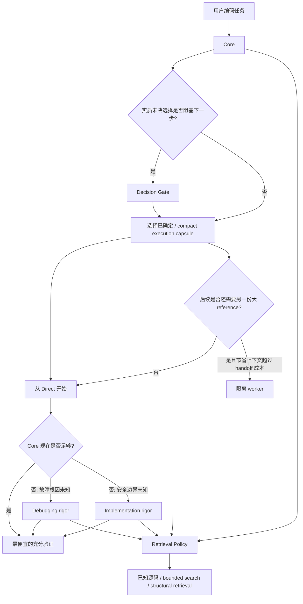

# Practical Coding

<p align="center">
  <a href="LICENSE"></a>
  <a href="https://agentskills.io"></a>
  
  
</p>

<p align="center">
  <a href="README.md">English</a> · <b>简体中文</b>
</p>

> ## 每个编码任务，只使用它真正需要的最小工程严格度。
>
> **从最低成本开始；只有未决选择真的阻塞下一步时才先做 Decision；只有 Direct 不足时才增加 Debugging 或 Implementation 严格度；只加载值得支付的代码上下文。**

Practical Coding 是一个轻量的编码 Agent Skill。它不再把任务硬分成四类，而是一个 **自适应工程严格度系统**：

1. **Core**：所有编码任务都需要的最小规则。
2. **Decision Gate**：只有实质未决选择会阻塞或改变下一安全动作时才先解决选择。
3. **Execution Escalation**：默认 Direct；只有当前 blocker 真的需要时才增加 Debugging 或 Implementation 严格度。
4. **Retrieval + Isolation**：只为真正有价值的仓库上下文和额外上下文支付成本。

```bash
npx skills@latest add Hubujiu/practical-coding
```

## v1.3 架构



核心区别是：

> **Decision 解决“下一步到底做什么”；Execution rigor 解决“已知下一步以后，需要多严格地执行”；Retrieval 解决“需要把哪些代码上下文加载进来”。**

### Core

常驻 `SKILL.md` 只保留所有编码任务都适用的最小规则：

- 先定义最小可观察成功条件；
- 优先复用最近的既有 primitive、API 和 contract；
- 不增加推测性的抽象、配置、wrapper、option 和脚手架；
- 只做最小 coherent reachable change；
- 测试、validation、fallback、注释、文档只在当前需求、既有 contract、项目规则或必要验证要求时添加；
- 最终编辑后只跑一次最便宜、最聚焦的充分检查；
- 只声明新证据真正支持的内容。

### Decision Gate

Decision 不再与 Debugging / Implementation 同级。

先问：

> **是否存在一个实质未决选择，会阻塞或显著改变下一安全动作？**

如果是，加载 [`decision.md`](references/decision.md)。先从仓库和权威来源解决可以发现的事实，只有真正属于用户的 scope、compatibility、cost、preference、risk tolerance 才需要提问。

如果请求、仓库、权威约束或便宜可逆的默认值已经把选择确定下来，就直接进入执行。

### Execution Escalation

Direct 是默认执行状态，而不是一个模块。

| 当前 blocker | 使用的严格度 |
|---|---|
| 下一安全动作已经明确 | **Direct：只用 Core** |
| 已观察到故障，但根因仍没有证据 | Core + [`debugging.md`](references/debugging.md) |
| 安全执行被未知 contract/invariant、未解决的重要风险边界或不足的高风险证据阻塞 | Core + [`implementation.md`](references/implementation.md) |

Debugging 和 Implementation 是**并列的升级 profile**，不是 `Direct → Debugging → Implementation` 的强制流水线。

已经诊断清楚的 Bug 可以直接修。只有一行的 persistence / permission 修改也可能需要 Implementation。反过来，多文件任务如果 contract、影响面和充分检查都已经明确，也可以 Direct。

### Retrieval Policy

Retrieval 与 Decision / execution rigor 独立：

1. 当前上下文 / 已知源码；
2. bounded 或 ranked source discovery；
3. 只有关系型探索确实值得时才使用 structural index；
4. 重要结论回到当前源码验证。

宿主原生搜索、FFF 式 ranked retrieval、普通 `rg` / filename / symbol search，以及 [`DeusData/codebase-memory-mcp`](https://github.com/DeusData/codebase-memory-mcp) 都只是能力，不是项目依赖。更强能力不存在时无损回退，不为了检索单独修改项目配置。

只有大范围检索本身足够复杂时才加载 `references/navigation.md`。

### Retrieval 改为“成本区间”评分

v1.2 暴露了一个 benchmark 问题：如果要求唯一精确 Retrieval 标签，就可能把“只多搜了一小步、但仍然合理”的行为判错。

v1.3 因此分成：

- **minimum sufficient retrieval**：至少需要多少检索；
- **maximum reasonable retrieval cost**：最多允许升级到哪里。

例如，已知概念但没有精确文件路径时，targeted read 和 bounded search 都可能合理；而没有必要的 structural exploration 仍然属于过度升级。

### 上下文隔离

“return to Direct” 只能改变逻辑状态，无法从模型上下文中真正移除已经读取的 reference。

因此 Root 保持 **Core + 同一时刻最多一个大型 reasoning reference**。如果 Decision 已经驻留，后面又真的需要另一种大型严格度；或者 broad mapping 会产生大量上下文，只有隔离节省量明显超过 handoff 成本时才派 worker。

Worker 接收 compact capsule：已确定选择、已验证事实、scope、repository state、success condition，而不是重放整段历史推理。

---

## v1.3 Benchmark 契约

v1.2 的旧分类：

```text
REASONING = NONE | DECISION | DEBUGGING | IMPLEMENTATION
RETRIEVAL = NONE | TARGETED | BOUNDED | STRUCTURAL
```

改成：

```text
DECISION  = CLEAR | REQUIRED
EXECUTION = BLOCKED | DIRECT | DEBUGGING | IMPLEMENTATION
RETRIEVAL = minimum sufficient .. maximum reasonable
```

约束：

```text
DECISION=REQUIRED  => EXECUTION=BLOCKED
DECISION=CLEAR     => EXECUTION in DIRECT | DEBUGGING | IMPLEMENTATION
```

新增四类明确的状态转换回归：

- Decision → Direct；
- Decision → Implementation；
- Debugging → Direct（根因已经确定后）；
- Debugging → Implementation（只有诊断后仍存在未解决的重要执行边界时）。

Native Behavior 还会检查：已经 settled 的 Decision 不会被重新打开，已经 diagnosed 的 Bug 不会无意义地重新加载 Debugging。

canonical benchmark runner 升级为 v2.1：`run_benchmarks.py` 保留为稳定执行内核，`case_catalog.py` 提供公开 case corpus，`adaptive_rigor.py` 安装 v1.3 契约。这样既不会破坏 v1.2 历史证据，也不会假装两个 schema 可以直接比较分数。

---

## 当前证据状态

**在重新跑 benchmark 之前，不声明任何 v1.3 模型结果。**

最后一个已经提交并验证的 baseline 是 [`benchmarks/results/v1.2/`](benchmarks/results/v1.2/)：

- reasoning classification：**114/114**；
- Retrieval exact classification：**106/114**；
- Native Behavior：**54/54**；
- Practical-only Delivery/Decision/Debug regression：**75/75**。

这些结果验证的是 v1.2，不是 v1.3 adaptive-rigor schema。v1.3 candidate 必须重新跑受影响的 Router/Behavior matrix，以及 current-vs-previous regression，才能更新 release claim。

GitHub Releases 当前实际只有已打 tag 的 `v1.0.0`；仓库内部 Skill / benchmark 版本之后继续迭代。下一次正式 tag 应该等 v1.3 validation gate 完成后再创建。

详见 [`benchmarks/REPRODUCING.md`](benchmarks/REPRODUCING.md) 和 [`benchmarks/NEXT_VALIDATION.md`](benchmarks/NEXT_VALIDATION.md)。

---

## 为什么不是简单安装 Ponytail + Superpowers？

Practical Coding 借鉴两者，但目标是它们外层的**控制策略**。

| 场景 | 多套宽泛 Skill 同时安装 | Practical Coding |
|---|---|---|
| 很小且明确的修改 | 多套策略都可能留给宿主/模型协调 | **只用 Core** |
| 未知 Bug | 多种流程规则可能重叠 | **只在根因未知期间使用 Debugging rigor** |
| 高风险修改 | 有严格规则，但可能被宽泛触发 | **只有重要边界未解决期间使用 Implementation rigor** |
| 架构选择 | 选择和实现推理容易混在一起 | **只有选择真的阻塞下一动作时才让 Decision 阻塞执行** |
| 代码检索 | 取决于宿主默认行为 | **显式 cheapest-sufficient retrieval policy** |
| 上下文增长 | 多个 reference 可能累计 | **同一时刻 Core + 最多一个大型 reasoning reference** |

关于 integrated-stack efficiency 的优势仍然只是待验证假设；在 combined-install benchmark 完成前，不把 pairwise specialist comparison 宣传成普适优越性。

---

## 安装

推荐：

```bash
npx skills@latest add Hubujiu/practical-coding
```

Claude Code：

```bash
git clone https://github.com/Hubujiu/practical-coding.git ~/.claude/skills/practical-coding
```

Cursor / Codex / Copilot CLI / Gemini CLI / Antigravity / Goose（macOS/Linux）：

```bash
git clone https://github.com/Hubujiu/practical-coding.git ~/.agents/skills/practical-coding
```

Windows PowerShell：

```powershell
git clone https://github.com/Hubujiu/practical-coding.git "$env:USERPROFILE\.agents\skills\practical-coding"
```

项目级安装：

```bash
git clone https://github.com/Hubujiu/practical-coding.git .github/skills/practical-coding
```

## 仓库结构

```text
practical-coding/
├── SKILL.md
├── AGENTS.md
├── README.md
├── README_zh.md
├── references/
│   ├── decision.md
│   ├── debugging.md
│   ├── implementation.md
│   ├── navigation.md
│   └── delegation.md
├── benchmarks/
│   ├── run_benchmarks.py
│   ├── case_catalog.py
│   ├── adaptive_rigor.py
│   └── run_catalog.py
├── examples/
├── agents/
└── docs/evaluations/
```

## 灵感来源

- [DietrichGebert/ponytail](https://github.com/DietrichGebert/ponytail)：YAGNI、native/stdlib-first、删除优先。
- [obra/superpowers](https://github.com/obra/superpowers)：系统化 debugging、工程严谨性、验证和隔离。
- [mattpocock/skills](https://github.com/mattpocock/skills) / [Agent Skills Spec](https://agentskills.io)：Progressive Disclosure 和可组合 Skill 结构。
- [dmtrKovalenko/fff](https://github.com/dmtrKovalenko/fff)：bounded/ranked code retrieval 思路。
- [DeusData/codebase-memory-mcp](https://github.com/DeusData/codebase-memory-mcp)：结构化代码智能与 graph-backed relationship query。

真正的差异是：**什么时候值得为哪一种工程严格度、检索能力和上下文成本付费。**

## 贡献

如果真实任务暴露出过度工程、漏升级、检索噪声、无意义上下文加载或不安全的极简化，欢迎提交最小可复现 issue/PR。详见 [CONTRIBUTING.md](CONTRIBUTING.md)。

MIT License。适用的第三方致谢见 [THIRD_PARTY_NOTICES.md](THIRD_PARTY_NOTICES.md)。
