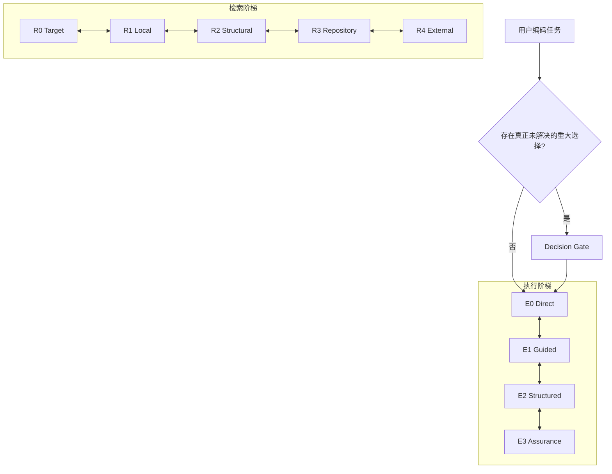

# Practical Coding — 渐进式阶梯实验

> **实验分支：** `experiment/progressive-ladders`。这里探索的是 v1.3 架构方向，不代表已经获得新的 benchmark 发布结论。

Practical Coding 现在把核心问题明确成一句话：

> **当前任务究竟只需要多少工程约束，以及多少代码上下文？**

这条分支把它拆成两个互相独立、都可以升降的渐进式阶梯，并明确要求以后通过 benchmark 调边界、合并或拆分层级，而不是凭直觉永久固定结构。

## 总体结构



关键不是单向升级，而是：

> **从最低层开始；证据不足才升级；一旦定位到边界就立即收缩。**

## 执行：渐进式约束

| 层级 | 含义 | 额外成本 |
|---|---|---|
| **E0 Direct** | 目标、契约和检查都已经足够清楚 | 只用 Core |
| **E1 Guided** | 只有一个局部不确定点阻塞 Direct | 仍只用 Core，多做一次有边界的取证 |
| **E2 Structured** | 存在真正的专业阻塞 | Core + Debugging 或 Implementation 中恰好一个能力 |
| **E3 Assurance** | 同一个专业能力需要更宽的证据才能支撑重大保证 | 不增加模块，只加深证据范围 |

`Debugging` 和 `Implementation` 不再被理解成前后相接的等级，而是按证据触发的**能力模块**。Decision 独立作为 Gate。

### 升级

只有当前证据无法回答下一个关键问题，或者无法支撑必须给出的正确性/安全性保证时才升级。

### 降级

一旦根因、契约、不变量或风险边界已经确定，就停止更重的流程，缩回最小影响面，完成最小一致修改，再做最便宜且足够的验证。

语义上的“降级”不会删除已经读进上下文的文字，它只是要求后续行为不再继续执行更重的流程。

## 检索：渐进式上下文

| 层级 | 范围 |
|---|---|
| **R0 Target** | 已知文件、符号、错误、测试或当前上下文 |
| **R1 Local** | 最近可能范围内的有界/排序检索 |
| **R2 Structural** | caller/callee/import/implementation/dependency/flow 等结构关系 |
| **R3 Repository** | 仓库级搜索，或明确要求的有界穷举结论 |
| **R4 External** | 仓库无法给出的官方 API、框架、兼容性、许可证等外部事实 |

工具不是阶梯本身。FFF 风格排序检索、普通 `rg`、LSP/AST、Codebase Memory 都只是某一级里可以使用的能力；缺什么就无损 fallback，不为了检索临时改项目配置。

检索的核心动作是：

```text
expand → localize → contract
扩大 → 定位 → 收缩
```

例如一次 repo-wide 搜索已经把问题定位到两个文件，就不应该继续维持 repo-wide 探索。

## Decision Gate

Decision 解决“做什么/选什么”；执行阶梯解决“已经知道做什么之后需要多强的过程”。

只有真正未解决、会改变下一步动作的重大选择才读取 `references/decision.md`。用户已经指定或仓库已经确定的选择属于输入，不属于 Decision 事件。

## Benchmark 如何调阶梯

阶梯数量和边界都不是常量。

对每个 task，分别做 execution / retrieval cap ablation，找出能够通过 correctness、安全、build 等硬门槛的**最低充分层级**，然后再看自适应 Skill 实际选了哪一级。

新增核心指标：

- **over-escalation**：自适应运行选得比最低充分层更高；
- **under-escalation**：选得太低导致失败，而更高 cap 可以通过；
- 各层成为“最低充分层”的次数分布；
- 在质量合格前提下的 token、耗时、tool calls、LOC 和 reference load 成本。

因此以后可以基于数据做结构变化：

```text
某一级几乎从来不是最低充分层
→ 测试与相邻层合并/删除

某一级同时大量出现过度升级和升级不足
→ 测试移动边界，必要时拆层
```

具体协议见 `benchmarks/LADDER_EVOLUTION.md`，分析工具见 `benchmarks/ladder_analysis.py`。

## 持久化 evolution 层

`evolution/` **不进入普通 Coding Agent 的运行时上下文**。它只服务 benchmark 和 Skill 维护：

```text
evolution/
├── patterns/      # 多个任务重复出现、已有证据支持的机制
├── experiments/   # 边界/层级/规则修改实验
└── rejected/      # 被回滚的修改及失败原因
```

这样即使一次 Skill 修改被回滚，失败经验仍然保留，不会几周后重新讨论、重新尝试同一个方案。

## 当前分支的意义

这一版不再把差异化重点放在“我也有 Debugging / Implementation / Navigation”，而放在控制策略本身：

> **Practical Coding 决定当前任务究竟只需要多少工程；benchmark 持续学习多少才刚刚好。**

历史 v1.0–v1.2 benchmark 结果仍保留在 `benchmarks/results/`，但它们不能直接作为这套新架构的成绩。合并前需要重新跑完整、重复、质量优先的验证矩阵。
