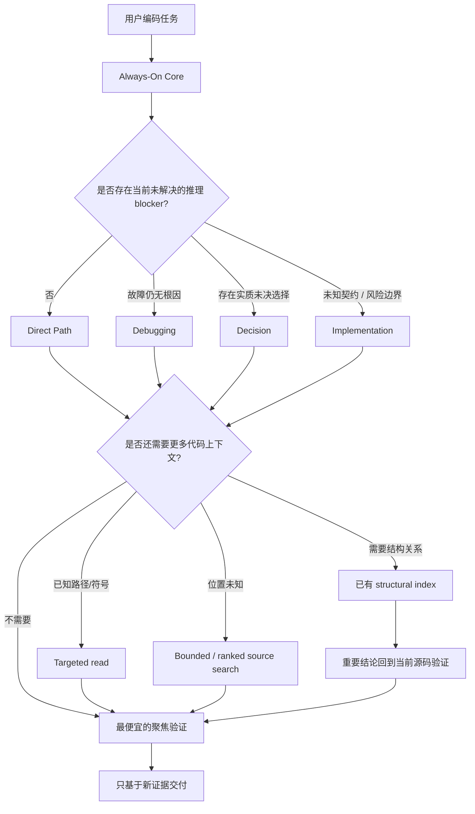

# Practical Coding

<p align="center">
  <a href="LICENSE"></a>
  <a href="https://agentskills.io"></a>
  
  
</p>

<p align="center">
  <a href="README.md">English</a> · <b>简体中文</b>
</p>

> ## 每个编码任务，只支付它真正需要的工程强度和上下文成本。
>
> **简单工作保持 Direct；未知 Bug 才进入根因调试；高风险修改才增加严谨度；代码检索在第一个足够的层级停止。**

Practical Coding 是一个轻量的编码 Agent Skill。它把两种成本分开控制：

1. **推理成本：** 只有真正未解决的 blocker 才允许加载 Debugging、Decision 或 Implementation。
2. **上下文成本：** 代码检索从已知源码开始，按需升级到 bounded/ranked search，再到结构化索引；只有前一级不足时才继续。

```bash
npx skills@latest add Hubujiu/practical-coding
```

## v1.2 的核心变化

Navigation 不再是 Event Router 的第四条互斥分支，而变成 Direct 和所有 routed event 都可使用的 **Retrieval Policy**。

| 当前情况 | Practical Coding 行为 |
|---|---|
| 改名、CSS、已知局部修改 | **Direct Path**：只用 Core |
| 已观察到 Bug，但根因未知 | Core + **Debugging** |
| 架构/API/依赖等实质选择仍未确定 | Core + **Decision** |
| 契约、安全、迁移、权限、持久化、并发、兼容性等重要边界未知 | Core + **Implementation** |
| 只是需要找到相关代码 | 走最便宜的充分检索路径；“需要搜索”本身不会选择 reasoning module |
| 需要大范围调用链/依赖关系映射 | 已有结构化索引能明显减少探索时才使用；没有就直接回退 bounded source search |

新的核心不变量：

> **Core + 最多一个 reasoning module；Retrieval 与 Event Router 正交。**

v1.1 遗留的 `.practical-coding.yaml` 不再被 Skill 读取，可以直接删除。Retrieval 能力改为根据当前宿主/环境中已经存在的工具动态选择，而不是保存为项目级偏好。

---

## 架构



### Always-On Core

常驻 `SKILL.md` 继续只保留所有编码任务都适用的最小规则：

- 先定义最小可观察成功条件；
- 实现上在第一个能工作的阶梯停止；
- 复用已有 primitive、API 和 contract；
- 不增加推测性的抽象、配置、wrapper、alias 或脚手架；
- 只做最小 coherent reachable change；
- 删除优先，普通代码优先；
- validation、fallback、retry、测试、注释、文档只在真实需求、既有 contract、项目规则或必要验证要求时添加；
- 最终只跑一次最便宜、最聚焦的检查；
- 只声明最新证据真正支持的内容。

### 三个 reasoning module

| 模块 | 触发条件 | 目的 |
|---|---|---|
| [`debugging.md`](references/debugging.md) | 已观察故障仍缺少证据化根因 | 复现 → 最早错误状态 → 支持的根因 → 根因修复 |
| [`decision.md`](references/decision.md) | 一个由用户决定的实质选择仍未解决，并会改变下一步 | 收敛最小真实 decision frontier |
| [`implementation.md`](references/implementation.md) | 安全执行被未知 contract/invariant、重要风险边界或不足以支撑高风险结论的证据阻塞 | 映射边界、保留保证并确定充分证据 |

Event Router 只在这三个模块之间选择。文件数量、任务名、需要检索代码、或者存在另一个 library，都不是 reasoning route 的触发条件。

---

## Retrieval：上下文筛选，而不是另一套 workflow

Retrieval 回答的是和 Event Router 不同的问题：

> **当前任务需要的代码上下文，怎样以最低成本获得？**

检索阶梯：

1. **当前上下文 / 已知目标** → 直接读取目标源码。
2. **不知道位置** → 优先使用宿主已经提供的 bounded/ranked search。
3. **没有 ranked primitive** → 回退普通 filename / text / symbol search，例如宿主搜索、`rg`、`grep`、`find`。
4. **问题主要是结构关系** → 只有已有 structural index 能显著减少重复探索时才使用。
5. **重要结论** → 回到当前源码验证，源码始终是权威来源。

在第一个足够的层级停止。

### FFF 式检索与 Codebase Memory 是互补关系

| 能力 | 最擅长 | 在 Practical Coding 中的角色 |
|---|---|---|
| 宿主原生 / FFF 式 ranked retrieval | 用有限输出和排序信号找到最可能相关的文件、文本候选 | 已经可用时作为低成本候选发现 |
| 普通 `rg` / filename / symbol search | 精确文本、名称、小仓库、通用场景 | 零特殊后端的 fallback |
| [`DeusData/codebase-memory-mcp`](https://github.com/DeusData/codebase-memory-mcp) 或其它 structural index | callers、callees、imports、implementations、依赖边、跨文件 flow | 已经可用且结构问题值得时使用 |

Practical Coding **不要求** `@ff-labs/pi-fff`、FFF、Codebase Memory、`.practical-coding.yaml` 或任何常驻图谱服务，也不会仅仅因为“更强的后端可能方便”就自动安装检索工具。能力不存在就无损降级到下一层。

`references/navigation.md` 保存更详细的大范围检索流程。普通 targeted lookup 不需要加载它。

---

## 上下文隔离

“return to Direct” 这样的文字无法把已经读进模型上下文的 reference 真正移除，因此 v1.2 把隔离当成真实资源问题处理：

- Direct 和小型 routed event 不使用 worker；
- Root 通常只携带 Core + 最多一个 reasoning reference；
- 普通源码搜索直接使用宿主工具，不加载 Navigation；
- 如果 Debugging / Decision / Implementation 已经驻留，而大范围 mapping 会产生明显上下文噪声，只有隔离收益大于 handoff 成本时才派只读 Navigation worker；
- worker 返回 compact evidence capsule，而不是 raw grep、搜索日志或 graph dump。

这样 Progressive Disclosure 才真正是在节省上下文，而不只是把同一份大提示词拆成多个文件。

---

## 为什么不直接同时安装 Ponytail + Superpowers？

Practical Coding 的差异不在于“拥有更多规则”，而在控制策略。

| 问题 | Ponytail + Superpowers | Practical Coding |
|---|---|---|
| 很小且明确的修改 | 两套宽泛哲学仍交给宿主/模型协调 | **只用 Core** |
| 未知 Bug | 多套流程规则可能同时相关 | **只加载 Debugging** |
| 高风险改动 | 有严谨能力，但由不同系统各自触发 | **只有风险边界未解决才加载 Implementation** |
| 代码检索 | 依赖宿主自己的工具行为 | **显式 cheapest-sufficient retrieval ladder** |
| 上下文成本 | 独立系统可能累计 | **Core + 最多一个 reasoning reference；昂贵检索只在值得时隔离** |

所以 Practical Coding 不是 `ponytail.md + superpowers.md`，而是在决定：**此刻值得支付多少工程推理成本，以及多少代码库上下文成本。**

---

## Benchmark 证据

仓库中 [`benchmarks/results/v1.1/`](benchmarks/results/v1.1/) 的结果验证的是旧版 v1.1 **五路由设计**。这些结果继续作为历史证据保留，但在用新契约重新跑受影响的 Router / Native behavior suite 之前，**不能把它们当成 v1.2 Retrieval 重构的验证结果。**

当前公开的 v1.1 结果仍为：

| Suite | Practical v1.1 |
|---|---:|
| Delivery | **100%（27/27）** |
| Decision | **100%（18/18）** |
| Debug | **96.7%（29/30）** |
| Router | **100%（114/114）** |
| Native behavior | **100%（54/54）** |
| 适用总计 | **99.6%（242/243）** |

查看 [v1.1 数据](benchmarks/results/v1.1/README.md)、[中文报告](benchmarks/results/v1.1/REPORT_ZH.md) 和 [复现指南](benchmarks/REPRODUCING.md)。在发布新的对比结论之前，需要重新跑 v1.2。

---

## 安装

推荐：

```bash
npx skills@latest add Hubujiu/practical-coding
```

Claude Code：

```bash
git clone https://github.com/Hubujiu/practical-coding.git ~/.claude/skills/practical-coding
```

Cursor / Codex / Copilot CLI / Gemini CLI / Antigravity / Goose（macOS/Linux）：

```bash
git clone https://github.com/Hubujiu/practical-coding.git ~/.agents/skills/practical-coding
```

Windows PowerShell：

```powershell
git clone https://github.com/Hubujiu/practical-coding.git "$env:USERPROFILE\.agents\skills\practical-coding"
```

项目级安装：

```bash
git clone https://github.com/Hubujiu/practical-coding.git .github/skills/practical-coding
```

---

## 仓库结构

```text
practical-coding/
├── SKILL.md
├── AGENTS.md
├── README.md
├── README_zh.md
├── references/
│   ├── debugging.md
│   ├── decision.md
│   ├── implementation.md
│   ├── navigation.md
│   └── delegation.md
├── benchmarks/
├── examples/
├── agents/
└── docs/evaluations/
```

## 灵感来源

- [DietrichGebert/ponytail](https://github.com/DietrichGebert/ponytail)：YAGNI、native/stdlib-first、删除优先。
- [obra/superpowers](https://github.com/obra/superpowers)：系统化 debugging、工程严谨性、验证、任务隔离。
- [mattpocock/skills](https://github.com/mattpocock/skills) / [Agent Skills Spec](https://agentskills.io)：Progressive Disclosure 和可组合 Skill 结构。
- [dmtrKovalenko/fff](https://github.com/dmtrKovalenko/fff)：frecency 等面向 Agent 的 bounded/ranked code retrieval 思路。
- [DeusData/codebase-memory-mcp](https://github.com/DeusData/codebase-memory-mcp)：结构化代码智能与 graph-backed relationship query。

真正的差异不是“谁发明了这些思想”，而是：**什么时候值得为哪一种能力支付实现、检索和上下文成本。**

## 贡献

如果真实任务暴露出过度工程、漏升级、检索噪声、无意义上下文加载或不安全的极简化，欢迎提交最小可复现 issue/PR。详见 [CONTRIBUTING.md](CONTRIBUTING.md)。

MIT License。适用的第三方致谢见 [THIRD_PARTY_NOTICES.md](THIRD_PARTY_NOTICES.md)。
