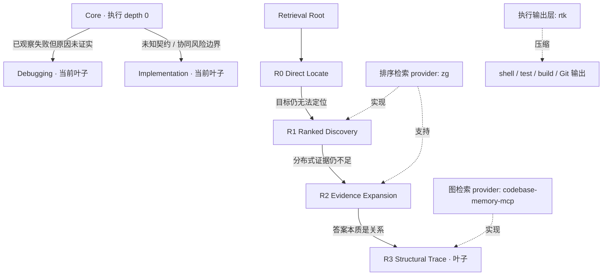

# Practical Coding

Practical Coding 是一个 Agent Skill：目标是交付最小、可靠的代码修改，同时避免把所有任务都变成重量级流程。

当前实验把三类问题彻底分开：

1. 决定工程化深度的**执行树**；
2. 按“尚未解决的信息问题”逐步展开的独立 **Retrieval 树**；
3. 提供排序检索、图检索和命令输出压缩的可替换**能力层**。



Decision 与 Clarification 继续是显式手动模式，不属于任何自动树。

## 运行时契约

Core 始终适用：

- 先定义最小可观察成功；
- 复用项目已有 primitive 与 contract；
- 不添加推测性的抽象、依赖、配置、验证、测试或文档；
- 保留无关行为和用户已有修改；
- 用能够证伪关键结论的最便宜检查验证。

Core 只知道两个直接自动执行子节点：

- [`references/debugging.md`](references/debugging.md)：已观察失败仍没有证据化原因；
- [`references/implementation.md`](references/implementation.md)：安全执行被未知契约、协同不变量、重大风险边界或证据要求阻塞。

每个被加载的节点只拥有自己的下一层 Router。没有通过 benchmark 证明有价值的 child 时，节点必须明确声明为叶子。自动路由只能为了消除当前 blocker 而加深，不能重新打开 deliberation。

## 手动模式

- [`references/manual/decision.md`](references/manual/decision.md) 只在用户当前明确要求比较方案、技术选型、推荐架构/依赖/API/数据模型或决策分析时加载；
- [`references/manual/clarification.md`](references/manual/clarification.md) 只在用户明确要求先采访、grill、提问或澄清需求时加载。

任何自动节点都不能路由到手动模式。手动任务完成后，把已确定的结果作为输入返回 Core。

## Retrieval 树

Retrieval depth 表示**当前还缺哪一种信息**，不表示工具品牌或能力强弱。

[`references/retrieval/SKILL.md`](references/retrieval/SKILL.md) 是 Retrieval 根节点，只知道 R0：

| 阶段 | 回答的问题 | 何时进入下一层 |
|---|---|---|
| [`R0 Direct Locate`](references/retrieval/direct.md) | 已知文件、symbol、identifier 或窄 literal 能否直接定位目标？ | 目标仍未知 → R1 |
| [`R1 Ranked Discovery`](references/retrieval/discovery.md) | 已知语义意图但不知道位置时，最可能的候选在哪里？ | 回答依赖跨文件证据 → R2 |
| [`R2 Evidence Expansion`](references/retrieval/evidence.md) | 当前 claim 所需的最小跨文件证据集是什么？ | 答案本质是关系 → R3 |
| [`R3 Structural Trace`](references/retrieval/structural.md) | 哪条调用、依赖、所有权、控制/数据流或影响关系能够证明答案？ | 叶子；关系成立后停止 |

Core 不一次性选择 R0–R3。每个 Retrieval 节点只知道自己的直接 child，并在当前 claim 获得最小充分源码证据后立即返回。

普通运行时中，provider 只是可选加速器；缺失时无损回退到有界源码检索。依赖启用 benchmark 则强制要求具体 provider，避免把“装了工具”和“没装工具”的结果混成一组成本比较。

## Navigation 边界

[`references/navigation.md`](references/navigation.md) 只回答：**应该去哪个有界仓库区域找？** 它根据 module 声明、包元数据和维护中的架构证据建立小型拓扑图。

Retrieval 回答：**哪一段具体源码证据能够解决问题？** Navigation 不执行语义发现、不扩展相关证据，也不追踪调用图。目标已经明确时跳过 Navigation，直接从 R0 开始。

## 能力层与输出层

[`docs/CAPABILITY_LAYER.md`](docs/CAPABILITY_LAYER.md) 定义 provider 边界。

当前依赖 profile 固定版本并强制要求：

- zvec-grep `0.2.0` 的 `zg`：实现 R1/R2 的混合排序检索；
- `codebase-memory-mcp` `0.10.8`：实现 R3 的图关系检索；
- `rtk` `0.47.0`：压缩 shell、test、build 与 Git 输出。

这些名称都不是树节点。未来替换 provider 时，不需要重构 Retrieval policy。

输出压缩是横切基础设施，必须保留命令语义、退出码、失败信息和关键验证证据。模型不会“路由到 RTK”。支持 command hook 的宿主可以做到透明改写；RTK 对 Codex 的上游集成属于规则/提示词而不是强制 pre-execution hook，因此 Benchmark 会通过所有 arm 相同的一条 capability note 暴露 wrapper，并记录 `rtk` 是否真的被调用。

## 依赖启用 Benchmark

机器可读 profile 位于 [`benchmarks/capability_manifest.json`](benchmarks/capability_manifest.json)。[`benchmarks/dependency_tree_validation.py`](benchmarks/dependency_tree_validation.py) 与 [`benchmarks/retrieval_validation.py`](benchmarks/retrieval_validation.py) 都会在任何依赖缺失或 probe 失败时，在创建比较 cell 前直接失败。前者保留执行树 ceiling；后者独立运行 `NONE/R0/R1/R2/R3` Retrieval ceiling。

先验证冻结的 profile。preflight 会按 manifest 中的版本正则强制校验 provider，并保存实际版本输出：

```powershell
zg --version
codebase-memory-mcp --version
rtk --version
git --version
node --version
npm --version
java -version
mvn --version
```

请先按照各上游项目的维护方式安装依赖。仓库不会在 measured cell 内静默安装或替换 provider。

### 计量边界

每个 cell 分成两个阶段：

1. **setup，不参与比较**：带版本校验的 provider probe、本地模型/资源初始化、`zg` 索引与首次 query、Codebase Memory 建图与 daemon warm-up、项目依赖解析、首次测试/构建 warm-up、工作区洁净检查；
2. **measured execution**：只有 setup 成功后才启动 Codex，此时才采集 transcript token、模型可见 tool call、时长、答案质量和路由 trace。

每个 cell 的 setup 详情写入 `capability-setup.json`，并明确标记 `included_in_comparison: false`。setup 报告只保留输出字节数和耗时用于审计，不估算 token。由于 setup 时 Codex 尚未启动，因此这些操作不可能进入 measured input/output token、tool call 或 wall time。配对比较的所有 arm 使用完全相同的预初始化环境。

如果模型在 measured 阶段再次执行 `zg index`、Codebase Memory 建图、`rtk init` 或包安装，这会被判为契约违规，而不是把冷启动成本混入结果。

## Benchmark 驱动演化

当前拓扑位于 [`benchmarks/tree_topology.json`](benchmarks/tree_topology.json)。[`benchmarks/tree_cases.py`](benchmarks/tree_cases.py) 不保存 expected automatic route 或固定 execution depth。

Benchmark 可以在证据支持时新增、拆分、合并、提升、折叠、移动或删除节点：

- **新增/加深**：存在可观察 pre-load signal，且 child 相比 parent 有稳定、通过质量门槛的净收益；
- **合并/移动边界**：节点长期难区分且分离没有净价值；
- **提升/折叠**：child 对 parent 的大多数有效任务都不可缺少；
- **删除**：节点没有独立 minimum-sufficient 或 marginal-lift 案例；
- **拆分**：叶子出现重复失败簇，并且能在加载前观察到稳定边界。

执行 depth 与 Retrieval depth 都只表示渐进披露，不是通用任务复杂度分数。

## 验证

不需要真实外部 provider 的确定性契约检查：

```powershell
python benchmarks/dependency_tree_validation.py --self-test
python benchmarks/retrieval_validation.py --self-test
python benchmarks/retrieval_analysis.py /dev/null --self-test
python -m unittest `
  benchmarks.test_tree_benchmarks `
  benchmarks.test_capability_environment `
  benchmarks.test_dependency_tree_validation `
  benchmarks.test_retrieval_analysis
```

Retrieval 树模型迭代必须存在全部依赖，先跑 `n=1`：

```powershell
python benchmarks/retrieval_validation.py --current-only --runs 1 --workers 3 `
  --output benchmark-results/retrieval-tree-n1
python benchmarks/retrieval_analysis.py benchmark-results/retrieval-tree-n1/results.jsonl `
  --output benchmark-results/retrieval-tree-n1/analysis.json
```

如果执行树文案或边界也发生变化，另跑 `dependency_tree_validation.py`，在同一 provider 与 warm-up 契约下保留 Core/Debugging/Implementation ceiling。

候选冻结后，再执行 no-skill、v1.5 baseline 与当前版本的 `n=3` Retrieval 配对比较：

```powershell
python benchmarks/retrieval_validation.py --runs 3 --workers 3 `
  --output benchmark-results/retrieval-tree-final
python benchmarks/retrieval_analysis.py benchmark-results/retrieval-tree-final/results.jsonl `
  --output benchmark-results/retrieval-tree-final/analysis.json
```

如果 release candidate 同时修改两棵树，还要运行：

```powershell
python benchmarks/dependency_tree_validation.py --runs 3 --workers 3 `
  --output benchmark-results/execution-tree-final
python benchmarks/tree_analysis.py benchmark-results/execution-tree-final/results.jsonl `
  --output benchmark-results/execution-tree-final/analysis.json
```

已接受的 v1.5 扁平 Event Router，以及被拒绝的固定深度、专家叶子和 execution-state 实验，都继续作为历史证据保存在 `benchmarks/results/` 与 `evolution/rejected/`。历史报告不会为了适配新拓扑而重写。

MIT License。Provider 归属见 [`THIRD_PARTY_NOTICES.md`](THIRD_PARTY_NOTICES.md)。
