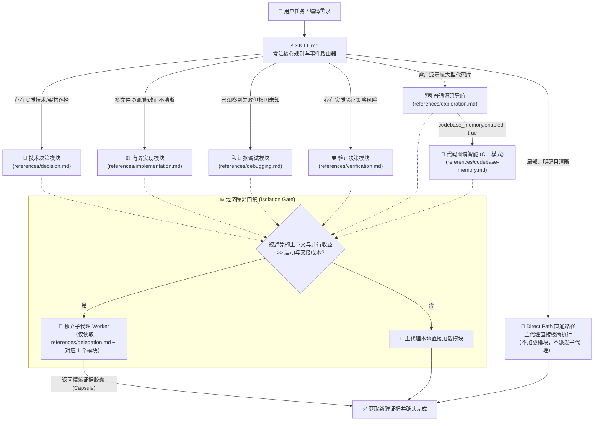

# Practical Coding

<p align="center">
  <a href="https://github.com/Hubujiu/practical-coding/blob/main/LICENSE"></a>
  <a href="https://agentskills.io"></a>
  
  
  <a href="https://github.com/Hubujiu/practical-coding/pulls"></a>
</p>

<p align="center">
  🌐 <a href="README.md">English</a> | <b>简体中文</b>
</p>

---

> **一个 Skill，按需加载。**  
> Practical Coding 是一个面向 AI Coding Agent 的轻量、事件驱动型通用编码 Skill。它彻底消除 LLM 的过度设计倾向，告别僵化流程的内耗开销，用新鲜证据驱动精准、极简、生产级的代码交付。

---

## 📑 目录

- [解决什么问题](#-解决什么问题)
- [灵感来源与技术血脉（集大成者）](#-灵感来源与技术血脉集大成者)
- [核心架构与工作流](#-核心架构与工作流)
- [常驻工程底线（Always-On Core）](#-常驻工程底线always-on-core)
- [六大按需工程模块](#-六大按需工程模块)
- [子代理委派与经济隔离门禁](#-子代理委派与经济隔离门禁)
- [可选代码图谱智能（Codebase Memory）](#-可选代码图谱智能codebase-memory)
- [快速上手与安装](#-快速上手与安装)
- [项目级配置](#-项目级配置)
- [项目结构](#-项目结构)
- [Luna 效果测试](#-luna-效果测试)
- [参与贡献与开源协议](#-参与贡献与开源协议)

---

## ⚡ 解决什么问题

当前的 AI 编码助手普遍存在两大典型痛点：
1. **过度设计与防御性代码膨胀（AI Bloat Trap）**：LLM 习惯于为了一个简单的 2 行修改，凭空臆造多层抽象、嵌套 Wrapper、未经请求的重试/降级兜底、宽泛的异常捕获以及冗长低效的样板单元测试。
2. **僵化流程的“仪式感内耗”（Process Ceremony Tax）**：重型多阶段 Agent 框架强行把*每一个*任务（哪怕是改个按钮颜色或修个 Typo）塞进固定的 5 阶段流水线（*头脑风暴 → 编写计划 → TDD 测试驱动 → 代码 Review → Git 仪式*），消耗极其昂贵的 Token 预算并产生大量等待延迟。

反之，完全没有任何工程约束的单提示词 Agent，在面对复杂的跨文件重构或疑难 Bug 时又极易迷失方向、破坏代码契约或耗尽上下文。

### 方案全方位对比

| 评估维度 / 任务场景 | 传统重型流水线 Agent 框架 | 朴素 / 无约束 LLM 提示词 | 🚀 Practical Coding |
|---|---|---|---|
| **局部 / 简单修改** *(如改 CSS、重命名变量)* | 强制经历繁冗的多阶段流程；在无意义的计划和测试上浪费 Token | 响应快速，但极易意外触碰无关代码或产生幻觉 | **Direct Path 直通路径**：不加载模块，不启动子代理，主代理直接精准执行 |
| **复杂特性开发** | 每一步都伴随着沉重的流程与上下文包袱 | 凭空臆造架构，过度包装，防御性代码泛滥 | **事件路由按需加载**：仅在出现未决事件时加载对应模块（`decision.md`、`implementation.md`） |
| **Bug 诊断定位** | 经常在尚未排查原因前就编写大段样板测试 | 用 `try/catch` 和默认值在下游修补表象，掩盖根因 | **证据驱动根因排查**：复现 → 最早异常状态 → 单一假设 → 根因修复 |
| **子代理（Subagent）使用** | 随意泛滥派生多层子代理流水线，交接成本高昂 | 单上下文单打独斗，容易上下文超载 | **经济隔离门禁**：仅当避免的上下文或并行收益明显超过启动交接成本时才派生子代理 |
| **技术方案与能力复用** | 倾向于重复造轮子或编写复杂的自定义包装层 | 经常编写质量低下的简陋自研平行代码 | **成熟实现优先**：现有代码 → 标准库/原生 → 已装依赖 → 成熟开源项目 → 最小自研补充 |
| **代码库结构检索** | 盲目将大量源码扫描 dump 进上下文 | 在大型仓库中反复执行低效的 grep/find | **非侵入式 CLI 模式**：通过 `codebase-memory-mcp` 调用 AST/LSP 图谱，零长期上下文污染 |

---

## 💡 灵感来源与技术血脉（集大成者）

Practical Coding 融合并升华了业内领先的 Agent 顶尖设计思想：

```text
               ┌─────────────────────────────────────────────────────────┐
               │              DietrichGebert/ponytail                    │
               │        “最懒资深工程师”哲学、YAGNI、标准库/原生优先       │
               └────────────────────────────┬────────────────────────────┘
                                            │（极简务实设计理念）
                                            ▼
┌───────────────────────────┐      ┌─────────────────┐      ┌─────────────────────────────┐
│      obra/superpowers     │      │                 │      │      Agent Skills 规范      │
│  工程严谨性、调试、委派与验证│─────►│ PRACTICAL CODING│◄─────│    (mattpocock / Anthropic) │
│  （剥离僵化流水线，按需触发）│      │                 │      │        渐进式披露机制       │
└───────────────────────────┘      └────────┬────────┘      └─────────────────────────────┘
                                            │（结构化图谱智能）
                                            ▼
               ┌─────────────────────────────────────────────────────────┐
               │             DeusData/codebase-memory-mcp                │
               │      Tree-sitter AST、Hybrid LSP、CLI 单次调用图谱智能    │
               └─────────────────────────────────────────────────────────┘
```

### 1. 🦄 [DietrichGebert/ponytail](https://github.com/DietrichGebert/ponytail) —— *“最懒资深工程师”的极简务实主义*
- **我们汲取的精髓**：极致的 **YAGNI**（You Aren't Gonna Need It）原则、**决策阶梯**（标准库/平台原生 → 已装依赖 → 成熟开源库 → 最后的最小补充）、拒绝防御性代码膨胀，以及追求**最小完备修改（Smallest Coherent Change）**的匠心。

### 2. ⚡ [obra/superpowers](https://github.com/obra/superpowers) —— *严谨的工程能力与隔离纪律*
- **我们汲取的精髓**：系统化的根因排查体系、风险对等的验证阶梯、子代理任务契约与胶囊汇报机制。
- **我们做出的进化**：将这些强大能力**从僵化的线性流水线中彻底解放**出来。你不需要为了一个简单改动忍受强制的头脑风暴或强制 TDD；所有工程能力只在**遇到未决事件时按需激活**。

### 3. 📦 [mattpocock/skills](https://github.com/mattpocock/skills) & [Agent Skills 规范](https://agentskills.io) —— *渐进式披露标准（Progressive Disclosure）*
- **我们汲取的精髓**：极小的常驻入口。[`SKILL.md`](SKILL.md) 保持在 50 行以内，常驻 Agent 上下文却几乎不占用 Token 预算；只有命中特定路由事件时才读取深入的参考模块。

### 4. 🧠 [DeusData/codebase-memory-mcp](https://github.com/DeusData/codebase-memory-mcp) —— *零上下文污染的高精度代码图谱*
- **我们汲取的精髓**：工业级 Tree-sitter AST 解析、各大主流语言的 Hybrid LSP 语义/类型推断、持久化增量知识图谱与覆盖率校验。
- **我们做出的进化**：摒弃将整个 MCP 服务长驻提示词的做法（每轮对话白白消耗上千 Token），Practical Coding 采用**一次性 CLI 模式**调用上游能力，用完即走。

---

## 🏗️ 核心架构与工作流

Practical Coding 由 **一个常驻核心（Always-On Core）** 与 **一个事件路由器（Event Router）** 驱动：



---

## 🛡️ 常驻工程底线（Always-On Core）

无论走哪条执行路径（包括最简单的直通修改），以下工程红线**始终生效**：

1. **精准审视**：在改动任何代码前，明确理解预期目标并仅审视最小相关上下文。
2. **因果可溯**：添加的每一项内容——无论是抽象、依赖、校验、重试、配置、测试还是文档——都必须追溯至具体需求、系统边界、项目规范或已确认的风险。
3. **成熟实现优先**：对于非平凡能力，优先集成维护良好的成熟实现，而不是自己造一套粗糙的平行版本。
4. **捍卫系统契约**：严格保护既有的安全性、权限模型、数据完整性、无障碍访问、向后兼容性与项目约束。
5. **范围纯净**：坚决不触碰无关代码，完整保留用户的既有修改。
6. **新鲜证据交付**：在声称完成任务前，必须以最低成本获取足以支撑结论的新鲜证据。

---

## 🧩 六大按需工程模块

当任务执行中遇到尚未解决的具体工程事件时，仅加载对应的轻量模块：

| 模块 | 何时加载 | 核心职责与产出 |
|---|---|---|
| 🧭 [`references/decision.md`](references/decision.md) | 聚焦检查后，仍存在会影响实现的实质方案、架构或依赖选择 | 评估不超过 3 个可行方案（原生优先）；选择满足当前需求的最小方案。 |
| 🏗️ [`references/implementation.md`](references/implementation.md) | 修改需要协调多个文件或契约，且修改影响面尚不清晰 | 绘制紧凑修改图；在最窄权威边界做校验；拒绝防御性膨胀。 |
| 🔍 [`references/debugging.md`](references/debugging.md) | 已观察到失败或测试未通过，且聚焦检查后根因仍不明确 | 证据第一：复现表象 → 定位最早错误状态 → 单一假设 → 根因修复。 |
| 🛡️ [`references/verification.md`](references/verification.md) | 风险或不确定性使得验证策略本身成为一项实质决策 | 最低成本伪证阶梯；驳斥“改动太简单不用测”、“最后改动前测过”等借口。 |
| 🗺️ [`references/exploration.md`](references/exploration.md) | 必须广泛扫描大型代码库且未启用代码图谱时的默认导航 | 产出有界影响图（精确路径、符号、调用边），不复制全文和海量日志。 |
| 🧠 [`references/codebase-memory.md`](references/codebase-memory.md) | 同上事件，且项目显式配置了 `codebase_memory.enabled: true` | 通过上游 CLI 调度 AST/LSP 图谱，执行 Scout、Verify、Auditor 级结构化检索与覆盖检查。 |

---

## 🤖 子代理委派与经济隔离门禁

Practical Coding 设立了严苛的**经济隔离门禁（Isolation Gate）**，坚决杜绝子代理滥用：

> **隔离准则：**  
> **仅当**派生子代理所节省的上下文体积，或解锁的并行收益**明显超过**其启动与上下文交接成本时，才将模块委派给独立子代理；否则直接在主代理执行。

### Worker 契约规范 ([`references/delegation.md`](references/delegation.md))
- **严格限定作用域**：Worker 仅读取 `delegation.md` + 被分配的 **1 个** 专属模块。
- **默认只读**：Decision、Exploration、Codebase Memory 和 Debugging 子代理一律为只读模式，不得修改业务代码。
- **单一写入者**：Implementation 子代理仅在其被明确授权的文件/目录范围内修改，且必须是该范围的唯一写入者。
- **精炼证据胶囊（Capsule）**：Worker 仅向主代理返回结构化结论（修改路径、符号、关键 Diff 摘要、测试结果），严禁返回完整对话日志或全文 Dump。

---

## 🧠 可选代码图谱智能（Codebase Memory）

Practical Coding 直接采用成熟的 MIT 开源项目 [`DeusData/codebase-memory-mcp`](https://github.com/DeusData/codebase-memory-mcp) 作为底层结构化代码智能引擎。

### 为什么采用单次 CLI 模式？
相较于将 MCP 服务作为常驻工具注入 System Prompt（每轮对话无谓消耗 1000+ Token），Practical Coding 采用**按需单次 CLI 命令**执行图谱查询：

```bash
# 检索代码符号与调用链路
codebase-memory-mcp cli search_graph '{"name_pattern":".*Handler.*","label":"Function"}'
codebase-memory-mcp cli trace_call_path '{"function_name":"main","direction":"both"}'

# 查询整体架构与索引覆盖率
codebase-memory-mcp cli get_architecture '{}'
codebase-memory-mcp cli check_index_coverage '{"paths":["src/core.ts"]}'
```

### CLI 解析阶梯
1. 优先使用系统 `PATH` 中已有的 `codebase-memory-mcp` 可执行文件。
2. 若环境安装了 Node.js / `npx`，按需使用官方 Lazy Launcher：
   ```bash
   npx --yes codebase-memory-mcp@latest cli <tool> '<json-arguments>'
   ```
3. **优雅降级**：若上游不可执行，自动降级至普通源码文本检索，并明确告知用户本次未启用代码图谱。

### 证据等级体系（Evidence Tiers）
- 🔭 **Scout（勘探级）**：用于快速正向发现。限制返回条数，浅层 Trace，结论标记为临时推测。
- 🎯 **Verify（验证级，默认）**：用于常规开发。获取关键代码 Snippet，并对所有证据路径批量调用 `check_index_coverage` 校验。
- 🔬 **Auditor（审查级）**：用于穷尽分析。限定作用域，强制完成全部关键分页，对所有覆盖 Gap 执行源码回源补查。

---

## 🚀 快速上手与安装

### 一键安装（推荐）

通过社区标准的 [`skills`](https://github.com/mattpocock/skills) 命令行工具：

```bash
npx skills@latest add Hubujiu/practical-coding
```

---

### 按平台手动安装指南

#### 🟣 Claude Code
```bash
git clone https://github.com/Hubujiu/practical-coding.git ~/.claude/skills/practical-coding
```

#### 🔵 Cursor / Codex / Copilot CLI / Gemini CLI / Antigravity / Goose

**macOS 与 Linux：**
```bash
git clone https://github.com/Hubujiu/practical-coding.git ~/.agents/skills/practical-coding
```

**Windows（PowerShell 7）：**
```powershell
git clone https://github.com/Hubujiu/practical-coding.git "$env:USERPROFILE\.agents\skills\practical-coding"
```

#### 📁 项目级仓库安装
若希望为特定代码仓库单独配置 Practical Coding：
```bash
# 适用于兼容 Agent Skills 规范的开发环境
git clone https://github.com/Hubujiu/practical-coding.git .github/skills/practical-coding
```

---

## ⚙️ 项目级配置

如需在项目中启用代码图谱智能，只需在项目根目录创建 `.practical-coding.yaml`：

```yaml
version: 1
codebase_memory:
  enabled: true
```

- `enabled: false`（或文件不存在）：默认关闭代码图谱，不主动打扰用户，采用常规源码检索。
- `enabled: true`：允许在大型/复杂代码库导航中按需调用上游图谱引擎。

---

## 📂 项目结构

```text
practical-coding/
├── SKILL.md                 # 轻量入口：常驻核心底线 + 事件路由器
├── AGENTS.md                # 针对 Agent 的使用指南与模块路由索引
├── README.md                # 英文说明文档
├── README_zh.md             # 简体中文说明文档（本文档）
├── CONTRIBUTING.md          # 社区贡献指南
├── LICENSE                  # MIT 开源许可证
├── THIRD_PARTY_NOTICES.md   # 上游 Codebase Memory MCP 归属与许可说明
├── agents/
│   └── openai.yaml          # Agent 配置文件
├── benchmarks/
│   ├── run.ps1              # PowerShell 统一运行入口
│   ├── run_benchmarks.py    # Luna 隔离运行、评分与聚合器
│   ├── test_benchmarks.py   # benchmark 基础设施回归测试
│   └── REPRODUCING.md       # 完整复现说明与证据边界
├── examples/
│   ├── README.md            # 配置示例说明
│   └── practical-coding.yaml# 项目级示例配置文件
├── references/              # 按需加载的六大工程模块
│   ├── decision.md          # 技术方案与架构决策模块
│   ├── implementation.md    # 跨文件有界实现与修改映射模块
│   ├── debugging.md         # 证据驱动的根因排查模块
│   ├── verification.md      # 风险对等验证与伪证阶梯模块
│   ├── delegation.md        # Worker 子代理协作契约与胶囊汇报协议
│   ├── exploration.md       # 普通源码搜索与有界影响图模块
│   └── codebase-memory.md   # 上游 AST/LSP 图谱调度与覆盖校验模块
└── .github/
    └── workflows/
        └── validate.yml     # Skill 自动化校验流水线
```

---

## 🧪 Luna 效果测试

`benchmarks/run.ps1` 直接调用固定的 `gpt-5.6-luna`，以隔离会话运行 Ponytail 交付任务、事件路由、grilling 多轮决策和 Superpowers debug 对照。`standard` 与 `full` 默认每格重复 3 次；`-BaselineRef HEAD` 或 `-BaselineSkill` 可以把修改前版本加入同轮对比。

测试链同时包含上游复用内容和项目自建用例：Delivery 复用 Ponytail 公布的 agentic 任务与确定性 scorer；Router 是 Practical 自有回归集；Decision 因 grilling 没有声明行为 benchmark，使用自建两轮协议；Debug 混合 Ponytail trace 任务与自建共享边界任务。完整命令、固定 commit、输出解释和不可泛化边界见 [`benchmarks/README.md`](benchmarks/README.md) 与 [`benchmarks/REPRODUCING.md`](benchmarks/REPRODUCING.md)。

---

## 🤝 参与贡献与开源协议

欢迎社区提交 Issue 与 Pull Request！提交前请参阅我们的 [贡献指南](CONTRIBUTING.md)。

- **开源协议**：[MIT License](LICENSE) © 2026 Hubujiu
- **第三方开源致谢**：详情请见 [THIRD_PARTY_NOTICES.md](THIRD_PARTY_NOTICES.md) 了解 [`DeusData/codebase-memory-mcp`](https://github.com/DeusData/codebase-memory-mcp) 的版权与授权声明。
